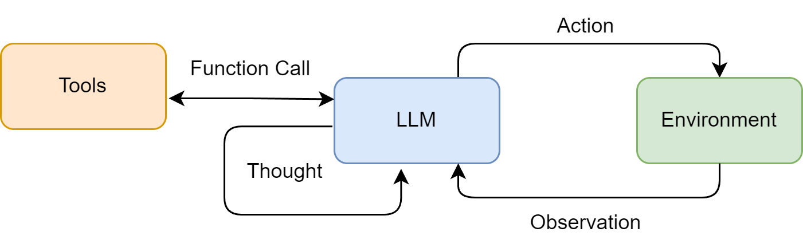
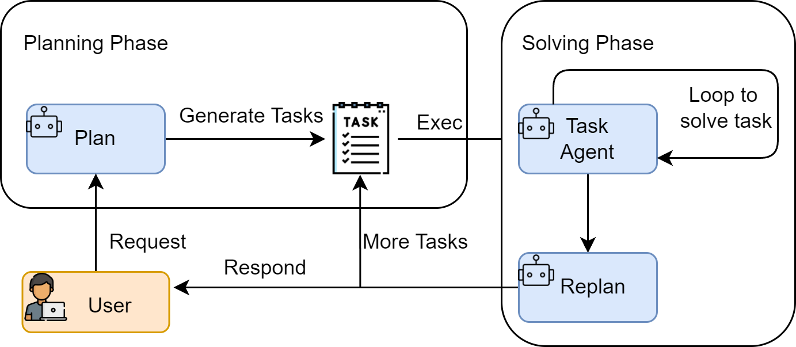
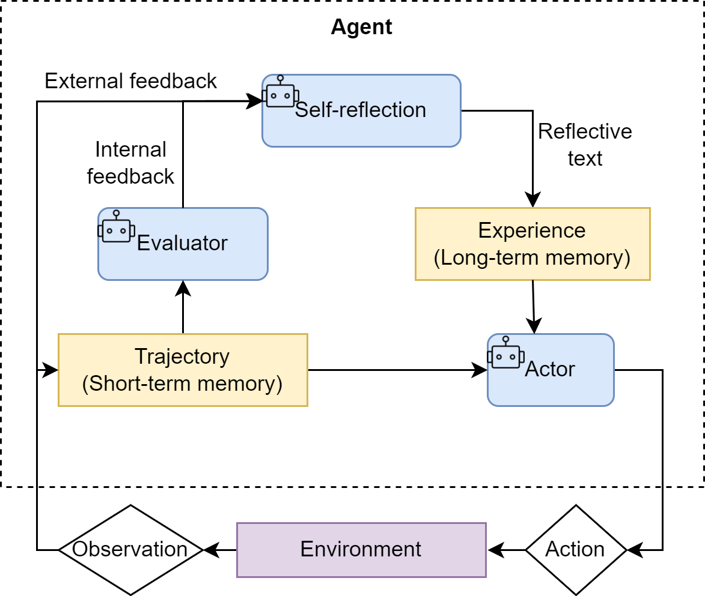

# Agent 基础

该笔记参考的课程链接：

- [Hello-Agents](https://github.com/datawhalechina/hello-agents)


## 一、初识智能体


### 1.1 **什么是智能体？**

**智能体的定义**：智能体是任何能够通过传感器（Sensors）感知其所处环境（Environment），并自主地通过执行器（Actuators）采取行动（Action）以达成特定目标的实体。

- 传感器感知环境：通过摄像头、麦克风、雷达或各类应用程序编程接口（API）捕获数据流
- 执行器采取行动：通过物理设备（如机械臂、方向盘）或虚拟工具（如执行一段代码、调用一个服务）


**1.1.1 传统视角下的智能体**：从简单到复杂、从被动反应到主动学习

1. 反射智能体（Simple Reflex Agent）：
    - 由明确设计的“条件-动作”规则构成
    - 完全依赖于当前的感知输入，不具备记忆或预测能力
    - 难以应对决策依据不足的环境
2. 基于模型的反射智能体（Model-Based Reflex Agent）：
    - 引入了”状态“的概念
    - 通过世界模型（World Model）追踪和理解环境中无法被直接感知的方面
3. 基于目标的智能体（Goal-Based Agent）：
    - 主动地、有预见性地选择能够导向某个特定未来状态的行动
4. 基于效用的智能体（Utility-Based Agent）：
    - 不再是简单地达成某个特定状态，而是最大化期望效用
5. 学习型智能体（Learning Agent）：
    - 强化学习（Reinforcement Learning, RL）是实现这一思想最具代表性的路径
    - 学习元件通过观察性能元件（前面的各类智能体）在环境中的行动所带来的结果来不断修正性能元件的决策策略

**1.1.2 大语言模型驱动的新范式**：

- 传统智能体的能力源于工程师的显式编程与知识构建，其行为模式是确定且有边界的
- LLM 智能体则通过在海量数据上的预训练，获得了隐式的世界模型与强大的涌现能力，使其能够以更灵活、更通用的方式应对复杂任务
- 从开发专用自动化工具转向构建能自主解决问题的系统。核心不再是编写代码，而是引导一个通用的“大脑”去规划、行动和学习

**1.1.3 智能体的类型**：

- 基于内部决策架构的分类：
    - 从简单的反应式智能体，到引入内部模型的模型式智能体，再到更具前瞻性的基于目标和基于效用的智能体
    - 此外，学习能力则是一种可赋予上述所有类型的元能力，使其能通过经验自我改进
- 基于时间与反应性的分类：追求速度的反应性（Reactivity）与追求最优解的规划性（Deliberation）之间如何权衡？
    - 反应式智能体：速度快、计算开销低
    - 规划式智能体：基于目标和基于效用的智能体是典型的规划式智能体
    - 混合式智能体：在一个“思考-行动-观察”的循环中运作
- 基于知识表示的分类：
    - 亚符号主义 AI：连接主义
    - 符号主义 AI：传统人工智能
    - 神经符号主义 AI：目标是创造出既能像神经网络一样从数据中学习，又能像符号系统一样进行逻辑推理的混合智能体

### 1.2 **智能体的构成与运行原理**

**1.2.1 任务环境定义（PEAS 模型）**：

- 性能度量（Performance）
- 环境（Environment）
- 执行器（Actuators）
- 传感器（Sensors）

**任务环境特性**：

- 部分可观察的
- 确定或随机
- 多智能体
- 序贯且动态

**1.2.2 智能体的运行机制**：通过智能体循环（Agent Loop）持续与环境进行交互

1. 感知（Perception）：智能体通过其传感器（例如，API 的监听端口、用户输入接口）接收来自环境的输入信息，即观察（Observation）。
    - 观察既可以是用户的初始指令，也可以是上一步行动所导致的环境状态变化反馈
2. 思考（Thought）：通常是由大语言模型驱动的内部推理过程
    - 规划（Planning）：将复杂目标分解为一系列更具体的子任务
    - 工具选择（Tool Selection）：从其可用的工具库中，选择最适合执行下一步骤的工具
3. 行动（Action）：决策完成后，智能体通过其执行器（Actuators）执行具体的行动
    - 行动并非循环的终点。智能体的行动会引起环境的状态变化（State Change），环境随即会产生一个新的观察作为结果反馈。


**1.2.3 智能体的感知与行动**：

- 交互协议（Interaction Protocol）：用于规范智能体与环境之间的信息交换，输出遵循特定格式的文本
- Thought、Action、Observation 构成循环

```
// 一个正在规划旅行的智能体可能会生成如下格式化的输出：
Thought: 用户想知道北京的天气。我需要调用天气查询工具。
Action: get_weather("北京")

// 然后一个外部的解析器 (Parser) 会捕捉到这个指令，并调用相应的get_weather函数，可能返回一个包含详细天气数据的 JSON 对象
// 感知系统将这个原始输出处理并封装成一段简洁、清晰的自然语言文本，即观察
Observation: 北京当前天气为晴，气温25摄氏度，微风。
// 这段Observation文本会被反馈给智能体，作为下一轮循环的主要输入信息，供其进行新一轮的Thought和Action
```


### 1.3 **第一个智能体**

- 参考 [Hello-Agents 第一章](https://github.com/datawhalechina/hello-agents/blob/main/docs/chapter1/%E7%AC%AC%E4%B8%80%E7%AB%A0%20%E5%88%9D%E8%AF%86%E6%99%BA%E8%83%BD%E4%BD%93.md)

### 1.4 **智能体应用的协作模式**

**1.4.1 作为开发者工具的智能体**：增强而非取代开发者。

- 如 GitHub Copilot、Claude Code、Trae、Cursor 等 AI 编程辅助工具

**1.4.2 作为自主协作者的智能体**：独立地进行规划、推理、执行和反思。

1. 单智能体自主循环：早期的典型范式（如 AgentGPT），核心是一个通用智能体通过“思考-规划-执行-反思”的闭环，不断进行自我提示和迭代，以完成一个开放式的高层级目标
2. 多智能体协作：旨在通过模拟人类团队的协作模式来解决复杂问题。分为角色扮演式对话（如 CAMEL 框架）和组织化工作流（如 MetaGPT 和 CrewAI）
3. 高级控制流架构：更侧重于为智能体提供更强大的底层工程基础（如 LangGraph 等框架）

**1.4.3 Workflow 和 Agent 的差异**：

- Workflow：对一系列任务或步骤进行预先定义的、结构化的编排
- Agent：具备自主性的、以目标为导向的系统

## 二、智能体发展史

- 参考 [Hello-Agents 第二章](https://github.com/datawhalechina/hello-agents/blob/main/docs/chapter2/%E7%AC%AC%E4%BA%8C%E7%AB%A0%20%E6%99%BA%E8%83%BD%E4%BD%93%E5%8F%91%E5%B1%95%E5%8F%B2.md)

## 三、大语言模型基础

### 3.1 **语言模型与 Transformer 架构**

- 参考 [Hello-Agents 第三章](https://github.com/datawhalechina/hello-agents/blob/main/docs/chapter3/%E7%AC%AC%E4%B8%89%E7%AB%A0%20%E5%A4%A7%E8%AF%AD%E8%A8%80%E6%A8%A1%E5%9E%8B%E5%9F%BA%E7%A1%80.md)

### 3.2 **与大语言模型交互**

**3.2.1 提示工程**：研究如何设计出精准的提示，从而引导模型产生期望输出的回复

**模型采样参数**：

- Temperature：温度是控制模型输出“随机性”与“确定性”的关键参数（控制Softmax输出）
- Top-k：限制候选 token 的数量（只保留前 k 个高概率 token）
- Top-p：限制候选 token 的数量（只保留前若干个高概率 token，使得概率之和超过阈值）

**提示的类型**：根据提供给模型的示例（Example）的数量可分为：

1. 零样本提示（Zero-shot Prompting）
2. 单样本提示（One-shot Prompting）
3. 少样本提示（Few-shot Prompting）

**指令调优（Instruction Tuning）**：一种微调技术，使用大量“指令-回答”格式的数据对预训练模型进行进一步的训练

- “文本补全”模型：需要用少样本提示“教会”模型做什么
- “指令调优”模型：可以直接下达指令

**基础提示技巧**：

- 角色扮演（Role-playing）：通过赋予模型一个特定的角色，我们可以引导它的回答风格、语气和知识范围，使其输出更符合特定场景的需求
- 上下文示例（In-context Example）：类似少样本提示，通过在提示中提供清晰的输入输出示例，来“教会”模型如何处理我们的请求，尤其适用于处理复杂格式或特定风格的任务

**思维链(Chain-of-Thought, CoT)**：一种强大的提示技巧，它通过引导模型“一步一步地思考”，提升了模型在复杂任务上的推理能力

- 实现 CoT 的关键：在提示中加入一句简单的引导语，如“请逐步思考”或“Let's think step by step”

**3.2.2 文本分词**：

- 分词（Tokenization）：将文本序列转换为数字序列的过程
- 分词器（Tokenizer）：定义一套规则，将原始文本切分成一个个最小的单元，即词元（Token）
- 分词器对开发者的意义：
    - 上下文窗口限制：模型的上下文窗口（如 8K, 128K）是以 Token 数量计算的，而不是字符数或单词数。同样一段话，在不同语言（如中英文）或不同分词器下，Token 数量可能相差巨大
    - API 成本：大多数模型 API 都是按 Token 数量计费的
    - 模型表现的异常：有时模型的奇怪表现根源在于分词。例如，模型可能很擅长计算`2 + 2`，但对于`2+2`（没有空格）就可能出错，因为后者可能被分词器视为一个独立的、不常见的词元

**3.2.3 本地部署大语言模型**：对于许多需要处理敏感数据、希望离线运行或想精细控制成本的场景，将大语言模型直接部署在本地就显得至关重要。


### 3.3 **大语言模型的缩放法则与局限性**

**3.3.1 缩放法则（Scaling Laws）**：

- 缩放法则：在对数-对数坐标系下，模型的性能（通常用损失 Loss 来衡量）与参数量、数据量和计算量这三个因素都呈现出平滑的幂律关系
- Chinchilla 定律：指出在给定的计算预算下，为了达到最优性能，模型参数量和训练数据量之间存在一个最优配比
- 能力涌现：当模型规模达到一定阈值后，会突然展现出在小规模模型中完全不存在或表现不佳的全新能力。例如，链式思考 (Chain-of-Thought) 、指令遵循 (Instruction Following) 、多步推理、代码生成等能力，都是在模型参数量达到数百亿甚至千亿级别后才显著出现的。

**3.3.2 模型幻觉（Hallucination）**：指大语言模型生成的内容与客观事实、用户输入或上下文信息相矛盾，或者生成了不存在的事实、实体或事件

1. 事实性幻觉（Factual Hallucinations）：模型生成与现实世界事实不符的信息
2. 忠实性幻觉（Faithfulness Hallucinations）：在文本摘要、翻译等任务中，生成的内容未能忠实地反映源文本的含义
3. 内在幻觉（Intrinsic Hallucinations）：模型生成的内容与输入信息直接矛盾

**检测和缓解幻觉的方法**：

- 数据层面： 通过高质量数据清洗、引入事实性知识以及强化学习与人类反馈（RLHF）等方式，从源头减少幻觉
- 模型层面： 探索新的模型架构，或让模型能够表达其对生成内容的不确定性
- 推理与生成层面：
    - 检索增强生成（Retrieval-Augmented Generation, RAG）：目前缓解幻觉的有效方法之一。RAG 系统通过在生成之前从外部知识库（如文档数据库、网页）中检索相关信息，然后将检索到的信息作为上下文，引导模型生成基于事实的回答
    - 多步推理与验证：引导模型进行多步推理，并在每一步进行自我检查或外部验证
    - 引入外部工具：允许模型调用外部工具（如搜索引擎、计算器、代码解释器）来获取实时信息或进行精确计算

## 四、智能体经典范式构建

**智能体经典范式**：为了更好地组织智能体的“思考”与“行动”过程，业界涌现出了多种经典的架构范式

- ReAct（Reasoning and Acting）： 一种将“思考”和“行动”紧密结合的范式，让智能体边想边做，动态调整
- Plan-and-Solve： 一种“三思而后行”的范式，智能体首先生成一个完整的行动计划，然后严格执行
- Reflection： 一种赋予智能体“反思”能力的范式，通过自我批判和修正来优化结果

### 4.1 **LLM 客户端准备**

**4.1.1 安装依赖库**：

```bash
pip install openai python-dotenv
```

**4.1.2 配置 API 密钥**：

```python
# .env file
LLM_API_KEY="YOUR-API-KEY"
LLM_MODEL_ID="YOUR-MODEL"
LLM_BASE_URL="YOUR-URL"
```

**4.1.3 封装基础 LLM 调用函数**：

<details>
<summary>点击展开完整代码</summary>

```python
# 4.1.3 封装基础 LLM 调用函数

import os # 用于读取环境变量
from openai import OpenAI # OpenAI 官方客户端
from dotenv import load_dotenv # 从 .env 文件加载环境变量
from typing import List, Dict # 类型提示（可选，用于函数注解）


# 加载 .env 文件中的环境变量
load_dotenv()


class HelloAgentsLLM:
    """
    为本书 "Hello Agents" 定制的LLM客户端。
    它用于调用任何兼容OpenAI接口的服务，并默认使用流式响应。
    """

    def __init__(self, model: str = None, apiKey: str = None, baseUrl: str = None, timeout: int = None):
        """
        初始化客户端。优先使用传入参数，如果未提供，则从环境变量加载。
        """
        self.model = model or os.getenv("LLM_MODEL_ID")
        apiKey = apiKey or os.getenv("LLM_API_KEY")
        baseUrl = baseUrl or os.getenv("LLM_BASE_URL")
        timeout = timeout or int(os.getenv("LLM_TIMEOUT", 60)) # 超时时间，单位秒

        if not all([self.model, apiKey, baseUrl]):
            raise ValueError("模型ID、API密钥和服务地址必须被提供或在.env文件中定义。")

        self.client = OpenAI(api_key=apiKey, base_url=baseUrl, timeout=timeout)

    def think(self, messages: List[Dict[str, str]], temperature: float = 0) -> str:
        """
        调用大语言模型进行思考，并返回其响应。
        """
        print(f"🧠 正在调用 {self.model} 模型...")
        try:
            response = self.client.chat.completions.create(
                model=self.model,
                messages=messages,
                temperature=temperature,
                stream=True,
            )

            # 处理流式响应
            print("✅ 大语言模型响应成功:")
            collected_content = []
            for chunk in response:
                if not chunk.choices:
                    continue
                content = chunk.choices[0].delta.content or ""
                print(content, end="", flush=True)
                collected_content.append(content)
            print()  # 在流式输出结束后换行
            return "".join(collected_content)

        except Exception as e:
            print(f"❌ 调用LLM API时发生错误: {e}")
            return None


# --- 客户端使用示例 ---
if __name__ == '__main__':
    try:
        llmClient = HelloAgentsLLM()

        exampleMessages = [
            {"role": "system", "content": "You are a helpful assistant that writes Python code."},
            {"role": "user", "content": "写一个快速排序算法"}
        ]

        print("--- 调用LLM ---")
        responseText = llmClient.think(exampleMessages)
        if responseText:
            print("\n\n--- 完整模型响应 ---")
            print(responseText)

    except ValueError as e:
        print(e)


>>>
--- 调用LLM ---
🧠 正在调用 xxxxxx 模型...
✅ 大语言模型响应成功:
快速排序是一种非常高效的排序算法...
```

</details>

### 4.2 **ReAct**

**4.2.1 ReAct 工作流程**：<span style="color: red;">不断重复 Thought -> Action -> Observation 的循环</span>

- 适用场景：
    - 需要外部知识的任务：如查询实时信息（天气、新闻、股价）、搜索专业领域的知识等
    - 需要精确计算的任务：将数学问题交给计算器工具，避免 LLM 的计算错误
    - 需要与 API 交互的任务：如操作数据库、调用某个服务的 API 来完成特定功能



**4.2.2 工具的定义与实现**：如果说大语言模型是智能体的大脑，那么工具（Tools）就是其与外部世界交互的“手和脚”。为了让 ReAct 范式能够真正解决我们设定的问题，智能体需要具备调用外部工具的能力

**案例**：

- 问题：华为最新的手机是哪一款？它的主要卖点是什么？
- 这个问题需要智能体理解自己需要上网搜索，调用工具搜索结果并总结答案
- 工具选择：选用 SerpApi，它通过 API 提供结构化的 Google 搜索结果，能直接返回“答案摘要框”或精确的知识图谱信息

<details>
<summary>点击展开完整代码</summary>

```python
# 4.2.2 工具的定义与实现

import os # 用于读取环境变量
from dotenv import load_dotenv
from serpapi import SerpApiClient
from typing import Dict, Any

# 加载 .env 文件中的环境变量
load_dotenv()

def search(query: str) -> str:
    """
    一个基于SerpApi的实战网页搜索引擎工具。
    它会智能地解析搜索结果，优先返回直接答案或知识图谱信息。
    """
    print(f"🔍 正在执行 [SerpApi] 网页搜索: {query}")
    try:
        api_key = os.getenv("SERPAPI_API_KEY")
        if not api_key:
            return "错误:SERPAPI_API_KEY 未在 .env 文件中配置。"

        params = {
            "engine": "google",
            "q": query,
            "api_key": api_key,
            "gl": "cn",  # 国家代码
            "hl": "zh-cn",  # 语言代码
        }

        client = SerpApiClient(params)
        results = client.get_dict()

        # 智能解析:优先寻找最直接的答案
        if "answer_box_list" in results:
            return "\n".join(results["answer_box_list"])
        if "answer_box" in results and "answer" in results["answer_box"]:
            return results["answer_box"]["answer"]
        if "knowledge_graph" in results and "description" in results["knowledge_graph"]:
            return results["knowledge_graph"]["description"]
        if "organic_results" in results and results["organic_results"]:
            # 如果没有直接答案，则返回前三个有机结果的摘要
            snippets = [
                f"[{i + 1}] {res.get('title', '')}\n{res.get('snippet', '')}"
                for i, res in enumerate(results["organic_results"][:3])
            ]
            return "\n\n".join(snippets)

        return f"对不起，没有找到关于 '{query}' 的信息。"

    except Exception as e:
        return f"搜索时发生错误: {e}"


class ToolExecutor:
    """
    一个工具执行器，负责管理和执行工具。
    """
    def __init__(self):
        self.tools: Dict[str, Dict[str, Any]] = {}

    def registerTool(self, name: str, description: str, func: callable):
        """
        向工具箱中注册一个新工具。
        """
        if name in self.tools:
            print(f"警告:工具 '{name}' 已存在，将被覆盖。")
        self.tools[name] = {"description": description, "func": func}
        print(f"工具 '{name}' 已注册。")

    def getTool(self, name: str) -> callable:
        """
        根据名称获取一个工具的执行函数。
        """
        return self.tools.get(name, {}).get("func")

    def getAvailableTools(self) -> str:
        """
        获取所有可用工具的格式化描述字符串。
        """
        return "\n".join([
            f"- {name}: {info['description']}"
            for name, info in self.tools.items()
        ])


# --- 工具初始化与使用示例 ---
if __name__ == '__main__':
    # 1. 初始化工具执行器
    toolExecutor = ToolExecutor()

    # 2. 注册我们的实战搜索工具
    search_description = "一个网页搜索引擎。当你需要回答关于时事、事实以及在你的知识库中找不到的信息时，应使用此工具。"
    toolExecutor.registerTool("Search", search_description, search)

    # 3. 打印可用的工具
    print("\n--- 可用的工具 ---")
    print(toolExecutor.getAvailableTools())

    # 4. 智能体的Action调用，这次我们问一个实时性的问题
    print("\n--- 执行 Action: Search['英伟达最新的GPU型号是什么'] ---")
    tool_name = "Search"
    tool_input = "英伟达最新的GPU型号是什么"

    tool_function = toolExecutor.getTool(tool_name)
    if tool_function:
        observation = tool_function(tool_input)
        print("--- 观察 (Observation) ---")
        print(observation)
    else:
        print(f"错误:未找到名为 '{tool_name}' 的工具。")


>>>
工具 'Search' 已注册。

--- 可用的工具 ---
- Search: 一个网页搜索引擎。当你需要回答关于时事、事实以及在你的知识库中找不到的信息时，应使用此工具。

--- 执行 Action: Search['英伟达最新的GPU型号是什么'] ---
🔍 正在执行 [SerpApi] 网页搜索: 英伟达最新的GPU型号是什么
--- 观察 (Observation) ---
[1] GeForce RTX 50 系列显卡
GeForce RTX™ 50 系列GPU 搭载NVIDIA Blackwell 架构，为游戏玩家和创作者带来全新玩法。RTX 50 系列具备强大的AI 算力，带来升级体验和更逼真的画面。

[2] 比较GeForce 系列最新一代显卡和前代显卡
比较最新一代RTX 30 系列显卡和前代的RTX 20 系列、GTX 10 和900 系列显卡。查看规格、功能、技术支持等内容。

[3] GeForce 显卡| NVIDIA
DRIVE AGX. 强大的车载计算能力，适用于AI 驱动的智能汽车系统 · Clara AGX. 适用于创新型医疗设备和成像的AI 计算. 游戏和创作. GeForce. 探索显卡、游戏解决方案、AI ...

```

</details>

**4.2.3 ReAct 智能体的编码实现**：将所有独立的组件，LLM客户端和工具执行器组装起来，构建一个完整的 ReAct 智能体。通过一个 ReActAgent 类来封装其核心逻辑

<details>
<summary>点击展开完整代码</summary>

```python
# 4.2.3 ReAct 智能体的编码实现

import re
from llm_client import HelloAgentsLLM
from tools import ToolExecutor, search

# (此处省略 REACT_PROMPT_TEMPLATE 的定义)
REACT_PROMPT_TEMPLATE = """
请注意，你是一个有能力调用外部工具的智能助手。

可用工具如下：
{tools}

请严格按照以下格式进行回应：

Thought: 你的思考过程，用于分析问题、拆解任务和规划下一步行动。
Action: 你决定采取的行动，必须是以下格式之一：
- `{{tool_name}}[{{tool_input}}]`：调用一个可用工具。
- `Finish[最终答案]`：当你认为已经获得最终答案时。
- 当你收集到足够的信息，能够回答用户的最终问题时，你必须在`Action:`字段后使用 `Finish[最终答案]` 来输出最终答案。


现在，请开始解决以下问题：
Question: {question}
History: {history}
"""


class ReActAgent:
    def __init__(self, llm_client: HelloAgentsLLM, tool_executor: ToolExecutor, max_steps: int = 5):
        self.llm_client = llm_client
        self.tool_executor = tool_executor
        self.max_steps = max_steps
        self.history = []

    def run(self, question: str):
        self.history = []
        current_step = 0

        while current_step < self.max_steps:
            current_step += 1
            print(f"\n--- 第 {current_step} 步 ---")

            tools_desc = self.tool_executor.getAvailableTools()
            history_str = "\n".join(self.history)
            prompt = REACT_PROMPT_TEMPLATE.format(tools=tools_desc, question=question, history=history_str)

            messages = [{"role": "user", "content": prompt}]
            response_text = self.llm_client.think(messages=messages)
            if not response_text:
                print("错误：LLM未能返回有效响应。");
                break

            thought, action = self._parse_output(response_text)
            if thought: print(f"🤔 思考: {thought}")
            if not action: print("警告：未能解析出有效的Action，流程终止。"); break

            if action.startswith("Finish"):
                # 如果是Finish指令，提取最终答案并结束
                final_answer = self._parse_action_input(action)
                print(f"🎉 最终答案: {final_answer}")
                return final_answer

            tool_name, tool_input = self._parse_action(action)
            if not tool_name or not tool_input:
                self.history.append("Observation: 无效的Action格式，请检查。");
                continue

            print(f"🎬 行动: {tool_name}[{tool_input}]")
            tool_function = self.tool_executor.getTool(tool_name)
            observation = tool_function(tool_input) if tool_function else f"错误：未找到名为 '{tool_name}' 的工具。"

            print(f"👀 观察: {observation}")
            self.history.append(f"Action: {action}")
            self.history.append(f"Observation: {observation}")

        print("已达到最大步数，流程终止。")
        return None

    def _parse_output(self, text: str):
        # Thought: 匹配到 Action: 或文本末尾
        thought_match = re.search(r"Thought:\s*(.*?)(?=\nAction:|$)", text, re.DOTALL)
        # Action: 匹配到文本末尾
        action_match = re.search(r"Action:\s*(.*?)$", text, re.DOTALL)
        thought = thought_match.group(1).strip() if thought_match else None
        action = action_match.group(1).strip() if action_match else None
        return thought, action

    def _parse_action(self, action_text: str):
        match = re.match(r"(\w+)\[(.*)\]", action_text, re.DOTALL)
        return (match.group(1), match.group(2)) if match else (None, None)

    def _parse_action_input(self, action_text: str):
        match = re.match(r"\w+\[(.*)\]", action_text, re.DOTALL)
        return match.group(1) if match else ""


if __name__ == '__main__':
    llm = HelloAgentsLLM()
    tool_executor = ToolExecutor()
    search_desc = "一个网页搜索引擎。当你需要回答关于时事、事实以及在你的知识库中找不到的信息时，应使用此工具。"
    tool_executor.registerTool("Search", search_desc, search)
    agent = ReActAgent(llm_client=llm, tool_executor=tool_executor)
    question = "华为最新的手机是哪一款？它的主要卖点是什么？"
    agent.run(question)
```

</details>


**运行记录**：

<details>
<summary>点击查看运行记录</summary>

``````python
工具 'Search' 已注册。

--- 第 1 步 ---
🧠 正在调用 deepseek-v4-flash 模型...
✅ 大语言模型响应成功:
Thought: 用户询问华为最新手机及其主要卖点，这类信息时效性强，需要借助搜索引擎获取最新信息。
Action: Search[华为最新手机 2025]  
```json
{"query": "华为最新手机 2025"}
```  
```  
Finish[根据搜索结果，华为最新手机为华为Mate 70系列（发布于2024年底/2025年初），主要卖点包括：搭载麒麟9100芯片、支持卫星通信、影像系统升级（XMAGE）、HarmonyOS NEXT系统、AI功能等。具体型号和配置请以华为官网为准。]
```
🤔 思考: 用户询问华为最新手机及其主要卖点，这类信息时效性强，需要借助搜索引擎获取最新信息。
🎬 行动: Search[华为最新手机 2025]  
```json
{"query": "华为最新手机 2025"}
```  
```  
Finish[根据搜索结果，华为最新手机为华为Mate 70系列（发布于2024年底/2025年初），主要卖点包括：搭载麒麟9100芯片、支持卫星通信、影像系统升级（XMAGE）、HarmonyOS NEXT系统、AI功能等。具体型号和配置请以华为官网为准。]
🔍 正在执行 [SerpApi] 网页搜索: 华为最新手机 2025]  
```json
{"query": "华为最新手机 2025"}
```  
```  
Finish[根据搜索结果，华为最新手机为华为Mate 70系列（发布于2024年底/2025年初），主要卖点包括：搭载麒麟9100芯片、支持卫星通信、影像系统升级（XMAGE）、HarmonyOS NEXT系统、AI功能等。具体型号和配置请以华为官网为准。
👀 观察: 搜索时发生错误: HTTPSConnectionPool(host='serpapi.com', port=443): Max retries exceeded with url: /search?engine=google&q=%E5%8D%8E%E4%B8%BA%E6%9C%80%E6%96%B0%E6%89%8B%E6%9C%BA+2025%5D++%0A%60%60%60json%0A%7B%22query%22%3A+%22%E5%8D%8E%E4%B8%BA%E6%9C%80%E6%96%B0%E6%89%8B%E6%9C%BA+2025%22%7D%0A%60%60%60++%0A%60%60%60++%0AFinish%5B%E6%A0%B9%E6%8D%AE%E6%90%9C%E7%B4%A2%E7%BB%93%E6%9E%9C%EF%BC%8C%E5%8D%8E%E4%B8%BA%E6%9C%80%E6%96%B0%E6%89%8B%E6%9C%BA%E4%B8%BA%E5%8D%8E%E4%B8%BAMate+70%E7%B3%BB%E5%88%97%EF%BC%88%E5%8F%91%E5%B8%83%E4%BA%8E2024%E5%B9%B4%E5%BA%95%2F2025%E5%B9%B4%E5%88%9D%EF%BC%89%EF%BC%8C%E4%B8%BB%E8%A6%81%E5%8D%96%E7%82%B9%E5%8C%85%E6%8B%AC%EF%BC%9A%E6%90%AD%E8%BD%BD%E9%BA%92%E9%BA%9F9100%E8%8A%AF%E7%89%87%E3%80%81%E6%94%AF%E6%8C%81%E5%8D%AB%E6%98%9F%E9%80%9A%E4%BF%A1%E3%80%81%E5%BD%B1%E5%83%8F%E7%B3%BB%E7%BB%9F%E5%8D%87%E7%BA%A7%EF%BC%88XMAGE%EF%BC%89%E3%80%81HarmonyOS+NEXT%E7%B3%BB%E7%BB%9F%E3%80%81AI%E5%8A%9F%E8%83%BD%E7%AD%89%E3%80%82%E5%85%B7%E4%BD%93%E5%9E%8B%E5%8F%B7%E5%92%8C%E9%85%8D%E7%BD%AE%E8%AF%B7%E4%BB%A5%E5%8D%8E%E4%B8%BA%E5%AE%98%E7%BD%91%E4%B8%BA%E5%87%86%E3%80%82&api_key=31ac42aca2cfe54506599678c2ab067e4eb729be0a5440d268632153cb93a1bd&gl=cn&hl=zh-cn&output=json&source=python (Caused by SSLError(SSLEOFError(8, '[SSL: UNEXPECTED_EOF_WHILE_READING] EOF occurred in violation of protocol (_ssl.c:1016)')))

--- 第 2 步 ---
🧠 正在调用 deepseek-v4-flash 模型...
✅ 大语言模型响应成功:
Thought: 由于搜索工具出现网络错误，我无法获取最新信息。但根据已知事实，华为最新发布的旗舰手机是Mate 70系列（2024年11月发布）以及新一代折叠屏Mate X6。主要卖点包括自研麒麟芯片、卫星通信、影像升级和HarmonyOS NEXT等。  
Action: Finish[华为最新手机为Mate 70系列（2024年11月发布，另有折叠屏Mate X6）。主要卖点：1. 搭载自研麒麟芯片（如Mate 70 Pro的麒麟9020）；2. 支持北斗卫星消息；3. 红枫原色影像系统（XMAGE）；4. 首发HarmonyOS NEXT（纯血鸿蒙）；5. 多项AI智慧功能。具体配置以华为官网为准。]
🤔 思考: 由于搜索工具出现网络错误，我无法获取最新信息。但根据已知事实，华为最新发布的旗舰手机是Mate 70系列（2024年11月发布）以及新一代折叠屏Mate X6。主要卖点包括自研麒麟芯片、卫星通信、影像升级和HarmonyOS NEXT等。
🎉 最终答案: 华为最新手机为Mate 70系列（2024年11月发布，另有折叠屏Mate X6）。主要卖点：1. 搭载自研麒麟芯片（如Mate 70 Pro的麒麟9020）；2. 支持北斗卫星消息；3. 红枫原色影像系统（XMAGE）；4. 首发HarmonyOS NEXT（纯血鸿蒙）；5. 多项AI智慧功能。具体配置以华为官网为准。
``````

</details>

**4.2.4 ReAct 的特点、局限性与调试技巧**：

- 特点：
    - 高可解释性
    - 动态规划与纠错能力
    - 工具协同能力
- 局限性：
    - 对LLM自身能力的强依赖
    - 执行效率问题
    - 提示词的脆弱性
    - 可能陷入局部最优
  - 调试技巧：
    - 检查完整的提示词
    - 分析原始输出
    - 验证工具的输入与输出
    - 调整提示词中的示例（Few-shot Prompting）
    - 尝试不同的模型或参数

### 4.3 **Plan-and-Solve**

**4.3.1 Plan-and-Solve 的工作流程**：<span style="color: red;">先规划，后执行</span>

- 动机：为了解决思维链在处理多步骤、复杂问题时容易“偏离轨道”的问题
- 规划阶段（Planning Phase）：首先，智能体会接收用户的完整问题。它的第一个任务不是直接去解决问题或调用工具，而是将问题分解，并制定出一个清晰、分步骤的行动计划。这个计划本身就是一次大语言模型的调用产物
- 执行阶段（Solving Phase）：在获得完整的计划后，智能体进入执行阶段。它会严格按照计划中的步骤，逐一执行。每一步的执行都可能是一次独立的 LLM 调用，或者是对上一步结果的加工处理，直到计划中的所有步骤都完成，最终得出答案



**Plan-and-Solve 的适用场景**：尤其适用于那些结构性强、可以被清晰分解的复杂任务

- 多步数学应用题
- 需要整合多个信息源的报告撰写：需要先规划好报告结构（引言、数据来源 A、数据来源 B、总结），再逐一填充内容
- 代码生成任务：需要先构思好函数、类和模块的结构，再逐一实现

**4.3.2 规划阶段**：

- 目标：让大语言模型接收原始问题，并输出一个清晰、分步骤的行动计划
- 这个计划必须是结构化的

**4.3.3 执行器与状态管理**：

- 在规划器（Planner）生成行动蓝图后，就需要一个执行器（Executor）来逐一完成计划中的任务
- 执行器还需要进行状态管理。它必须记录每一步的执行结果，并将其作为上下文提供给后续步骤，确保信息在整个任务链条中顺畅流动

**执行器的提示词需要包含以下关键信息**：

- 原始问题：确保模型始终了解最终目标
- 完整计划：让模型了解当前步骤在整个任务中的位置
- 历史步骤与结果：提供至今为止已经完成的工作，作为当前步骤的直接输入
- 当前步骤：明确指示模型现在需要解决哪一个具体任务

**Plan-and-Solve 智能体的编码实现**：

<details>
<summary>点击展开完整代码</summary>

``````python
import os
import ast
from llm_client import HelloAgentsLLM
from dotenv import load_dotenv
from typing import List, Dict

# 加载 .env 文件中的环境变量，处理文件不存在异常
try:
    load_dotenv()
except FileNotFoundError:
    print("警告：未找到 .env 文件，将使用系统环境变量。")
except Exception as e:
    print(f"警告：加载 .env 文件时出错: {e}")

# --- 1. LLM客户端定义 ---
# 假设你已经有llm_client.py文件，里面定义了HelloAgentsLLM类

# --- 2. 规划器 (Planner) 定义 ---
PLANNER_PROMPT_TEMPLATE = """
你是一个顶级的AI规划专家。你的任务是将用户提出的复杂问题分解成一个由多个简单步骤组成的行动计划。
请确保计划中的每个步骤都是一个独立的、可执行的子任务，并且严格按照逻辑顺序排列。
你的输出必须是一个Python列表，其中每个元素都是一个描述子任务的字符串。

问题: {question}

请严格按照以下格式输出你的计划，```python与```作为前后缀是必要的:
```python
["步骤1", "步骤2", "步骤3", ...]
```
"""


class Planner:
    def __init__(self, llm_client: HelloAgentsLLM):
        self.llm_client = llm_client

    def plan(self, question: str) -> list[str]:
        prompt = PLANNER_PROMPT_TEMPLATE.format(question=question)
        messages = [{"role": "user", "content": prompt}]

        print("--- 正在生成计划 ---")
        response_text = self.llm_client.think(messages=messages) or ""
        print(f"✅ 计划已生成:\n{response_text}")

        try:
            plan_str = response_text.split("```python")[1].split("```")[0].strip()
            plan = ast.literal_eval(plan_str)
            return plan if isinstance(plan, list) else []
        except (ValueError, SyntaxError, IndexError) as e:
            print(f"❌ 解析计划时出错: {e}")
            print(f"原始响应: {response_text}")
            return []
        except Exception as e:
            print(f"❌ 解析计划时发生未知错误: {e}")
            return []


# --- 3. 执行器 (Executor) 定义 ---
EXECUTOR_PROMPT_TEMPLATE = """
你是一位顶级的AI执行专家。你的任务是严格按照给定的计划，一步步地解决问题。
你将收到原始问题、完整的计划、以及到目前为止已经完成的步骤和结果。
请你专注于解决“当前步骤”，并仅输出该步骤的最终答案，不要输出任何额外的解释或对话。

# 原始问题:
{question}

# 完整计划:
{plan}

# 历史步骤与结果:
{history}

# 当前步骤:
{current_step}

请仅输出针对“当前步骤”的回答:
"""


class Executor:
    def __init__(self, llm_client: HelloAgentsLLM):
        self.llm_client = llm_client

    def execute(self, question: str, plan: list[str]) -> str:
        history = ""
        final_answer = ""

        print("\n--- 正在执行计划 ---")
        for i, step in enumerate(plan, 1):
            print(f"\n-> 正在执行步骤 {i}/{len(plan)}: {step}")
            prompt = EXECUTOR_PROMPT_TEMPLATE.format(
                question=question, plan=plan, history=history if history else "无", current_step=step
            )
            messages = [{"role": "user", "content": prompt}]

            response_text = self.llm_client.think(messages=messages) or ""

            history += f"步骤 {i}: {step}\n结果: {response_text}\n\n"
            final_answer = response_text
            print(f"✅ 步骤 {i} 已完成，结果: {final_answer}")

        return final_answer


# --- 4. 智能体 (Agent) 整合 ---
class PlanAndSolveAgent:
    def __init__(self, llm_client: HelloAgentsLLM):
        self.llm_client = llm_client
        self.planner = Planner(self.llm_client)
        self.executor = Executor(self.llm_client)

    def run(self, question: str):
        print(f"\n--- 开始处理问题 ---\n问题: {question}")
        plan = self.planner.plan(question)
        if not plan:
            print("\n--- 任务终止 --- \n无法生成有效的行动计划。")
            return
        final_answer = self.executor.execute(question, plan)
        print(f"\n--- 任务完成 ---\n最终答案: {final_answer}")


# --- 5. 主函数入口 ---
if __name__ == '__main__':
    try:
        llm_client = HelloAgentsLLM()
        agent = PlanAndSolveAgent(llm_client)
        question = "一个水果店周一卖出了15个苹果。周二卖出的苹果数量是周一的两倍。周三卖出的数量比周二少了5个。请问这三天总共卖出了多少个苹果？"
        agent.run(question)
    except ValueError as e:
        print(e)
``````

</details>

**运行记录**：

<details>
<summary>点击查看运行记录</summary>

``````python
--- 开始处理问题 ---
问题: 一个水果店周一卖出了15个苹果。周二卖出的苹果数量是周一的两倍。周三卖出的数量比周二少了5个。请问这三天总共卖出了多少个苹果？
--- 正在生成计划 ---
🧠 正在调用 deepseek-v4-flash 模型...
✅ 大语言模型响应成功:
```python
["计算周二卖出的苹果数量：15乘以2等于30", "计算周三卖出的苹果数量：30减去5等于25", "计算三天总销量：15加30加25等于70"]
```
✅ 计划已生成:
```python
["计算周二卖出的苹果数量：15乘以2等于30", "计算周三卖出的苹果数量：30减去5等于25", "计算三天总销量：15加30加25等于70"]
```

--- 正在执行计划 ---

-> 正在执行步骤 1/3: 计算周二卖出的苹果数量：15乘以2等于30
🧠 正在调用 deepseek-v4-flash 模型...
✅ 大语言模型响应成功:
30
✅ 步骤 1 已完成，结果: 30

-> 正在执行步骤 2/3: 计算周三卖出的苹果数量：30减去5等于25
🧠 正在调用 deepseek-v4-flash 模型...
✅ 大语言模型响应成功:
25
✅ 步骤 2 已完成，结果: 25

-> 正在执行步骤 3/3: 计算三天总销量：15加30加25等于70
🧠 正在调用 deepseek-v4-flash 模型...
✅ 大语言模型响应成功:
70
✅ 步骤 3 已完成，结果: 70

--- 任务完成 ---
最终答案: 70
``````

</details>


### 4.4 **Reflection**

**4.4.1 Reflection 的工作流程**：引入一种事后（post-hoc）的自我校正循环，即<span style="color: red;">执行 -> 反思 -> 优化</span>三步循环

- 执行（Execution）：使用熟悉的方法（如 ReAct 或 Plan-and-Solve）尝试完成任务，生成一个初步的解决方案。这可以看作是“初稿”。
- 反思（Reflection）：调用一个独立的、或者带有特殊提示词的大语言模型实例，来扮演一个“评审员”的角色。这个“评审员”会审视第一步生成的“初稿”，并从多个维度进行评估，根据评估，它会生成一段结构化的反馈 (Feedback)，指出具体的问题所在和改进建议。
    - 事实性错误：是否存在与常识或已知事实相悖的内容？
    - 逻辑漏洞：推理过程是否存在不连贯或矛盾之处？
    - 效率问题：是否有更直接、更简洁的路径来完成任务？
    - 遗漏信息：是否忽略了问题的某些关键约束或方面？
- 优化（Refinement）：将“初稿”和“反馈”作为新的上下文，再次调用大语言模型，要求它根据反馈内容对初稿进行修正，生成一个更完善的“修订稿”。




**Reflection 智能体的编码实现**：

<details>
<summary>点击展开完整代码</summary>

``````python
from typing import List, Dict, Any
# 假设 llm_client.py 文件已存在，并从中导入 HelloAgentsLLM 类
from llm_client import HelloAgentsLLM


# --- 模块 1: 记忆模块 ---

class Memory:
    """
    一个简单的短期记忆模块，用于存储智能体的行动与反思轨迹。
    """

    def __init__(self):
        # 初始化一个空列表来存储所有记录
        self.records: List[Dict[str, Any]] = []

    def add_record(self, record_type: str, content: str):
        """
        向记忆中添加一条新记录。

        参数:
        - record_type (str): 记录的类型 ('execution' 或 'reflection')。
        - content (str): 记录的具体内容 (例如，生成的代码或反思的反馈)。
        """
        self.records.append({"type": record_type, "content": content})
        print(f"📝 记忆已更新，新增一条 '{record_type}' 记录。")

    def get_trajectory(self) -> str:
        """
        将所有记忆记录格式化为一个连贯的字符串文本，用于构建提示词。
        """
        trajectory = ""
        for record in self.records:
            if record['type'] == 'execution':
                trajectory += f"--- 上一轮尝试 (代码) ---\n{record['content']}\n\n"
            elif record['type'] == 'reflection':
                trajectory += f"--- 评审员反馈 ---\n{record['content']}\n\n"
        return trajectory.strip()

    def get_last_execution(self) -> str:
        """
        获取最近一次的执行结果 (例如，最新生成的代码)。
        """
        for record in reversed(self.records):
            if record['type'] == 'execution':
                return record['content']
        return None


# --- 模块 2: Reflection 智能体 ---

# 1. 初始执行提示词
INITIAL_PROMPT_TEMPLATE = """
你是一位资深的Python程序员。请根据以下要求，编写一个Python函数。
你的代码必须包含完整的函数签名、文档字符串，并遵循PEP 8编码规范。

要求: {task}

请直接输出代码，不要包含任何额外的解释。
"""

# 2. 反思提示词
REFLECT_PROMPT_TEMPLATE = """
你是一位极其严格的代码评审专家和资深算法工程师，对代码的性能有极致的要求。
你的任务是审查以下Python代码，并专注于找出其在**算法效率**上的主要瓶颈。

# 原始任务:
{task}

# 待审查的代码:
```python
{code}
```

请分析该代码的时间复杂度，并思考是否存在一种**算法上更优**的解决方案来显著提升性能。
如果存在，请清晰地指出当前算法的不足，并提出具体的、可行的改进算法建议（例如，使用筛法替代试除法）。
如果代码在算法层面已经达到最优，才能回答“无需改进”。

请直接输出你的反馈，不要包含任何额外的解释。
"""

# 3. 优化提示词
REFINE_PROMPT_TEMPLATE = """
你是一位资深的Python程序员。你正在根据一位代码评审专家的反馈来优化你的代码。

# 原始任务:
{task}

# 你上一轮尝试的代码:
{last_code_attempt}

# 评审员的反馈:
{feedback}

请根据评审员的反馈，生成一个优化后的新版本代码。
你的代码必须包含完整的函数签名、文档字符串，并遵循PEP 8编码规范。
请直接输出优化后的代码，不要包含任何额外的解释。
"""


class ReflectionAgent:
    def __init__(self, llm_client, max_iterations=3):
        self.llm_client = llm_client
        self.memory = Memory()
        self.max_iterations = max_iterations

    def run(self, task: str):
        print(f"\n--- 开始处理任务 ---\n任务: {task}")

        # --- 1. 初始执行 ---
        print("\n--- 正在进行初始尝试 ---")
        initial_prompt = INITIAL_PROMPT_TEMPLATE.format(task=task)
        initial_code = self._get_llm_response(initial_prompt)
        self.memory.add_record("execution", initial_code)

        # --- 2. 迭代循环：反思与优化 ---
        for i in range(self.max_iterations):
            print(f"\n--- 第 {i + 1}/{self.max_iterations} 轮迭代 ---")

            # a. 反思
            print("\n-> 正在进行反思...")
            last_code = self.memory.get_last_execution()
            reflect_prompt = REFLECT_PROMPT_TEMPLATE.format(task=task, code=last_code)
            feedback = self._get_llm_response(reflect_prompt)
            self.memory.add_record("reflection", feedback)

            # b. 检查是否需要停止
            if "无需改进" in feedback or "no need for improvement" in feedback.lower():
                print("\n✅ 反思认为代码已无需改进，任务完成。")
                break

            # c. 优化
            print("\n-> 正在进行优化...")
            refine_prompt = REFINE_PROMPT_TEMPLATE.format(
                task=task,
                last_code_attempt=last_code,
                feedback=feedback
            )
            refined_code = self._get_llm_response(refine_prompt)
            self.memory.add_record("execution", refined_code)

        final_code = self.memory.get_last_execution()
        print(f"\n--- 任务完成 ---\n最终生成的代码:\n{final_code}")
        return final_code

    def _get_llm_response(self, prompt: str) -> str:
        """一个辅助方法，用于调用LLM并获取完整的流式响应。"""
        messages = [{"role": "user", "content": prompt}]
        # 确保能处理生成器可能返回None的情况
        response_text = self.llm_client.think(messages=messages) or ""
        return response_text


if __name__ == '__main__':
    # 1. 初始化LLM客户端 (请确保你的 .env 和 llm_client.py 文件配置正确)
    try:
        llm_client = HelloAgentsLLM()
    except Exception as e:
        print(f"初始化LLM客户端时出错: {e}")
        exit()

    # 2. 初始化 Reflection 智能体，设置最多迭代2轮
    agent = ReflectionAgent(llm_client, max_iterations=2)

    # 3. 定义任务并运行智能体
    task = "编写一个Python函数，找出1到n之间所有的素数 (prime numbers)。"
    agent.run(task)
``````

</details>

**运行记录**：

<details>
<summary>点击查看运行记录</summary>

``````python
--- 开始处理任务 ---
任务: 编写一个Python函数，找出1到n之间所有的素数 (prime numbers)。

--- 正在进行初始尝试 ---
🧠 正在调用 deepseek-v4-flash 模型...
✅ 大语言模型响应成功:
```python
def find_primes(n):
    """
    找出 1 到 n 之间所有的素数（包含 n）。

    参数：
        n (int): 正整数上限

    返回：
        list: 由小到大排列的素数列表

    异常：
        ValueError: 当 n 不是正整数时抛出

    示例：
        >>> find_primes(10)
        [2, 3, 5, 7]
        >>> find_primes(1)
        []
    """
    if not isinstance(n, int) or n < 1:
        raise ValueError("n 必须是正整数")

    if n < 2:
        return []

    # 埃拉托斯特尼筛法
    is_prime = [True] * (n + 1)
    is_prime[0] = is_prime[1] = False

    for i in range(2, int(n ** 0.5) + 1):
        if is_prime[i]:
            for j in range(i * i, n + 1, i):
                is_prime[j] = False

    return [num for num in range(2, n + 1) if is_prime[num]]
```
📝 记忆已更新，新增一条 'execution' 记录。

--- 第 1/2 轮迭代 ---

-> 正在进行反思...
🧠 正在调用 deepseek-v4-flash 模型...
✅ 大语言模型响应成功:
该代码使用埃拉托斯特尼筛法，时间复杂度为 **O(n log log n)**，空间复杂度为 **O(n)**。该算法是求解 1 到 n 内全部素数的经典最优方法之一，在算法层面已无需改进。
📝 记忆已更新，新增一条 'reflection' 记录。

✅ 反思认为代码已无需改进，任务完成。

--- 任务完成 ---
最终生成的代码:
```python
def find_primes(n):
    """
    找出 1 到 n 之间所有的素数（包含 n）。

    参数：
        n (int): 正整数上限

    返回：
        list: 由小到大排列的素数列表

    异常：
        ValueError: 当 n 不是正整数时抛出

    示例：
        >>> find_primes(10)
        [2, 3, 5, 7]
        >>> find_primes(1)
        []
    """
    if not isinstance(n, int) or n < 1:
        raise ValueError("n 必须是正整数")

    if n < 2:
        return []

    # 埃拉托斯特尼筛法
    is_prime = [True] * (n + 1)
    is_prime[0] = is_prime[1] = False

    for i in range(2, int(n ** 0.5) + 1):
        if is_prime[i]:
            for j in range(i * i, n + 1, i):
                is_prime[j] = False

    return [num for num in range(2, n + 1) if is_prime[num]]
```
``````

</details>

**4.4.5 Reflection 机制的成本收益分析**：

- 主要成本
    - 模型调用开销增加
    - 任务延迟显著提高
    - 提示工程复杂度上升
- 核心收益
    - 解决方案质量的跃迁
    - 鲁棒性与可靠性增强

**Reflection 的适用场景**：非常适合那些对最终结果的质量、准确性和可靠性有极高要求，且对任务完成的实时性要求相对宽松的场景

- 生成关键的业务代码或技术报告
- 在科学研究中进行复杂的逻辑推演
- 需要深度分析和规划的决策支持系统

## 五、基于低代码平台的智能体搭建

在前一章中，通过编写 Python 代码，从零开始实现了 ReAct、Plan-and-Solve 和 Reflection 多种经典的智能体工作流。这个过程为我们打下了坚实的技术基础，让我们深刻理解了智能体内部的运作机理。然而，对于一个快速发展的领域而言，纯代码的开发模式并非总是最高效的选择，尤其是在需要快速验证想法、或者非专业开发者希望参与构建的场景中。

### 5.1 **平台化构建的兴起**

随着技术的成熟，我们看到越来越多的能力正在被“平台化”。正如网站的开发从手写 HTML/CSS/JS，演进到了可以使用 WordPress、Wix 等建站平台一样，智能体的构建也迎来了平台化的浪潮。本章将聚焦于如何利用图形化、模块化的低代码平台，来快速、直观地搭建、调试和部署智能体应用，将我们的重心从“实现细节”转向“业务逻辑”。

**5.1.1 为何需要低代码平台（低代码平台的核心价值）**

- 降低技术门槛
- 提升开发效率
- 提供更优的可视化与可观测性
- 标准化与最佳实践沉淀

**5.1.2 低代码平台的选择**

**Coze**

- 核心定位：由字节跳动推出的 Coze，主打零代码/低代码的 Agent 的构建体验，让不具备编程背景的用户也能轻松创造
- 特点分析：Coze 拥有极其友好的可视化界面，用户可以像搭建乐高积木一样，通过拖拽插件、配置知识库和设定工作流来创建智能体。其内置了极为丰富的插件库，并支持一键发布到抖音、飞书、微信公众号等多个主流平台，极大地简化了分发流程。
- 适用人群：AI 应用的入门用户、产品经理、运营人员，以及希望快速将创意变为可交互产品的个人创作者。

**Dify**

- 核心定位：Dify 是一个开源的、功能全面的 LLM 应用开发与运营平台[2]，旨在为开发者提供从原型构建到生产部署的一站式解决方案。
- 特点分析：它融合了后端服务和模型运营的理念，支持 Agent 工作流、RAG Pipeline、数据标注与微调等多种能力。对于追求专业、稳定、可扩展的企业级应用而言，Dify 提供了坚实的基础。
- 适用人群：有一定技术背景的开发者、需要构建可扩展的企业级 AI 应用的团队。

**FastGPT**

- 核心定位：FastGPT 是一个开源的、基于 LLM 大语言模型的知识库问答平台与 Agent 构建工具[3]，专注于提供简单易用的 RAG（检索增强生成）解决方案和可视化工作流编排能力。
- 特点分析：FastGPT 最核心的优势在于其对知识库问答场景的极致优化。它提供了从数据导入、自动文本分块、向量化存储到智能检索的完整 RAG 链路，并支持通过直观的可视化界面（Flow 模块）编排复杂的对话流程和 Agent 工作流。平台采用模型中立设计，可灵活对接 OpenAI、Claude、通义千问等多种国内外主流大模型，同时提供了完善的 API 接口和插件市场，便于与企业微信、钉钉、飞书等现有系统快速集成。
- 适用人群：希望基于私有知识库快速搭建智能客服、企业内部知识助手、文档问答机器人的开发者和中小企业团队，以及对 RAG 技术感兴趣但希望降低实现门槛的技术爱好者。

**n8n**

- 核心定位：n8n 本质上是一个开源工作流自动化工具，而非纯粹的 LLM 平台。近年来，它积极集成了 AI 能力。
- 特点分析：n8n 的强项在于“连接”。它拥有数百个预置的节点，可以轻松地将各类 SaaS 服务、数据库、API 连接成复杂的自动化业务流程。你可以在这个流程中嵌入 LLM 节点，使其成为整个自动化链路中的一环。虽然在 LLM 功能的专一度上不如前两者，但其通用自动化能力是独一无二的。不过，其学习曲线也相对陡峭。
- 适用人群：需要将 AI 能力深度整合进现有业务流程、实现高度定制化自动化的开发者和企业。

### 5.2 **平台一：Coze**

**5.2.3 Coze 的优势与局限性分析**

**优势**：

- 强大的插件生态系统
- 直观的可视化编排
- 灵活的提示词控制
- 便捷的多平台部署

**局限性**：

- 不支持MCP
- 部分插件配置的复杂度高
- 无法直接导入编排 json 文件

### 5.3 **平台二：Dify**

### 5.4 **平台三：FastGPT**

### 5.5 **平台四：n8n**


## 六、框架开发实践

**本章目标**：探讨如何利用业界主流的一些智能体框架，来高效、规范地构建可靠的智能体应用

**框架的本质**：提供一套经过验证的“规范”。它将所有智能体共有的、重复性的工作（如主循环、状态管理、工具调用、日志记录等）进行抽象和封装，让我们在构建新的智能体时，能够专注于其独特的业务逻辑，而非通用的底层实现

### 6.1 **从手动实现到框架开发**

**6.1.1 为何需要智能体框架**：

- 提升代码复用与开发效率：这是最直接的价值。一个好的框架会提供一个通用的 Agent 基类或执行器，它封装了智能体运行的核心循环（Agent Loop）。无论是 ReAct 还是 Plan-and-Solve，都可以基于框架提供的标准组件快速搭建，从而避免重复劳动。
- 实现核心组件的解耦与可扩展性：
     - 模型层 (Model Layer)：负责与大语言模型交互，可以轻松替换不同的模型（OpenAI, Anthropic, 本地模型）
     - 工具层 (Tool Layer)：提供标准化的工具定义、注册和执行接口，添加新工具不会影响其他代码
     - 记忆层 (Memory Layer)：处理短期和长期记忆，可以根据需求切换不同的记忆策略（如滑动窗口、摘要记忆）
- 标准化复杂的状态管理：我们在`ReflectionAgent`中实现的`Memory`类只是一个简单的开始。在真实的、长时运行的智能体应用中，状态管理是一个巨大的挑战，它需要处理上下文窗口限制、历史信息持久化、多轮对话状态跟踪等问题。一个框架可以提供一套强大而通用的状态管理机制，开发者无需每次都重新处理这些复杂问题。
- 简化可观测性与调试过程：当智能体的行为变得复杂时，理解其决策过程变得至关重要。一个精心设计的框架可以内置强大的可观测性能力。例如，通过引入事件回调机制（Callbacks），我们可以在智能体生命周期的关键节点（如 `on_llm_start`, `on_tool_end`, `on_agent_finish`）自动触发日志记录或数据上报，从而轻松地追踪和调试智能体的完整运行轨迹。这远比在代码中手动添加`print`语句要高效和系统化。

**6.1.2 主流框架的选型与对比**：


### 6.2 **框架一：AutoGen**

**6.2.1 AutoGen 的核心机制**：


（1）框架结构的演进

- 分层设计： 框架被拆分为两个核心模块：
    - autogen-core：作为框架的底层基础，封装了与语言模型交互、消息传递等核心功能。它的存在保证了框架的稳定性和未来扩展性。
    - autogen-agentchat：构建于 core 之上，提供了用于开发对话式智能体应用的高级接口，简化了多智能体应用的开发流程。
- 异步优先： 新架构全面转向异步编程 (async/await)。在多智能体协作场景中，网络请求（如调用 LLM API）是主要耗时操作。异步模式允许系统在等待一个智能体响应时处理其他任务，从而避免了线程阻塞，显著提升了并发处理能力和系统资源的利用效率。

（2）核心智能体组件

- AssistantAgent (助理智能体)： 这是任务的主要解决者，其核心是封装了一个大型语言模型（LLM）。它的职责是根据对话历史生成富有逻辑和知识的回复，例如提出计划、撰写文章或编写代码。通过不同的系统消息（System Message），我们可以为其赋予不同的“专家”角色。
- UserProxyAgent (用户代理智能体)： 这是 AutoGen 中功能独特的组件。它扮演着双重角色：既是人类用户的“代言人”，负责发起任务和传达意图；又是一个可靠的“执行器”，可以配置为执行代码或调用工具，并将结果反馈给其他智能体。这种设计清晰地区分了“思考”（由 AssistantAgent 完成）与“行动”。

（3）从 GroupChatManager 到 Team

- 轮询群聊 (RoundRobinGroupChat)： 这是一种明确的、顺序化的对话协调机制。它会让参与的智能体按照预定义的顺序依次发言。这种模式非常适用于流程固定的任务，例如一个典型的软件开发流程：产品经理先提出需求，然后工程师编写代码，最后由代码审查员进行检查。
- 工作流：
    1. 首先，创建一个 `RoundRobinGroupChat` 实例，并将所有参与协作的智能体（如产品经理、工程师等）加入其中。
    2. 当一个任务开始时，群聊会按照预设的顺序，依次激活相应的智能体。
    3. 被选中的智能体根据当前的对话上下文进行响应。
    4. 群聊将新的回复加入对话历史，并激活下一个智能体。
    5. 这个过程会持续进行，直到达到最大对话轮次或满足预设的终止条件。

**6.2.2 软件开发团队**：

本节将通过一个完整的实战案例来具体展示如何应用这些新特性。我们将构建一个模拟的软件开发团队，该团队由多个具有不同专业技能的智能体组成，它们将协作完成一个真实的软件开发任务。

（1）业务目标

我们的目标是开发一个功能明确的 Web 应用：实时显示比特币当前价格。这个任务虽小，却完整地覆盖了软件开发的典型环节：从需求分析、技术选型、编码实现到代码审查和最终测试。这使其成为检验 AutoGen 自动化协作流程的理想场景。

（2）智能体团队角色

为了模拟真实的软件开发流程，我们设计了四个职责分明的智能体角色：

- ProductManager (产品经理): 负责将用户的模糊需求转化为清晰、可执行的开发计划。
- Engineer (工程师): 依据开发计划，负责编写具体的应用程序代码。
- CodeReviewer (代码审查员): 负责审查工程师提交的代码，确保其质量、可读性和健壮性。
- UserProxy (用户代理): 代表最终用户，发起初始任务，并负责执行和验证最终交付的代码。

这种角色划分是多智能体系统设计中的关键一步，它将一个复杂任务分解为多个由领域“专家”处理的子任务。

**6.2.3 核心代码实现**：

下面，我们将分步解析这个自动化团队的核心代码。

（1）模型客户端配置

所有基于 LLM 的智能体都需要一个模型客户端来与语言模型进行交互。AutoGen `0.7.4` 提供了标准化的 `OpenAIChatCompletionClient`，它可以方便地与任何兼容 OpenAI API 规范的模型服务（包括 OpenAI 官方服务、Azure OpenAI 以及本地模型服务如 Ollama等）进行对接。

我们通过一个独立的函数来创建和配置模型客户端，并通过环境变量管理 API Key 和服务地址，这是一种良好的工程实践，增强了代码的灵活性和安全性。

```python
from autogen_ext.models.openai import OpenAIChatCompletionClient

def create_openai_model_client():
    """创建并配置 OpenAI 模型客户端"""
    return OpenAIChatCompletionClient(
        model=os.getenv("LLM_MODEL_ID", "gpt-4o"),
        api_key=os.getenv("LLM_API_KEY"),
        base_url=os.getenv("LLM_BASE_URL", "https://api.openai.com/v1")
    )
```

（2）智能体角色的定义

定义智能体的核心在于编写高质量的系统消息 (System Message)。系统消息就像是给智能体设定的“行为准则”和“专业知识库”，它精确地规定了智能体的角色、职责、工作流程，甚至是与其他智能体交互的方式。一个精心设计的系统消息是确保多智能体系统能够高效、准确协作的关键。在我们的软件开发团队中，我们为每一个角色都创建了一个独立的函数来封装其定义。

<strong>产品经理 (ProductManager)</strong>

产品经理负责启动整个流程。它的系统消息不仅定义了其职责，还规范了其输出的结构，并包含了引导对话转向下一环节（工程师）的明确指令。

```python
def create_product_manager(model_client):
    """创建产品经理智能体"""
    system_message = """你是一位经验丰富的产品经理，专门负责软件产品的需求分析和项目规划。

你的核心职责包括：
1. **需求分析**：深入理解用户需求，识别核心功能和边界条件
2. **技术规划**：基于需求制定清晰的技术实现路径
3. **风险评估**：识别潜在的技术风险和用户体验问题
4. **协调沟通**：与工程师和其他团队成员进行有效沟通

当接到开发任务时，请按以下结构进行分析：
1. 需求理解与分析
2. 功能模块划分
3. 技术选型建议
4. 实现优先级排序
5. 验收标准定义

请简洁明了地回应，并在分析完成后说"请工程师开始实现"。"""

    return AssistantAgent(
        name="ProductManager",
        model_client=model_client,
        system_message=system_message,
    )
```

<strong>工程师 (Engineer)</strong>

工程师的系统消息聚焦于技术实现。它列举了工程师的技术专长，并规定了其在接收到任务后的具体行动步骤，同样也包含了引导流程转向代码审查员的指令。

```python
def create_engineer(model_client):
    """创建软件工程师智能体"""
    system_message = """你是一位资深的软件工程师，擅长 Python 开发和 Web 应用构建。

你的技术专长包括：
1. **Python 编程**：熟练掌握 Python 语法和最佳实践
2. **Web 开发**：精通 Streamlit、Flask、Django 等框架
3. **API 集成**：有丰富的第三方 API 集成经验
4. **错误处理**：注重代码的健壮性和异常处理

当收到开发任务时，请：
1. 仔细分析技术需求
2. 选择合适的技术方案
3. 编写完整的代码实现
4. 添加必要的注释和说明
5. 考虑边界情况和异常处理

请提供完整的可运行代码，并在完成后说"请代码审查员检查"。"""

    return AssistantAgent(
        name="Engineer",
        model_client=model_client,
        system_message=system_message,
    )
```

<strong>代码审查员 (CodeReviewer)</strong>

代码审查员的定义则侧重于代码的质量、安全性和规范性。它的系统消息详细列出了审查的重点和流程，确保了代码交付前的质量关卡。

```python
def create_code_reviewer(model_client):
    """创建代码审查员智能体"""
    system_message = """你是一位经验丰富的代码审查专家，专注于代码质量和最佳实践。

你的审查重点包括：
1. **代码质量**：检查代码的可读性、可维护性和性能
2. **安全性**：识别潜在的安全漏洞和风险点
3. **最佳实践**：确保代码遵循行业标准和最佳实践
4. **错误处理**：验证异常处理的完整性和合理性

审查流程：
1. 仔细阅读和理解代码逻辑
2. 检查代码规范和最佳实践
3. 识别潜在问题和改进点
4. 提供具体的修改建议
5. 评估代码的整体质量

请提供具体的审查意见，完成后说"代码审查完成，请用户代理测试"。"""

    return AssistantAgent(
        name="CodeReviewer",
        model_client=model_client,
        system_message=system_message,
    )
```

<strong>用户代理 (UserProxy)</strong>

`UserProxyAgent` 是一个特殊的智能体，它不依赖 LLM 进行回复，而是作为用户在系统中的代理。它的 `description` 字段清晰地描述了其职责，尤其重要的是，它负责在任务最终完成后发出 `TERMINATE` 指令，以正常结束整个协作流程。

```python
def create_user_proxy():
    """创建用户代理智能体"""
    return UserProxyAgent(
        name="UserProxy",
        description="""用户代理，负责以下职责：
1. 代表用户提出开发需求
2. 执行最终的代码实现
3. 验证功能是否符合预期
4. 提供用户反馈和建议

完成测试后请回复 TERMINATE。""",
    )
```

通过这四个独立的定义函数，我们不仅构建了一支功能完备的“虚拟团队”，也展示了通过系统消息进行“提示工程” ，是设计高效多智能体应用的核心环节。

（3）定义团队协作流程

在本案例中，软件开发的流程是相对固定的（需求->编码->审查->测试），因此 `RoundRobinGroupChat` (轮询群聊) 是理想的选择。我们按照业务逻辑顺序，将四个智能体加入到参与者列表中。

```python
from autogen_agentchat.teams import RoundRobinGroupChat
from autogen_agentchat.conditions import TextMentionTermination

# 定义团队聊天和协作规则
team_chat = RoundRobinGroupChat(
    participants=[
        product_manager,
        engineer,
        code_reviewer,
        user_proxy
    ],
    termination_condition=TextMentionTermination("TERMINATE"),
    max_turns=20,
)
```

- <strong>参与者顺序:</strong> `participants` 列表的顺序决定了智能体发言的先后次序。
- <strong>终止条件:</strong> `termination_condition` 是控制协作流程何时结束的关键。这里我们设定，当任何消息中包含关键词 "TERMINATE" 时，对话便结束。在我们的设计中，这个指令由 `UserProxy` 在完成最终测试后发出。
- <strong>最大轮次:</strong> `max_turns` 是一个安全阀，用于防止对话陷入无限循环，避免不必要的资源消耗。

（4）启动与运行

由于 AutoGen `0.7.4` 采用异步架构，整个协作流程的启动和运行都在一个异步函数中完成，并最终通过 `asyncio.run()` 来执行。

```python
async def run_software_development_team():
    # ... 初始化客户端和智能体 ...
    
    # 定义任务描述
    task = """我们需要开发一个比特币价格显示应用，具体要求如下：
            核心功能：
            - 实时显示比特币当前价格（USD）
            - 显示24小时价格变化趋势（涨跌幅和涨跌额）
            - 提供价格刷新功能

            技术要求：
            - 使用 Streamlit 框架创建 Web 应用
            - 界面简洁美观，用户友好
            - 添加适当的错误处理和加载状态

            请团队协作完成这个任务，从需求分析到最终实现。"""
    
    # 异步执行团队协作，并流式输出对话过程
    result = await Console(team_chat.run_stream(task=task))
    return result

# 主程序入口
if __name__ == "__main__":
    result = asyncio.run(run_software_development_team())
```

当程序运行时，`task` 作为初始消息被传入 `team_chat`，产品经理作为第一个参与者接收到该消息，随后整个自动化协作流程便开始了。

（5）预期协作效果

当我们运行这个软件开发团队时，可以观察到一个完整的协作流程：

```bash
🔧 正在初始化模型客户端...
👥 正在创建智能体团队...
🚀 启动 AutoGen 软件开发团队协作...
============================================================
---------- TextMessage (user) ----------
我们需要开发一个比特币价格显示应用，具体要求如下：
...
请团队协作完成这个任务，从需求分析到最终实现。
---------- TextMessage (ProductManager) ----------
### 1. 需求理解与分析
...
请工程师开始实现。
---------- TextMessage (Engineer) ----------
### 技术方案实施
...
请代码审查员检查。
---------- TextMessage (CodeReviewer) ----------
### 代码审查
...
代码审查完成，请用户代理测试。    
---------- TextMessage (UserProxy) ----------
已经完成需求
---------- TextMessage (ProductManager) ----------
太好了，感谢您的反馈！如果在使用过程中有任何问题，或者有其他功能需求和改进建议，请随时告知我们。我们会持续提供支持和改进。期待您对我们的应用
有愉快的使用体验！
---------- TextMessage (Engineer) ----------
很高兴听到项目顺利完成。如果您或用户有任何问题或者需要帮助，请随时联系我们。感谢您对我们工作的支持，让我们一起确保应用稳定运行并不断优化用户
体验！
---------- TextMessage (CodeReviewer) ----------
非常感谢大家的努力与协作，使得项目能够顺利完成。未来若有更多技术支持的需求或者需要改进的地方，我们愿意为项目的持续优化贡
献力量。期待用户能够享受到流畅的体验，同时也欢迎提出更多的反馈与建议。再次感谢团队的合作！
---------- TextMessage (UserProxy) ----------
Enter your response: TERMINATE
============================================================
✅ 团队协作完成！

📋 协作结果摘要：
- 参与智能体数量：4个
- 任务完成状态：成功
```


**该案例的生成代码**：

<details>
<summary>点击展开上述案例的生成代码</summary>

```python
import streamlit as st
import requests

# 页面配置
st.set_page_config(
    page_title="Bitcoin Price Tracker",
    page_icon="₿",
    layout="centered"
)

API_URL = "https://api.coingecko.com/api/v3/coins/bitcoin"


# 使用 cache_data，TTL=30秒；命中缓存时不显示 spinner，未命中时显示自定义提示
@st.cache_data(ttl=30, show_spinner="Fetching latest Bitcoin price...")
def fetch_bitcoin_data():
    """获取比特币市场数据"""
    params = {
        "localization": "false",
        "tickers": "false",
        "market_data": "true",
        "community_data": "false",
        "developer_data": "false"
    }

    resp = requests.get(API_URL, params=params, timeout=10)
    resp.raise_for_status()
    data = resp.json()

    return {
        "price": data["market_data"]["current_price"]["usd"],
        "price_change_24h": data["market_data"]["price_change_24h"],
        "price_change_24h_pct": data["market_data"]["price_change_percentage_24h"],
        "high_24h": data["market_data"]["high_24h"]["usd"],
        "low_24h": data["market_data"]["low_24h"]["usd"]
    }


def show_error(message):
    """显示错误信息及重试按钮"""
    st.error(f"⚠️ {message}")
    if st.button("🔄 重试"):
        fetch_bitcoin_data.clear()
        st.rerun()


def main():
    # 顶部标题区
    st.title("₿ Bitcoin Price Tracker")
    st.caption("Live BTC/USD price and 24-hour performance")

    # 布局：按钮放左上角，内容居中
    col_top_left, col_top_center, col_top_right = st.columns([1, 3, 1])
    with col_top_left:
        # 手动刷新（只清除该函数缓存）
        if st.button("🔄 Refresh", use_container_width=True):
            fetch_bitcoin_data.clear()
            st.rerun()

    # 获取数据（自动依赖 cache_data 的 TTL）
    try:
        data = fetch_bitcoin_data()
    except requests.exceptions.Timeout:
        show_error("请求超时，网络连接不稳定。")
        return
    except requests.exceptions.RequestException as e:
        show_error(f"网络错误：{str(e)}")
        return
    except (KeyError, ValueError) as e:
        show_error(f"API 返回数据格式异常：{str(e)}")
        return

    # 成功获取数据后展示
    price = data["price"]
    change_abs = data["price_change_24h"]
    change_pct = data["price_change_24h_pct"]

    # 涨跌方向与颜色
    if change_pct >= 0:
        arrow = "🚀"
        color = "normal"
    else:
        arrow = "📉"
        color = "inverse"

    # 核心价格指标
    st.metric(
        label="Bitcoin (BTC) Price",
        value=f"${price:,.2f}",
        delta=f"{change_abs:+,.2f} ({change_pct:+.2f}%)",
        delta_color=color,
        help="24小时价格变化（金额和百分比）"
    )

    # 24h 高/低
    st.markdown(
        f"{arrow} 24小时最高：${data['high_24h']:,.2f} | 最低：${data['low_24h']:,.2f}"
    )

    # 更新说明
    st.caption("数据来源：CoinGecko | 每30秒自动更新，也可手动刷新")


if __name__ == "__main__":
    main()
```

</details>

**测试结果**：


整个协作过程展现了 AutoGen 框架的优势：<strong>自然的对话驱动协作</strong>、<strong>角色专业化分工</strong>、<strong>流程自动化管理</strong>和<strong>完整的开发闭环</strong>。

**6.2.4 AutoGen 的优势与局限性分析**：

任何技术框架都有其特定的适用场景和设计权衡。在本节中，我们将客观地分析 AutoGen 的核心优势及其在实际应用中可能面临的局限性与挑战。

（1）优势

- 如案例所示，我们无需为智能体团队设计复杂的状态机或控制流逻辑，而是将一个完整的软件开发流程，自然地映射为产品经理、工程师和审查员之间的对话。这种方式更贴近人类团队的协作模式，显著降低了为复杂任务建模的门槛。开发者可以将更多精力聚焦于定义“谁（角色）”以及“做什么（职责）”，而非“如何做（流程控制）”。
- 框架允许通过系统消息（System Message）为每个智能体赋予高度专业化的角色。在案例中，`ProductManager` 专注于需求，而 `CodeReviewer` 则专注于质量。一个精心设计的智能体可以在不同项目中被复用，易于维护和扩展。
- 对于流程化任务，`RoundRobinGroupChat` 这样机制提供了清晰、可预测的协作流程。同时，`UserProxyAgent` 的设计为“人类在环”（Human-in-the-loop）提供了天然的接口。它既可以作为任务的发起者，也可以是流程的监督者和最终的验收者。这种设计确保了自动化系统始终处于人类的监督之下。

（2）局限性

- 虽然 `RoundRobinGroupChat` 提供了顺序化的流程，但基于 LLM 的对话本质上具有不确定性。智能体可能会产生偏离预期的回复，导致对话走向意外的分支，甚至陷入循环。
- 当智能体团队的工作结果未达预期时，调试过程可能非常棘手。与传统程序不同，我们得到的不是清晰的错误堆栈，而是一长串的对话历史。这被称为“对话式调试”的难题。

（3）非 OpenAI 模型的配置补充

如果你想使用非 OpenAI 系列的模型（如 DeepSeek、通义千问等），在 0.7.4 版本中需要在 `OpenAIChatCompletionClient` 的参数中传入模型信息字典。以 DeepSeek 为例：

```python
from autogen_ext.models.openai import OpenAIChatCompletionClient

model_client = OpenAIChatCompletionClient(
    model="deepseek-chat",
    api_key=os.getenv("DEEPSEEK_API_KEY"),
    base_url="https://api.deepseek.com/v1",
    model_info={
        "function_calling": True,
        "max_tokens": 4096,
        "context_length": 32768,
        "vision": False,
        "json_output": True,
        "family": "deepseek",
        "structured_output": True,
    }
)
```

这个 `model_info` 字典帮助 AutoGen 了解模型的能力边界，从而更好地适配不同的模型服务。

### 6.3 **框架二：AgentScope**

**6.3.1 AgentScope 的设计**：

（1）分层架构体系


- 基础组件层 (Foundational Components)
- 智能体基础设施层 (Agent-level Infrastructure) 
- 多智能体协作层 (Multi-Agent Cooperation) ：核心创新
- 开发与部署层 (Deployment & Development)

（2）消息驱动

AgentScope 的核心创新在于其消息驱动架构。在这个架构中，所有的智能体交互都被抽象为消息的发送和接收，而不是传统的函数调用。

```python
from agentscope.message import Msg

# 消息的标准结构
message = Msg(
    name="Alice",           # 发送者名称
    content="Hello, Bob!",  # 消息内容
    role="user",           # 角色类型
    metadata={             # 元数据信息
        "timestamp": "2024-01-15T10:30:00Z",
        "message_type": "text",
        "priority": "normal"
    }
)
```

将消息作为交互的基础单元，带来了几个关键优势：

- 异步解耦: 消息的发送方和接收方在时间上解耦，无需相互等待，天然支持高并发场景
- 位置透明: 智能体无需关心另一个智能体是在本地进程还是在远程服务器上，消息系统会自动处理路由
- 可观测性: 每一条消息都可以被记录、追踪和分析，极大地简化了复杂系统的调试与监控
- 可靠性: 消息可以被持久化存储和重试，即使系统出现故障，也能保证交互的最终一致性，提升了系统的容错能力

（3）智能体生命周期管理

在 AgentScope 中，每个智能体都有明确的生命周期（初始化、运行、暂停、销毁等），并基于一个统一的基类 `AgentBase` 来实现。开发者通常只需要关注其核心的 `reply` 方法。

```python
from agentscope.agents import AgentBase

class CustomAgent(AgentBase):
    def __init__(self, name: str, **kwargs):
        super().__init__(name=name, **kwargs)
        # 智能体初始化逻辑
    
    def reply(self, x: Msg) -> Msg:
        # 智能体的核心响应逻辑
        response = self.model(x.content)
        return Msg(name=self.name, content=response, role="assistant")
    
    def observe(self, x: Msg) -> None:
        # 智能体的观察逻辑（可选）
        self.memory.add(x)
```

这种设计模式分离了智能体的内部逻辑与外部通信，开发者只需在 `reply` 方法中定义智能体“思考和回应”的方式即可。

（4）消息传递机制

AgentScope 内置了一个**消息中心 (MsgHub)**，它是整个消息驱动架构的中枢。MsgHub 不仅负责消息的路由和分发，还集成了持久化和分布式通信等高级功能，它有以下这些特点：

- 灵活的消息路由: 支持点对点、广播、组播等多种通信模式，可以构建灵活复杂的交互网络。
- 消息持久化: 能够将所有消息自动保存到数据库（如 SQLite, MongoDB），确保了长期运行任务的状态可以被恢复。
- 原生分布式支持: 这是 AgentScope 的标志性特性。智能体可以被部署在不同的进程或服务器上，`MsgHub` 会通过 RPC（远程过程调用）自动处理跨节点的通信，对开发者完全透明。

这些由底层架构提供的工程化能力，使得 AgentScope 在处理需要高并发、高可靠性的复杂应用场景时，比传统的对话驱动框架更具优势。当然，这也要求开发者理解并适应消息驱动的异步编程范式。


**6.3.2 三国狼人杀游戏**：

为了深入理解 AgentScope 的消息驱动架构和多智能体协作能力，我们将构建一个融合了中国古典文化元素的"三国狼人杀"游戏。这个案例不仅展示了 AgentScope 在处理复杂多智能体交互方面的优势，更重要的是，它演示了如何在一个需要**实时协作、角色扮演和策略博弈**的场景中，充分发挥消息驱动架构的威力。与传统狼人杀不同，我们的"三国狼人杀"将刘备、关羽、诸葛亮等经典角色引入游戏，每个智能体不仅要完成狼人杀的基本任务（如狼人击杀、预言家查验、村民推理），还要体现出对应三国人物的性格特点和行为模式。这种设计让我们能够观察到 AgentScope 在处理**多层次角色建模**方面的表现。

（1）架构设计与核心组件

本案例的系统设计遵循了分层解耦的原则，将游戏逻辑划分为三个独立的层次，每个层次都映射了 AgentScope 的一个或多个核心组件：

- 游戏控制层 (Game Control Layer)：由一个 `ThreeKingdomsWerewolfGame` 类作为游戏的主控制器，负责维护全局状态（如玩家存活列表、当前游戏阶段）、推进游戏流程（调用夜晚阶段、白天阶段）以及裁定胜负。
- 智能体交互层 (Agent Interaction Layer)：完全由 `MsgHub` 驱动。所有智能体间的通信，无论是狼人间的秘密协商，还是白天的公开辩论，都通过消息中心进行路由和分发。
- 角色建模层 (Role Modeling Layer)：每个玩家都是一个基于 `DialogAgent` 的实例。我们通过精心设计的系统提示词，为每个智能体注入了“游戏角色”和“三国人格”的双重身份。

（2）消息驱动的游戏流程

本案例最核心的设计是以消息驱动代替状态机来管理游戏流程。在传统实现中，游戏阶段的转换通常由一个中心化的状态机（State Machine）控制。而在 AgentScope 的范式下，游戏流程被自然地建模为一系列定义好的消息交互模式。