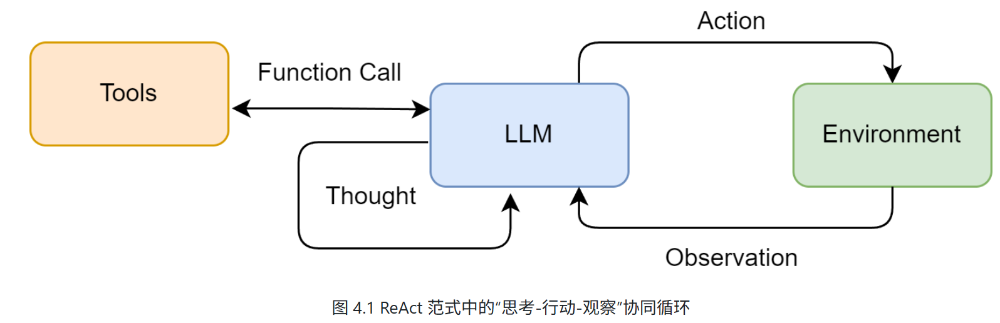

# Agent 基础

该笔记参考的课程链接：

- [Hello-Agents](https://github.com/datawhalechina/hello-agents)
- [菜鸟教程-AI Agent](https://www.runoob.com/ai-agent/ai-agent-tutorial.html)


## 一、初识智能体

### 1.1 **什么是智能体？**

**智能体的定义**：智能体是任何能够通过传感器（Sensors）感知其所处环境（Environment），并自主地通过执行器（Actuators）采取行动（Action）以达成特定目标的实体。

- 传感器感知环境：通过摄像头、麦克风、雷达或各类应用程序编程接口（API）捕获数据流
- 执行器采取行动：通过物理设备（如机械臂、方向盘）或虚拟工具（如执行一段代码、调用一个服务）


**1.1.1 传统视角下的智能体**：从简单到复杂、从被动反应到主动学习

1. 反射智能体（Simple Reflex Agent）：
    - 由明确设计的“条件-动作”规则构成
    - 完全依赖于当前的感知输入，不具备记忆或预测能力
    - 难以应对决策依据不足的环境
2. 基于模型的反射智能体（Model-Based Reflex Agent）：
    - 引入了”状态“的概念
    - 通过世界模型（World Model）追踪和理解环境中无法被直接感知的方面
3. 基于目标的智能体（Goal-Based Agent）：
    - 主动地、有预见性地选择能够导向某个特定未来状态的行动
4. 基于效用的智能体（Utility-Based Agent）：
    - 不再是简单地达成某个特定状态，而是最大化期望效用
5. 学习型智能体（Learning Agent）：
    - 强化学习（Reinforcement Learning, RL）是实现这一思想最具代表性的路径
    - 学习元件通过观察性能元件（前面的各类智能体）在环境中的行动所带来的结果来不断修正性能元件的决策策略

**1.1.2 大语言模型驱动的新范式**：

- 传统智能体的能力源于工程师的显式编程与知识构建，其行为模式是确定且有边界的
- LLM 智能体则通过在海量数据上的预训练，获得了隐式的世界模型与强大的涌现能力，使其能够以更灵活、更通用的方式应对复杂任务
- 从开发专用自动化工具转向构建能自主解决问题的系统。核心不再是编写代码，而是引导一个通用的“大脑”去规划、行动和学习

**1.1.3 智能体的类型**：

- 基于内部决策架构的分类：
    - 从简单的反应式智能体，到引入内部模型的模型式智能体，再到更具前瞻性的基于目标和基于效用的智能体
    - 此外，学习能力则是一种可赋予上述所有类型的元能力，使其能通过经验自我改进
- 基于时间与反应性的分类：追求速度的反应性（Reactivity）与追求最优解的规划性（Deliberation）之间如何权衡？
    - 反应式智能体：速度快、计算开销低
    - 规划式智能体：基于目标和基于效用的智能体是典型的规划式智能体
    - 混合式智能体：在一个“思考-行动-观察”的循环中运作
- 基于知识表示的分类：
    - 亚符号主义 AI：连接主义
    - 符号主义 AI：传统人工智能
    - 神经符号主义 AI：目标是创造出既能像神经网络一样从数据中学习，又能像符号系统一样进行逻辑推理的混合智能体

### 1.2 **智能体的构成与运行原理**

**1.2.1 任务环境定义（PEAS 模型）**：性能度量（Performance）、环境（Environment）、执行器（Actuators）和传感器（Sensors）

**任务环境特性**：

- 部分可观察的
- 确定或随机
- 多智能体
- 序贯且动态

**1.2.2 智能体的运行机制**：通过智能体循环（Agent Loop）持续与环境进行交互

1. 感知（Perception）：智能体通过其传感器（例如，API 的监听端口、用户输入接口）接收来自环境的输入信息（即观察）
    - 观察（Observation）：来自环境的信息，既可以是用户的初始指令，也可以是上一步行动所导致的环境状态变化反馈
2. 思考（Thought）：通常是由大语言模型驱动的内部推理过程
    - 规划（Planning）：将复杂目标分解为一系列更具体的子任务
    - 工具选择（Tool Selection）：从其可用的工具库中，选择最适合执行下一步骤的工具
3. 行动（Action）：决策完成后，智能体通过其执行器（Actuators）执行具体的行动。行动并非循环的终点。智能体的行动会引起环境的状态变化（State Change），环境随即会产生一个新的观察作为结果反馈。


**1.2.3 智能体的感知与行动**：

- 交互协议（Interaction Protocol）：用于规范智能体与环境之间的信息交换，输出遵循特定格式的文本
- Thought、Action、Observation 构成循环

```
// 一个正在规划旅行的智能体可能会生成如下格式化的输出：
Thought: 用户想知道北京的天气。我需要调用天气查询工具。
Action: get_weather("北京")

// 然后一个外部的解析器 (Parser) 会捕捉到这个指令，并调用相应的get_weather函数，可能返回一个包含详细天气数据的 JSON 对象
// 感知系统将这个原始输出处理并封装成一段简洁、清晰的自然语言文本，即观察
Observation: 北京当前天气为晴，气温25摄氏度，微风。
// 这段Observation文本会被反馈给智能体，作为下一轮循环的主要输入信息，供其进行新一轮的Thought和Action
```


### 1.3 **第一个智能体**

- 参考 [Hello-Agents 第一章](https://github.com/datawhalechina/hello-agents/blob/main/docs/chapter1/%E7%AC%AC%E4%B8%80%E7%AB%A0%20%E5%88%9D%E8%AF%86%E6%99%BA%E8%83%BD%E4%BD%93.md)

### 1.4 **智能体应用的协作模式**

**1.4.1 作为开发者工具的智能体**：增强而非取代开发者。

- 如 GitHub Copilot、Claude Code、Trae、Cursor 等 AI 编程辅助工具

**1.4.2 作为自主协作者的智能体**：独立地进行规划、推理、执行和反思。

- 单智能体自主循环：早期的典型范式（如 AgentGPT），核心是一个通用智能体通过“思考-规划-执行-反思”的闭环，不断进行自我提示和迭代，以完成一个开放式的高层级目标
- 多智能体协作：旨在通过模拟人类团队的协作模式来解决复杂问题。分为角色扮演式对话（如 CAMEL 框架）和组织化工作流（如 MetaGPT 和 CrewAI）
- 高级控制流架构：更侧重于为智能体提供更强大的底层工程基础（如 LangGraph 等框架）

**1.4.3 Workflow 和 Agent 的差异**：

- Workflow：对一系列任务或步骤进行预先定义的、结构化的编排
- Agent：具备自主性的、以目标为导向的系统

## 二、智能体发展史

- 参考 [Hello-Agents 第二章](https://github.com/datawhalechina/hello-agents/blob/main/docs/chapter2/%E7%AC%AC%E4%BA%8C%E7%AB%A0%20%E6%99%BA%E8%83%BD%E4%BD%93%E5%8F%91%E5%B1%95%E5%8F%B2.md)

## 三、大语言模型基础

### 3.1 **语言模型与 Transformer 架构**

- 参考 [Hello-Agents 第三章](https://github.com/datawhalechina/hello-agents/blob/main/docs/chapter3/%E7%AC%AC%E4%B8%89%E7%AB%A0%20%E5%A4%A7%E8%AF%AD%E8%A8%80%E6%A8%A1%E5%9E%8B%E5%9F%BA%E7%A1%80.md)

### 3.2 **与大语言模型交互**

**3.2.1 提示工程**：研究如何设计出精准的提示，从而引导模型产生期望输出的回复

**模型采样参数**：

- Temperature：温度是控制模型输出“随机性”与“确定性”的关键参数（控制Softmax输出）
- Top-k：限制候选 token 的数量（只保留前 k 个高概率 token）
- Top-p：限制候选 token 的数量（只保留前若干个高概率 token，使得概率之和超过阈值）

**提示的类型**：根据我们给模型提供示例（Example）的数量可分为：

- 零样本提示（Zero-shot Prompting）
- 单样本提示（One-shot Prompting）
- 少样本提示（Few-shot Prompting）

**指令调优（Instruction Tuning）**：一种微调技术，使用大量“指令-回答”格式的数据对预训练模型进行进一步的训练

- “文本补全”模型：需要用少样本提示“教会”模型做什么
- “指令调优”模型：可以直接下达指令

**基础提示技巧**：

- 角色扮演（Role-playing）：通过赋予模型一个特定的角色，我们可以引导它的回答风格、语气和知识范围，使其输出更符合特定场景的需求
- 上下文示例（In-context Example）：类似少样本提示，通过在提示中提供清晰的输入输出示例，来“教会”模型如何处理我们的请求，尤其适用于处理复杂格式或特定风格的任务

**思维链(Chain-of-Thought, CoT)**：一种强大的提示技巧，它通过引导模型“一步一步地思考”，提升了模型在复杂任务上的推理能力

- 实现 CoT 的关键：在提示中加入一句简单的引导语，如“请逐步思考”或“Let's think step by step”

**3.2.2 文本分词**：

- 分词（Tokenization）：将文本序列转换为数字序列的过程
- 分词器（Tokenizer）：定义一套规则，将原始文本切分成一个个最小的单元，即词元（Token）

**分词器对开发者的意义**：

- 上下文窗口限制：模型的上下文窗口（如 8K, 128K）是以 Token 数量计算的，而不是字符数或单词数。同样一段话，在不同语言（如中英文）或不同分词器下，Token 数量可能相差巨大
- API 成本：大多数模型 API 都是按 Token 数量计费的
- 模型表现的异常：有时模型的奇怪表现根源在于分词。例如，模型可能很擅长计算`2 + 2`，但对于`2+2`（没有空格）就可能出错，因为后者可能被分词器视为一个独立的、不常见的词元

**3.2.3 本地部署大语言模型**：对于许多需要处理敏感数据、希望离线运行或想精细控制成本的场景，将大语言模型直接部署在本地就显得至关重要。


### 3.3 **大语言模型的缩放法则与局限性**

**3.3.1 缩放法则（Scaling Laws）**：

- 缩放法则：在对数-对数坐标系下，模型的性能（通常用损失 Loss 来衡量）与参数量、数据量和计算量这三个因素都呈现出平滑的幂律关系
- Chinchilla 定律：指出在给定的计算预算下，为了达到最优性能，模型参数量和训练数据量之间存在一个最优配比
- 能力涌现：当模型规模达到一定阈值后，会突然展现出在小规模模型中完全不存在或表现不佳的全新能力。例如，链式思考 (Chain-of-Thought) 、指令遵循 (Instruction Following) 、多步推理、代码生成等能力，都是在模型参数量达到数百亿甚至千亿级别后才显著出现的。

**3.3.2 模型幻觉（Hallucination）**：指大语言模型生成的内容与客观事实、用户输入或上下文信息相矛盾，或者生成了不存在的事实、实体或事件

- 事实性幻觉（Factual Hallucinations）：模型生成与现实世界事实不符的信息
- 忠实性幻觉（Faithfulness Hallucinations）：在文本摘要、翻译等任务中，生成的内容未能忠实地反映源文本的含义
- 内在幻觉（Intrinsic Hallucinations）：模型生成的内容与输入信息直接矛盾

**检测和缓解幻觉的方法**：

- 数据层面： 通过高质量数据清洗、引入事实性知识以及强化学习与人类反馈（RLHF）等方式，从源头减少幻觉
- 模型层面： 探索新的模型架构，或让模型能够表达其对生成内容的不确定性
- 推理与生成层面
    - 检索增强生成（Retrieval-Augmented Generation, RAG）：目前缓解幻觉的有效方法之一。RAG 系统通过在生成之前从外部知识库（如文档数据库、网页）中检索相关信息，然后将检索到的信息作为上下文，引导模型生成基于事实的回答
    - 多步推理与验证：引导模型进行多步推理，并在每一步进行自我检查或外部验证
    - 引入外部工具：允许模型调用外部工具（如搜索引擎、计算器、代码解释器）来获取实时信息或进行精确计算

## 四、智能体经典范式构建

**智能体经典范式**：为了更好地组织智能体的“思考”与“行动”过程，业界涌现出了多种经典的架构范式

- ReAct (Reasoning and Acting)： 一种将“思考”和“行动”紧密结合的范式，让智能体边想边做，动态调整。
- Plan-and-Solve： 一种“三思而后行”的范式，智能体首先生成一个完整的行动计划，然后严格执行。
- Reflection： 一种赋予智能体“反思”能力的范式，通过自我批判和修正来优化结果。

### 4.1 **LLM 客户端准备**

### 4.2 **ReAct**

**4.2.1 ReAct 工作流程**：

- 不断重复 Thought -> Action -> Observation 的循环
- 适用场景：
    - 需要外部知识的任务：如查询实时信息（天气、新闻、股价）、搜索专业领域的知识等。
    - 需要精确计算的任务：将数学问题交给计算器工具，避免LLM的计算错误。
    - 需要与API交互的任务：如操作数据库、调用某个服务的API来完成特定功能。



**4.2.2 工具的定义与实现**：如果说大语言模型是智能体的大脑，那么工具 (Tools) 就是其与外部世界交互的“手和脚”。为了让ReAct范式能够真正解决我们设定的问题，智能体需要具备调用外部工具的能力。

**案例**：

- 问题：华为最新的手机是哪一款？它的主要卖点是什么？这个问题需要智能体理解自己需要上网搜索，调用工具搜索结果并总结答案
- 工具选择：选用 SerpApi，它通过 API 提供结构化的 Google 搜索结果，能直接返回“答案摘要框”或精确的知识图谱信息

**4.2.3 ReAct 智能体的编码实现**：

**4.2.4 ReAct 的特点、局限性与调试技巧**：

- 特点：
    - 高可解释性
    - 动态规划与纠错能力
    - 工具协同能力
- 局限性：
    - 对LLM自身能力的强依赖
    - 执行效率问题
    - 提示词的脆弱性
    - 可能陷入局部最优
  - 调试技巧：
    - 检查完整的提示词
    - 分析原始输出
    - 验证工具的输入与输出
    - 调整提示词中的示例 (Few-shot Prompting)
    - 尝试不同的模型或参数

### 4.3 **Plan-and-Solve**

**4.3.1 Plan-and-Solve 的工作原理**：将任务处理明确地分为两个阶段：先规划 (Plan)，后执行 (Solve)

- 动机：为了解决思维链在处理多步骤、复杂问题时容易“偏离轨道”的问题
- 规划阶段 (Planning Phase)：首先，智能体会接收用户的完整问题。它的第一个任务不是直接去解决问题或调用工具，而是将问题分解，并制定出一个清晰、分步骤的行动计划。这个计划本身就是一次大语言模型的调用产物。
- 执行阶段 (Solving Phase)：在获得完整的计划后，智能体进入执行阶段。它会严格按照计划中的步骤，逐一执行。每一步的执行都可能是一次独立的 LLM 调用，或者是对上一步结果的加工处理，直到计划中的所有步骤都完成，最终得出答案。

**Plan-and-Solve 的适用场景**：尤其适用于那些结构性强、可以被清晰分解的复杂任务

- 多步数学应用题：需要先列出计算步骤，再逐一求解。
- 需要整合多个信息源的报告撰写：需要先规划好报告结构（引言、数据来源A、数据来源B、总结），再逐一填充内容。
- 代码生成任务：需要先构思好函数、类和模块的结构，再逐一实现。

**4.3.2 规划阶段**：规划阶段的目标是让大语言模型接收原始问题，并输出一个清晰、分步骤的行动计划。这个计划必须是结构化的。

`````python
PLANNER_PROMPT_TEMPLATE = """
你是一个顶级的AI规划专家。你的任务是将用户提出的复杂问题分解成一个由多个简单步骤组成的行动计划。
请确保计划中的每个步骤都是一个独立的、可执行的子任务，并且严格按照逻辑顺序排列。
你的输出必须是一个Python列表，其中每个元素都是一个描述子任务的字符串。

问题: {question}

请严格按照以下格式输出你的计划,```python与```作为前后缀是必要的:
```python
["步骤1", "步骤2", "步骤3", ...]
```
"""
`````

**4.3.3 执行器与状态管理**：在规划器 (Planner) 生成了清晰的行动蓝图后，我们就需要一个执行器 (Executor) 来逐一完成计划中的任务。执行器不仅负责调用大语言模型来解决每个子问题，还承担着一个至关重要的角色：状态管理。它必须记录每一步的执行结果，并将其作为上下文提供给后续步骤，确保信息在整个任务链条中顺畅流动

**提示词需要包含以下关键信息**：

- 原始问题：确保模型始终了解最终目标。
- 完整计划：让模型了解当前步骤在整个任务中的位置。
- 历史步骤与结果：提供至今为止已经完成的工作，作为当前步骤的直接输入。
- 当前步骤：明确指示模型现在需要解决哪一个具体任务。

`````python
EXECUTOR_PROMPT_TEMPLATE = """
你是一位顶级的AI执行专家。你的任务是严格按照给定的计划，一步步地解决问题。
你将收到原始问题、完整的计划、以及到目前为止已经完成的步骤和结果。
请你专注于解决“当前步骤”，并仅输出该步骤的最终答案，不要输出任何额外的解释或对话。

# 原始问题:
{question}

# 完整计划:
{plan}

# 历史步骤与结果:
{history}

# 当前步骤:
{current_step}

请仅输出针对“当前步骤”的回答:
"""
`````

### 4.4 **Reflection**

**4.4.1 Reflection 机制的核心思想**：工作流程可以概括为一个简洁的三步循环：执行 -> 反思 -> 优化

- 执行 (Execution)：首先，智能体使用我们熟悉的方法（如 ReAct 或 Plan-and-Solve）尝试完成任务，生成一个初步的解决方案或行动轨迹。这可以看作是“初稿”。
- 反思 (Reflection)：接着，智能体进入反思阶段。它会调用一个独立的、或者带有特殊提示词的大语言模型实例，来扮演一个“评审员”的角色。这个“评审员”会审视第一步生成的“初稿”，并从多个维度进行评估，根据评估，它会生成一段结构化的反馈 (Feedback)，指出具体的问题所在和改进建议。
    - 事实性错误：是否存在与常识或已知事实相悖的内容？
    - 逻辑漏洞：推理过程是否存在不连贯或矛盾之处？
    - 效率问题：是否有更直接、更简洁的路径来完成任务？
    - 遗漏信息：是否忽略了问题的某些关键约束或方面？
- 优化 (Refinement)：最后，智能体将“初稿”和“反馈”作为新的上下文，再次调用大语言模型，要求它根据反馈内容对初稿进行修正，生成一个更完善的“修订稿”。

