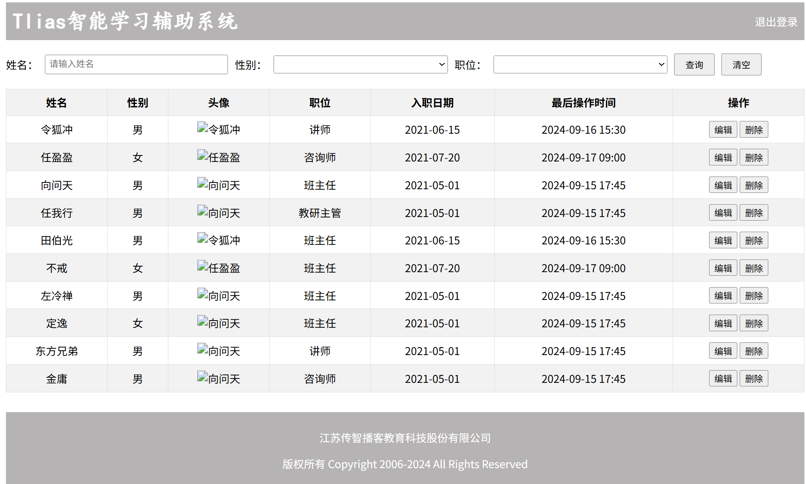

# HTML-CSS

该笔记参考的课程链接：

- [黑马程序员 AI+JavaWeb](https://www.bilibili.com/video/BV1yGydYEE3H?spm_id_from=333.788.videopod.episodes&vd_source=46f99c7c1ed609a31f70615a4551767f&p=2)


## 一、HTML-CSS

### 1.1 **HTML-CSS 入门**

**Web 标准**：Web 标准也称网页标准，由一系列的标准组成，大部分由 W3C (World WideWeb Consortium，万维网联盟) 负责制定

**网页的组成**：

- HTML：超文本标记语言，用于创建网页结构
- CSS：层叠样式表，用于创建网页样式
- JavaScript：脚本语言，用于创建网页交互

**HTML（HyperText Markup Language）**：超文本标记语言，用于定义网页内容的含义和结构

- 超文本：超越了文本的限制，比普通文本更强大。除了文字信息，还可以定义图片、音频、视频等内容。
- 标记语言：由标签`<标签名>`构成的语言
- [HTML官方文档](https://developer.mozilla.org/zh-CN/docs/Web/HTML)

**CSS（Cascading Style Sheet）**：层叠样式表，用于控制页面的样式（表现）。

- [CSS官方文档](https://developer.mozilla.org/zh-CN/docs/Web/CSS)

**HTML 基本骨架标签**：

```html
<html>
    <head>
        <title>HTML快速入门</title>
    </head>
    <body>
        <h1>这是一个一级标题</h1>
        
        <p>这是一个段落</p>
    </body>
</html>
```

**前端开发工具**：VS code

### 1.2 **HTML-CSS 常见标签和样式**

**1.2.1 标题排版**：

**标题标签**：`<h1>一级标题</h1>` ~ `<h6>六级标题</h6>`

**超链接标签**：`<a href="https://www.cctv.com">央视网</a>`

<details>
<summary>点击展开完整代码</summary>

```html
<!DOCTYPE html>
<html lang="en">
<head>
  <meta charset="UTF-8">
  <meta name="viewport" content="width=device-width, initial-scale=1.0">
  <title>【新思想引领新征程】推进长江十年禁渔 谱写长江大保护新篇章</title>
</head>
<body>
  <!-- 定义一个标题, 标题内容: 【新思想引领新征程】推进长江十年禁渔 谱写长江大保护新篇章 -->
  <h1>【新思想引领新征程】推进长江十年禁渔 谱写长江大保护新篇章</h1>

  <!-- 定义一个超链接, 里面展示 央视网 -->
  <!-- a 超链接标签:
        href: 链接地址 - url地址
        target: 打开方式 
          _blank: 新窗口打开
          _self: 本窗口打开(默认)
    -->
  <a href="https://www.cctv.com" target="_blank">央视网</a> 
  2024年05月15日 20:07

</body>
</html>
```

</details>

**1.2.2 标题样式**：

**CSS 样式**：

1. 行内样式：body 内定义`<span style="color: gray;">2024年05月15日 20:07</span>`
2. 内部样式：head 内定义`<style>span{color: gray;}</style>`
3. 外部样式：.css 文件内定义，然后 head 内引入该文件 `<link rel="stylesheet" href="css/news.css">`

<details>
<summary>点击展开完整代码</summary>

```html
<!DOCTYPE html>
<html lang="en">
<head>
  <meta charset="UTF-8">
  <meta name="viewport" content="width=device-width, initial-scale=1.0">
  <title>【新思想引领新征程】推进长江十年禁渔 谱写长江大保护新篇章</title>
    
  <!-- 方式二: 内部样式 -->
  <style>
    span{
      /* 关键字 */
      /* color: gray; */

      /* RGB表示法 */
      /* color: rgb(255, 120, 0); */

      /* RGBA表示法 */
      /* color: rgba(255, 120, 0, 0); */

      /* 十六进制表示法 */
      /* color: #0000ff; */
      color: #b2b2b2;
    }
  </style>

  <!-- 方式三: 外部样式 -->
  <!-- <link rel="stylesheet" href="css/news.css"> -->
</head>

<body>
  <h1>【新思想引领新征程】推进长江十年禁渔 谱写长江大保护新篇章</h1>
  
  <a href="https://www.cctv.com" target="_blank">央视网</a> 

  <!-- 方式一: 行内样式 -->
  <!-- <span style="color: gray;">2024年05月15日 20:07</span> -->

</body>
</html>
```

</details>

**CSS 选择器**：

- 元素选择器：`元素名{}`
- 类选择器：`.类名{}`
- ID选择器：`#ID名{}`
- ……

<details>
<summary>点击展开完整代码</summary>

```html
<!DOCTYPE html>
<html lang="en">
<head>
  <meta charset="UTF-8">
  <meta name="viewport" content="width=device-width, initial-scale=1.0">
  <title>【新思想引领新征程】推进长江十年禁渔 谱写长江大保护新篇章</title>
  <style>
    /* 元素选择器 */
    /* span {
      color: #b2b2b2;
    } */

    /* 类选择器 */
    /* .cls {
      color: #ff0000;
    } */

    /* ID选择器 */
    #time {
      color: #b2b2b2;
    }

    a {
      /* 去除超链接下方的下划线 */
      text-decoration: none;
    }
  </style>
</head>

<body>
  <h1>【新思想引领新征程】推进长江十年禁渔 谱写长江大保护新篇章</h1>
  
  <a href="https://www.cctv.com" target="_blank">央视网</a>
  
  <span class="cls" id="time">2024年05月15日 20:07</span>

</body>
</html>
```

</details>

**1.2.3 正文排版**：

**视频标签**：`<video src="视频地址" controls width="80%"></video>`

**图片标签**：` </img>`

> 宽度和高度只设置一个即可, 另一个会等比例缩放

**段落标签**：`<p>段落</p>`

**1.2.4 正文样式**：

**加粗**：

- `<b>加粗文本</b>`
- `<strong>央视网消息</strong>`

**下划线**：

- `<u>下划线文本</u>`
- `<ins>插入的文本</ins>`

**斜体**：

- `<i>斜体文本</i>`
- `<em>强调的文本</em>`

**删除线**：

- `<s>删除的文本</s>`
- `<del>删除的文本</del>`

**字符实体**：

- `&nbsp;`：空格
- `&lt;`：小于符号
- `&gt;`：大于符号

**首行缩进**：

- `&nbsp;&nbsp;&nbsp;&nbsp;`
  - CSS 样式：`p{text-indent: 2em;}`

**1.2.5 整体布局**：

**盒子模型**：包括内容（content）、内边距（padding）、边框（border）、外边距（margin）

**布局标签-块标签**：`<div></div>`

**布局标签-内联标签**：`<span></span>`

- 包裹行内内容
- 不会换行

**页面原型**：指在应用程序开发初期，由产品经理制作的一个早期项目模型，它用于展示页面的基本布局、功能和交互设计。通常用来帮助设计师、开发者等更好地理解和讨论最终产品的外观和行为。


**1.2.6 表单**：

**表单标签**：`<form>表单内容</form>`

<details>
<summary>点击展开完整代码</summary>

```html
<!DOCTYPE html>
<html lang="en">
<head>
  <meta charset="UTF-8">
  <meta name="viewport" content="width=device-width, initial-scale=1.0">
  <title>表单标签</title>
</head>
<body>
  <!-- form表单:
        action: 表单数据提交的url地址
        method: 提交方式
          get: 默认, 表单数据会出现在url后面, 形式: /save?name=Tom&age=18
            特点:
              1. 如果表单中包含了隐私数据, get方式并不安全, 不推荐使用该方式.
              2. 在浏览器中get请求的大小是有限制的, 不适合提交大数据量的表单.
          post: 表单数据会在消息体/请求体中提交到服务器
            特点: 
              1. 安全.
              2. 请求大小没有限制
      注意: 表单项要想能够采集数据, 必须得设置name属性, 表示当前表单项的名字
  -->
  <form action="/save" method="post">
    姓名: <input type="text" name="name">
    年龄: <input type="text" name="age">
    <input type="submit" value="提交">
  </form>
</body>
</html>
```

</details>

**表单项标签**：

- `<input>`：通过`type`属性定义不同类型的表单项。`type`属性可取：
    - `"text"`、`"password"`、`"radio"`、`"checkbox"`、`"file"`、`"date"`、`"time"`、`"datetime-local"`等
    - 按钮类型`"button"`、`"reset"`、`"submit"`
- `<select></select>`：定义下拉列表
- `<textarea></textarea>`：定义文本域

<details>
<summary>点击展开完整代码</summary>

```html
<!DOCTYPE html>
<html lang="en">
<head>
    <meta charset="UTF-8">
    <meta http-equiv="X-UA-Compatible" content="IE=edge">
    <meta name="viewport" content="width=device-width, initial-scale=1.0">
    <title>HTML-表单项标签</title>
</head>
<body>

<!-- value: 表单项提交的值 -->
<form action="/save" method="post">
     <!-- input定义标签，包括各种type属性 -->
     姓名: <input type="text" name="name"> <br><br>

     密码: <input type="password" name="password"> <br><br> 

     性别: <input type="radio" name="gender" value="1"> 男
          <!-- 加了label将选项与文本关联，选中范围更大，点击文本也能选中 -->
          <label><input type="radio" name="gender" value="2"> 女 </label> <br><br>
     
     爱好: <label><input type="checkbox" name="hobby" value="java"> java </label>
          <label><input type="checkbox" name="hobby" value="game"> game </label>
          <label><input type="checkbox" name="hobby" value="sing"> sing </label> <br><br>
     
     图像: <input type="file" name="image">  <br><br>

     生日: <input type="date" name="birthday"> <br><br>

     时间: <input type="time" name="time"> <br><br>

     日期时间: <input type="datetime-local" name="datetime"> <br><br>

     <!-- select定义下拉列表 -->
     学历: <select name="degree">
               <option value="">----------- 请选择 -----------</option>
               <option value="1">大专</option>
               <option value="2">本科</option>
               <option value="3">硕士</option>
               <option value="4">博士</option>
          </select>  <br><br>
     
     <!-- textarea定义文本域 -->
     描述: <textarea name="description" cols="30" rows="10"></textarea>  <br><br>
     
     <input type="hidden" name="id" value="1">

     <!-- 表单常见按钮 -->
     <input type="button" value="按钮">
     <input type="reset" value="重置"> 
     <input type="submit" value="提交">   
     <br>
</form>

</body>
</html>
```

</details>

### 1.3 **Vibe Coding 案例-员工管理页面制作**

**提示词-①顶部导航栏**：

```
你是一名前端开发工程师，现需要制作一个HTML页面，这个页面共分为4个部分，先实现第一个部分-顶部导航栏。具体需求如下:
1.内容:要展示一个醒目(加粗加粗展示)的标题，标题内容:Tlias智能学习辅助系统;还要展示一个"退出登录”的超链接。
2.布局:标题和退出登录的超链接，展示在一行里面。 标题居左显示，退出登录的超链接居右展示。
3.给整个顶部导航栏，设置一个灰色的背景色。
请帮我生成这个HTML页面。
```

**提示词-②搜索表单区域**：

```
接下来，再帮我生成第二个部分-搜索表单区域，具体说明如下:
1.组成:包括三个表单项和两个操作按钮。
  1.1表单项具体为:姓名(文本输入框)、性别(下拉选择，选项包括 男/女，默认为空)、职位(下拉选择，选项包括班主任、讲师、学工主管、教研主管、咨询师，默认为空)。
  1.2两个按钮:“查询”与“清空”按钮，用于提交表单或重置表单项
2.布局:所有表单项及按钮需水平排列于一行，确保美观大气
```

**提示词-③表格展示区**：

```
再继续帮我生成第三个部分-表格展示区:
1.表格结构:展示列包括姓名、性别(显示男/女)、头像(小图片展示)、职位(显示班主任/讲师/学工主管/教研主管/咨询师)、入职日期、最后操作时间、操作(里包含两个按钮编辑与删除)
2.测试数据:基于《笑傲江湖》小说人物在表格中生成3条测试数据，每条数据应包含上述所有列的信息，以体现实际应用场景
3.样式:可适当调整表格样式，确保美观大气。
```

**提示词-④页脚版权区域**：

```
再继续帮我生成第四个部分-页脚版权区域
1.内容:第一行显示公司全称“江苏传智播客教育科技股份有限公司”:第二行展示版权信息，"版权所有 Copyright 2006-2024 Al1 Rights Reservedh
2.设计:该区域应具有灰色背景，字体颜色为白色，居中对齐，以营造专业且统一的视觉效果:
```

**AI 生成代码**：

<details>
<summary>点击展开完整代码</summary>

```html
<!DOCTYPE html>
<html lang="zh-CN">
<head>
    <meta charset="UTF-8">
    <title>Tlias智能学习辅助系统</title>
    <style>
        /* 导航栏样式 */
        .navbar {
            background-color: #b5b3b3; /* 灰色背景 */
            
            display: flex; /* flex弹性布局 */
            justify-content: space-between; /* 左右对齐 */

            padding: 10px; /* 内边距 */
            align-items: center; /* 垂直居中 */
        }
        .navbar h1 {
            margin: 0; /* 移除默认的上下外边距 */
            font-weight: bold; /* 加粗 */
            color: white;
            /* 设置字体为楷体 */
            font-family: "楷体";
        }
        .navbar a {
            color: white; /* 链接颜色为白色 */
            text-decoration: none; /* 移除下划线 */
        }

        /* 搜索表单样式 */
        .search-form {
            display: flex;
            flex-wrap: nowrap;
            align-items: center;
            gap: 10px; /* 控件之间的间距 */
            margin: 20px 0;
        }
        .search-form input[type="text"], .search-form select {
            padding: 5px; /* 输入框内边距 */
            width: 260px; /* 宽度 */
        }
        .search-form button {
            padding: 5px 15px; /* 按钮内边距 */
        }

        /* 表格样式 */
        table {
            width: 100%;
            border-collapse: collapse;
        }
        th, td {
            border: 1px solid #ddd; /* 边框 */
            padding: 8px; /* 单元格内边距 */
            text-align: center; /* 左对齐 */
        }
        th {
            background-color: #f2f2f2;
            font-weight: bold;
        }
        tr:nth-child(even) {
            background-color: #f2f2f2;
        }
        .avatar {
            width: 30px;
            height: 30px;
        }

        /* 页脚样式 */
        .footer {
            background-color: #b5b3b3; /* 灰色背景 */
            color: white; /* 白色文字 */
            text-align: center; /* 居中文本 */
            padding: 10px 0; /* 上下内边距 */
            margin-top: 30px;
        }

        #container {
            width: 80%; /* 宽度为80% */
            margin: 0 auto; /* 水平居中 */
        }
    </style>
</head>
<body>
    <div id="container">
        <!-- 顶部导航栏 -->
        <div class="navbar">
            <h1>Tlias智能学习辅助系统</h1>
            <a href="#">退出登录</a>
        </div>

        <!-- 搜索表单区域 -->
        <form class="search-form" action="/search" method="post">
            <label for="name">姓名：</label>
            <input type="text" id="name" name="name" placeholder="请输入姓名">

            <label for="gender">性别：</label>
            <select id="gender" name="gender">
                <option value=""></option>
                <option value="1">男</option>
                <option value="2">女</option>
            </select>

            <label for="position">职位：</label>
            <select id="position" name="position">
                <option value=""></option>
                <option value="1">班主任</option>
                <option value="2">讲师</option>
                <option value="3">学工主管</option>
                <option value="4">教研主管</option>
                <option value="5">咨询师</option>
            </select>

            <button type="submit">查询</button>
            <button type="reset">清空</button>
        </form>

        <!-- 表格展示区 -->
        <table>
            <!-- 表头 -->
            <thead>
                <tr>
                    <th>姓名</th>
                    <th>性别</th>
                    <th>头像</th>
                    <th>职位</th>
                    <th>入职日期</th>
                    <th>最后操作时间</th>
                    <th>操作</th>
                </tr>
            </thead>

            <!-- 表格主体内容 -->
            <tbody>
                <tr>
                    <td>令狐冲</td>
                    <td>男</td>
                    <td></td>
                    <td>讲师</td>
                    <td>2021-06-15</td>
                    <td>2024-09-16 15:30</td>
                    <td class="action-buttons">
                        <button type="button">编辑</button>
                        <button type="button">删除</button>
                    </td>
                </tr>
                <tr>
                    <td>任盈盈</td>
                    <td>女</td>
                    <td></td>
                    <td>咨询师</td>
                    <td>2021-07-20</td>
                    <td>2024-09-17 09:00</td>
                    <td class="action-buttons">
                        <button type="button">编辑</button>
                        <button type="button">删除</button>
                    </td>
                </tr>
                <tr>
                    <td>向问天</td>
                    <td>男</td>
                    <td></td>
                    <td>班主任</td>
                    <td>2021-05-01</td>
                    <td>2024-09-15 17:45</td>
                    <td class="action-buttons">
                        <button type="button">编辑</button>
                        <button type="button">删除</button>
                    </td>
                </tr>
                <tr>
                    <td>任我行</td>
                    <td>男</td>
                    <td></td>
                    <td>教研主管</td>
                    <td>2021-05-01</td>
                    <td>2024-09-15 17:45</td>
                    <td class="action-buttons">
                        <button type="button">编辑</button>
                        <button type="button">删除</button>
                    </td>
                </tr>
                <tr>
                    <td>田伯光</td>
                    <td>男</td>
                    <td></td>
                    <td>班主任</td>
                    <td>2021-06-15</td>
                    <td>2024-09-16 15:30</td>
                    <td class="action-buttons">
                        <button type="button">编辑</button>
                        <button type="button">删除</button>
                    </td>
                </tr>
                <tr>
                    <td>不戒</td>
                    <td>女</td>
                    <td></td>
                    <td>班主任</td>
                    <td>2021-07-20</td>
                    <td>2024-09-17 09:00</td>
                    <td class="action-buttons">
                        <button type="button">编辑</button>
                        <button type="button">删除</button>
                    </td>
                </tr>
                <tr>
                    <td>左冷禅</td>
                    <td>男</td>
                    <td></td>
                    <td>班主任</td>
                    <td>2021-05-01</td>
                    <td>2024-09-15 17:45</td>
                    <td class="action-buttons">
                        <button type="button">编辑</button>
                        <button type="button">删除</button>
                    </td>
                </tr>
                <tr>
                    <td>定逸</td>
                    <td>女</td>
                    <td></td>
                    <td>班主任</td>
                    <td>2021-05-01</td>
                    <td>2024-09-15 17:45</td>
                    <td class="action-buttons">
                        <button type="button">编辑</button>
                        <button type="button">删除</button>
                    </td>
                </tr>
                <tr>
                    <td>东方兄弟</td>
                    <td>男</td>
                    <td></td>
                    <td>讲师</td>
                    <td>2021-05-01</td>
                    <td>2024-09-15 17:45</td>
                    <td class="action-buttons">
                        <button type="button">编辑</button>
                        <button type="button">删除</button>
                    </td>
                </tr>
                <tr>
                    <td>金庸</td>
                    <td>男</td>
                    <td></td>
                    <td>咨询师</td>
                    <td>2021-05-01</td>
                    <td>2024-09-15 17:45</td>
                    <td class="action-buttons">
                        <button type="button">编辑</button>
                        <button type="button">删除</button>
                    </td>
                </tr>
            </tbody>
        </table>

        <!-- 页脚版权区域 -->
        <footer class="footer">
            <p>江苏传智播客教育科技股份有限公司</p>
            <p>版权所有 Copyright 2006-2024 All Rights Reserved</p>
        </footer>
    </div>
</body>
</html>
```

</details>

**效果**：


