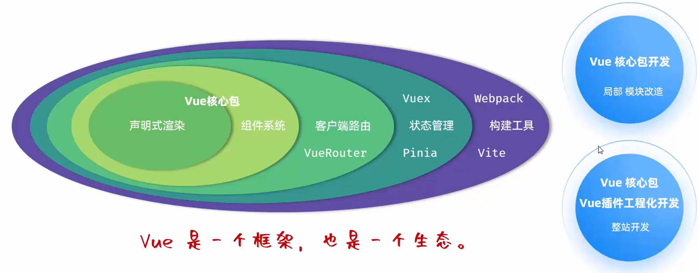
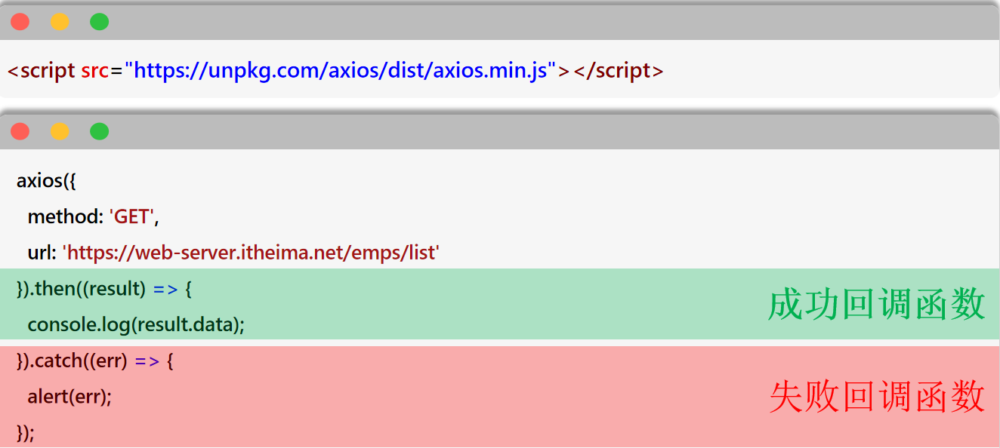

# Vue


## 一、Vue

### 1.1 **Vue 快速入门**

**Vue 简介**：Vue 是一款用于**构建用户界面**的**渐进式**的 JavaScript **框架**

- **构建用户界面**：基于数据（如服务端返回的原始数据）渲染出用户看到的界面
- **渐进式**：根据需求选择 Vue 提供的功能
- **框架**：一套完整的项目解决方案，用于快速构建项目（大大提升前端项目的开发效率）
- [Vue 官网](https://cn.vuejs.org/)



**Vue 的使用步骤**：

```html
<body>
  <!-- 3. 准备元素（div），被 Vue 控制 -->
  <div id="app">
    <!-- 通过插值表达式渲染页面 -->
    <h1>{{message}}</h1> 
    <h1>{{count}}</h1>
  </div>
  
  <script type="module">
    // 1. 引入 Vue 模块（通过 CDN 以及原生 ES 模块使用 Vue）
    import { createApp } from 'https://unpkg.com/vue@3/dist/vue.esm-browser.js';

    // 2. 创建 Vue 的应用实例，控制视图的元素
    createApp({
      data() {
        // 准备数据
        return {
          message: 'Hello Vue',
          count: 100
        }
      }
    }).mount('#app');
  </script>
</body>
```

### 1.2 **Vue 常用指令**

**指令**：HTML 标签上带有`v-`前缀的特殊属性，不同的指令具有不同的含义，可以实现不同的功能

```html
<div>
  <p v-xxx="..."></p>
</div>
```

**`v-for`**：

- 作用：列表渲染，遍历容器的元素或者对象的属性
- 语法：`<tr v-for="(item, index) in items" :key="item.id"> {{item}}</tr>`

> key: 唯一标识，推荐使用 id 作为 key

**`v-bind`**：

- 作用：动态为 HTML 标签绑定属性值
- 语法：`v-bind:属性名="属性值"`

**`v-if`**：

- 作用：控制元素的显示和隐藏
- 语法：`v-if="表达式"`、`v-else-if="表达式"`、`v-else="表达式"`，表达式为 true 才渲染
- 原理：基于条件判断，来控制创建或移除元素节点（**条件渲染**）
- 场景：不频繁切换

**`v-show`**：

- 作用：控制元素的显示和隐藏
- 语法：`v-show="表达式"`，表达式为 true 才显示
- 原理：基于 CSS 样式 display 来控制显示与隐藏（**渲染后条件显示**）
- 场景：频繁切换

**`v-model`**：

- 作用：在表单元素上使用，双向数据绑定。可以方便的 获取 或 设置 表单项数据
- 语法：`v-model="变量名”`

**`v-on`**：

- 作用：为 html 标签绑定事件（添加事件监听）
- 语法：`v-on:事件名="方法名"`，简写为`@事件名="..."`

**Vue 案例-员工列表**：

<details>
<summary>点击展开完整代码</summary>

```html
<!DOCTYPE html>
<html lang="zh-CN">
<head>
    <meta charset="UTF-8">
    <title>Tlias智能学习辅助系统</title>
    <style>
        /* 导航栏样式 */
        .navbar {
            background-color: #b5b3b3; /* 灰色背景 */
            
            display: flex; /* flex弹性布局 */
            justify-content: space-between; /* 左右对齐 */

            padding: 10px; /* 内边距 */
            align-items: center; /* 垂直居中 */
        }
        .navbar h1 {
            margin: 0; /* 移除默认的上下外边距 */
            font-weight: bold; /* 加粗 */
            color: white;
            /* 设置字体为楷体 */
            font-family: "楷体";
        }
        .navbar a {
            color: white; /* 链接颜色为白色 */
            text-decoration: none; /* 移除下划线 */
        }

        /* 搜索表单样式 */
        .search-form {
            display: flex;
            flex-wrap: nowrap;
            align-items: center;
            gap: 10px; /* 控件之间的间距 */
            margin: 20px 0;
        }
        .search-form input[type="text"], .search-form select {
            padding: 5px; /* 输入框内边距 */
            width: 260px; /* 宽度 */
        }
        .search-form button {
            padding: 5px 15px; /* 按钮内边距 */
        }

        /* 表格样式 */
        table {
            width: 100%;
            border-collapse: collapse;
        }
        th, td {
            border: 1px solid #ddd; /* 边框 */
            padding: 8px; /* 单元格内边距 */
            text-align: center; /* 左对齐 */
        }
        th {
            background-color: #f2f2f2;
            font-weight: bold;
        }
        .avatar {
            width: 30px;
            height: 30px;
        }

        /* 页脚样式 */
        .footer {
            background-color: #b5b3b3; /* 灰色背景 */
            color: white; /* 白色文字 */
            text-align: center; /* 居中文本 */
            padding: 10px 0; /* 上下内边距 */
            margin-top: 30px;
        }

        #container {
            width: 80%; /* 宽度为80% */
            margin: 0 auto; /* 水平居中 */
        }
    </style>
</head>
<body>
    <div id="container">
        <!-- 顶部导航栏 -->
        <div class="navbar">
            <h1>Tlias智能学习辅助系统</h1>
            <a href="#">退出登录</a>
        </div>
        
        {{searchForm}}
        <!-- 搜索表单区域 -->
        <form class="search-form">
            <label for="name">姓名：</label>
            <input type="text" id="name" name="name" v-model="searchForm.name" placeholder="请输入姓名">

            <label for="gender">性别：</label>
            <select id="gender" name="gender" v-model="searchForm.gender">
                <option value=""></option>
                <option value="1">男</option>
                <option value="2">女</option>
            </select>

            <label for="position">职位：</label>
            <select id="position" name="position" v-model="searchForm.job">
                <option value=""></option>
                <option value="1">班主任</option>
                <option value="2">讲师</option>
                <option value="3">学工主管</option>
                <option value="4">教研主管</option>
                <option value="5">咨询师</option>
            </select>

            <button type="button" v-on:click="search">查询</button>
            <button type="button" @click="clear">清空</button>
        </form>


        <!-- 表格展示区 -->
        <table>
            <!-- 表头 -->
            <thead>
                <tr>
                    <th>序号</th>
                    <th>姓名</th>
                    <th>性别</th>
                    <th>头像</th>
                    <th>职位</th>
                    <th>入职日期</th>
                    <th>最后操作时间</th>
                    <th>操作</th>
                </tr>
            </thead>

            <!-- 表格主体内容 -->
            <tbody>
                <!-- key相当于主键？ -->
                <tr v-for="(e, index) in empList" :key="e.id">
                    <td>{{index + 1}}</td>
                    <td>{{e.name}}</td>
                    <td>{{e.gender == 1?'男' : '女'}}</td>

                    <!-- 插值表达式是不能出现在标签内部 -->
                    <td></td>

                    <!-- v-if: 控制元素的显示与隐藏 -->
                     <!-- 选择性渲染并显示，适用于不频繁切换的情况 -->
                    <td>
                        <span v-if="e.job == 1">班主任</span>
                        <span v-else-if="e.job == 2">讲师</span>
                        <span v-else-if="e.job == 3">学工主管</span>
                        <span v-else-if="e.job == 4">教研主管</span>
                        <span v-else-if="e.job == 5">咨询师</span>
                        <span v-else>其他</span>
                    </td>

                    <!-- v-show: 控制元素的显示与隐藏 -->
                     <!-- 全部渲染并选择性显示，适用于频繁切换的情况 -->
                    <!-- <td>
                        <span v-show="e.job == 1">班主任</span>
                        <span v-show="e.job == 2">讲师</span>
                        <span v-show="e.job == 3">学工主管</span>
                        <span v-show="e.job == 4">教研主管</span>
                        <span v-show="e.job == 5">咨询师</span>
                    </td> -->

                    <td>{{e.entrydate}}</td>
                    <td>{{e.updatetime}}</td>
                    <td class="action-buttons">
                        <button type="button">编辑</button>
                        <button type="button">删除</button>
                    </td>
                </tr>
            </tbody>
        </table>

        <!-- 页脚版权区域 -->
        <footer class="footer">
            <p>江苏传智播客教育科技股份有限公司</p>
            <p>版权所有 Copyright 2006-2024 All Rights Reserved</p>
        </footer>
    </div>
    

    <script type="module">
      import { createApp } from 'https://unpkg.com/vue@3/dist/vue.esm-browser.js'

      createApp({
        data() {
          return {
            // 定义v-model绑定的表单数据对象(双向绑定，数据模型和视图互相影响)
            searchForm: { //封装用户输入的查询条件
                name: '',
                gender: '',
                job: ''
            },
            //定义v-for绑定的表格数据对象
            empList: [
              { "id": 1,
                "name": "谢逊",
                "image": "https://web-framework.oss-cn-hangzhou.aliyuncs.com/2023/4.jpg",
                "gender": 1,
                "job": "1",
                "entrydate": "2023-06-09",
                "updatetime": "2024-09-30T14:59:38"
              },
              {
                "id": 2,
                "name": "韦一笑",
                "image": "https://web-framework.oss-cn-hangzhou.aliyuncs.com/2023/1.jpg",
                "gender": 1,
                "job": "1",
                "entrydate": "2020-05-09",
                "updatetime": "2024-09-01T00:00:00"
              },
              {
                "id": 3,
                "name": "黛绮丝",
                "image": "https://web-framework.oss-cn-hangzhou.aliyuncs.com/2023/2.jpg",
                "gender": 2,
                "job": "2",
                "entrydate": "2021-06-01",
                "updatetime": "2024-09-01T00:00:00"
              }
            ]
          }
        },
        //方法，用v-on:click="search"绑定
        methods: {
            search(){
                //将搜索条件, 输出到控制台
                console.log(this.searchForm);
            },
            clear(){
                //清空表单项数据
                this.searchForm = {name:'', gender:'', job:''}
            }
        },
      }).mount('#container')
    </script>

</body>
</html>
```

</details>

## 二、Ajax

### 2.1 **Ajax**

**Ajax**：Asynchronous JavaScript And XML，异步的 JavaScript 和 XML。

**作用**：

* **数据交换**：通过 Ajax 可以给服务器发送请求，并获取服务器响应的数据。
* **异步交互**：可以在**不重新加载整个页面**的情况下，与服务器交换数据并**更新部分网页**的技术，如：搜索联想、用户名是否可用的校验等等。

### 2.2 **Axios**

**Axios**：Axios 对原生的 Ajax 进行了封装，简化书写，快速开发。

- [Axios 官网](https://www.axios-http.cn/)

**步骤**：

* 引入 Axios 的 `.js` 文件（参照官网）
* 使用 Axios 发送请求，并获取响应结果



* `method`：请求方式，如 `GET`、`POST`
* `url`：请求路径
* `data`：请求数据（`method`为 `POST` 时）
* `params`：发送请求时携带的 url 参数 如：...?key=val

```html
<body>
    
    <input type="button" value="获取数据GET" id="btnGet">
    <input type="button" value="操作数据POST" id="btnPost">

    <script src="js/axios.js"></script>
    <script>
        //发送GET请求
        document.querySelector('#btnGet').addEventListener('click', () => {
            //axios发起异步请求
            axios({
                url: 'https://mock.apifox.cn/m1/3083103-0-default/emps/list',
                method: 'GET'
            }).then((result) => { //成功回调函数
                console.log(result.data);
            }).catch((err) => { //失败回调函数
                console.log(err);
            })
        })
        
        //发送POST请求
        document.querySelector('#btnPost').addEventListener('click', () => {
            //axios发起异步请求
            axios({
                url: 'https://mock.apifox.cn/m1/3083103-0-default/emps/update',
                method: 'POST',
                data: 'id=1' //POST请求方式 , 请求体
            }).then((result) => { //成功回调函数
                console.log(result.data);
            }).catch((err) => { //失败回调函数
                console.log(err);
            })
        })
    </script>
</body>
```

### 2.3 **Axios 请求方式别名（推荐）**

为了方便起见，Axios 已经为所有支持的请求方法提供了别名

格式：`axios.请求方式(url [, data [, config]])`

```html
<body>
    
    <input type="button" value="获取数据GET" id="btnGet">
    <input type="button" value="操作数据POST" id="btnPost">

    <script src="js/axios.js"></script>
    <script>
        //发送GET请求
        document.querySelector('#btnGet').addEventListener('click', () => {
            axios.get('https://mock.apifox.cn/m1/3083103-0-default/emps/list').then((result) => {
                console.log(result.data);
            })
            .catch((err) => { //失败回调函数
                console.log(err);
            });
            console.log('=========================='); // 这行比上面的先输出（异步交互）
        })

        
        //发送POST请求
        document.querySelector('#btnPost').addEventListener('click', () => {
            axios.post('https://mock.apifox.cn/m1/3083103-0-default/emps/update', 'id=1').then((result) => {
                console.log(result.data);
            });
        })
    </script>
</body>
```

### 2.4 **Ajax 案例**

```html
<body>
    // ...省略页面内容定义
    
    <script src="js/axios.js"></script>
    <script type="module">
      import { createApp } from 'https://unpkg.com/vue@3/dist/vue.esm-browser.js'

      createApp({
        // data() 函数定义组件要用到的所有"响应式数据"
        // 每个组件实例调用一次 data()，就得到一份全新独立的数据。保证每个组件实例的数据互相独立。
        data() {
          return {
            searchForm: { //封装用户输入的查询条件
                name: '',
                gender: '',
                job: ''
            },
            empList: [] // 员工列表
          }
        },
        // methods 对象定义组件中的方法
        methods: {
            // async、await将异步变为同步
            async search(){
                // 发送ajax请求，获取数据
                // 代码可读性、可维护性不强
                // axios.get(`https://web-server.itheima.net/emps/list?name=${this.searchForm.name}&gender=${this.searchForm.gender}&job=${this.searchForm.job}`).then((result) => {
                //     this.empList = result.data.data;
                // })
                // console.log('===========================');

                let result = await axios.get(`https://web-server.itheima.net/emps/list?name=${this.searchForm.name}&gender=${this.searchForm.gender}&job=${this.searchForm.job}`);
                this.empList = result.data.data;
            },
            clear(){
                //清空表单项数据
                this.searchForm = {name:'', gender:'', job:''}
                this.search()
            }
        },
        // 生命周期-钩子函数 mounted
        mounted(){
            // 页面加载完成之后，自动发送 ajax 请求，获取数据
            this.search()
        }
      }).mount('#container')
    </script>

</body>
```

## 三、Vue 生命周期

**生命周期**：指一个对象从创建到销毁的整个过程。

**生命周期的八个阶段**：每触发一个生命周期事件，会自动执行一个**生命周期方法（钩子）**。


**典型应用场景**：在页面加载完毕时，发起异步请求，加载数据，渲染页面

```html
<body>
    // ...省略页面内容定义
    
    <script src="js/axios.js"></script>
    <script type="module">
      import { createApp } from 'https://unpkg.com/vue@3/dist/vue.esm-browser.js'

      createApp({
        // ...省略 data() 函数 和 methods 对象

        // 生命周期-钩子函数 mounted
        mounted(){
            // 页面加载完成之后，自动发送 ajax 请求，获取数据
            this.search()
        }
      }).mount('#container')
    </script>

</body>
```