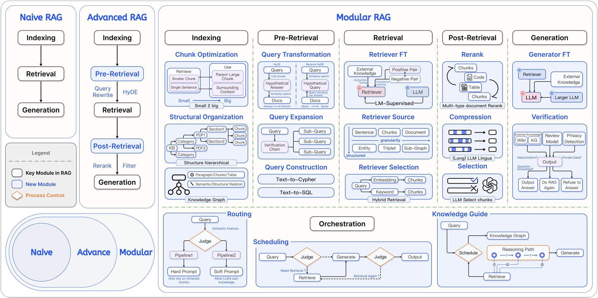
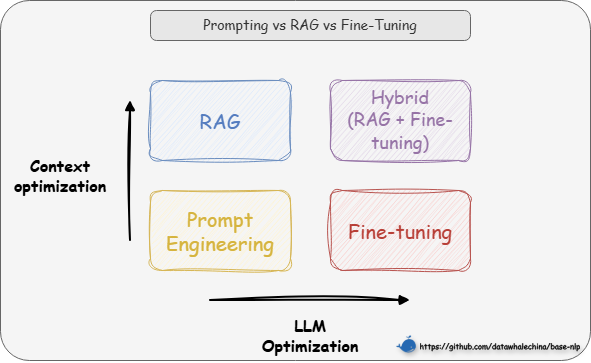
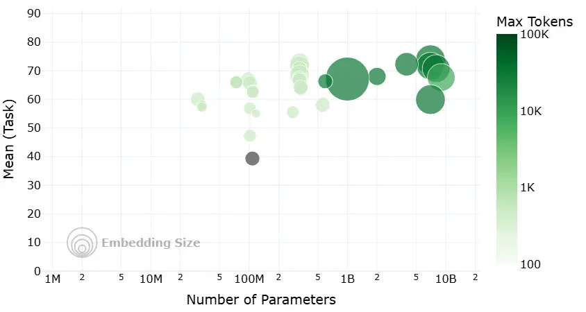
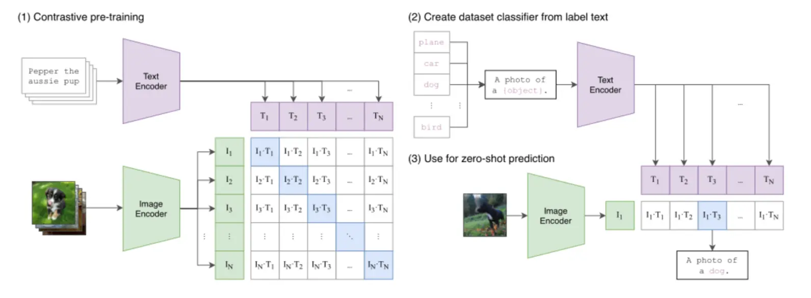

# RAG

相关链接：

- [all-in-rag](https://github.com/datawhalechina/all-in-rag/tree/main)

## 一、RAG 基础入门

### 1.1 **RAG 简介**

**1.1.1 核心定义**

**RAG（Retrieval-Augmented Generation）**是一种旨在解决大语言模型（LLM）“知其然不知其所以然”问题的技术范式。

它的核心是将**模型内部学到的“参数化知识”**（模型权重中固化的、模糊的“记忆”），与**来自外部知识库的“非参数化知识”**（精准、可随时更新的外部数据）相结合。

其运作逻辑就是在 LLM 生成文本前，先通过检索机制从外部知识库中动态获取相关信息，并将这些“参考资料”融入生成过程，从而提升输出的准确性和时效性。

>💡 一句话总结：RAG 就是让 LLM 学会了“开卷考试”，它既能利用自己学到的知识，也能随时查阅外部资料。

**1.1.2 技术原理**

RAG 系统主要通过两个阶段来实现“参数化知识”与“非参数化知识”的结合：

1. **检索阶段**：寻找“非参数化知识”
     * **知识向量化**：**嵌入模型（Embedding Model）** 充当了“连接器”的角色。它将外部知识库编码为向量索引（Index），存入**向量数据库**。
     * **语义召回**：当用户发起查询时，检索模块利用同样的嵌入模型将问题向量化，并通过**相似度搜索（Similarity Search）**，从海量数据中精准锁定与问题最相关的文档片段。
2. **生成阶段**：融合两种知识
     * **上下文整合**：生成模块接收检索阶段送来的相关文档片段以及用户的原始问题。
     * **指令引导生成**：该模块会遵循预设的 Prompt 指令，将上下文与问题有效整合，并引导 LLM（如 DeepSeek）进行可控的、有理有据的文本生成。

<div align="center">
   
   <p>图 1-1 RAG 双阶段架构示意图</p>
</div>


**1.1.3 技术演进分类**

<div align="center">
   
   <p>图 1-2 RAG 技术演进分类</p>
</div>

<div align="center">
<table border="1" style="margin: 0 auto;">
  <tr>
    <th style="text-align: center;"></th>
    <th style="text-align: center;">初级 RAG（Naive RAG）</th>
    <th style="text-align: center;">高级 RAG（Advanced RAG）</th>
    <th style="text-align: center;">模块化 RAG（Modular RAG）</th>
  </tr>
  <tr>
    <td style="text-align: center;"><strong>流程</strong></td>
    <td style="text-align: center;"><strong>离线:</strong> <code>索引</code><br><strong>在线:</strong> <code>检索 → 生成</code></td>
    <td style="text-align: center;"><strong>离线:</strong> <code>索引</code><br><strong>在线:</strong> <code>...→ 检索前 → ... → 检索后 → ...</code></td>
    <td style="text-align: center;">积木式可编排流程</td>
  </tr>
  <tr>
    <td style="text-align: center;"><strong>特点</strong></td>
    <td style="text-align: center;">基础线性流程</td>
    <td style="text-align: center;">增加<strong>检索前后</strong>的优化步骤</td>
    <td style="text-align: center;">模块化、可组合、可动态调整</td>
  </tr>
  <tr>
    <td style="text-align: center;"><strong>关键技术</strong></td>
    <td style="text-align: center;">基础向量检索</td>
    <td style="text-align: center;"><strong>查询重写（Query Rewrite）</strong><br><strong>结果重排（Rerank）</strong></td>
    <td style="text-align: center;"><strong>动态路由（Routing）</strong><br><strong>查询转换（Query Transformation）</strong><br><strong>多路融合（Fusion）</strong></td>
  </tr>
  <tr>
    <td style="text-align: center;"><strong>局限性</strong></td>
    <td style="text-align: center;">效果不稳定，难以优化</td>
    <td style="text-align: center;">流程相对固定，优化点有限</td>
    <td style="text-align: center;">系统复杂性高</td>
  </tr>
</table>
<p><em>表 1-1 RAG 技术演进分类对比</em></p>
</div>

> “离线”指提前完成的数据预处理工作（如索引构建）；“在线”指用户发起请求后的实时处理流程。

### 1.2 **为什么要使用 RAG？**

**1.2.1 技术选型**

通常应**优先选择对模型改动最小、成本最低的方案**，技术选型路径往往遵循的顺序是**提示词工程（Prompt Engineering） -> 检索增强生成 -> 微调（Fine-tuning）**。

从两个维度来理解这些技术的区别：

* **模型优化**：提示工程和 RAG 完全不改变模型权重，而微调则直接修改模型参数
* **上下文优化**：提示工程只是优化提问方式，而 RAG 则通过引入外部知识库，极大地丰富了上下文信息

<div align="center">
  
  <p>图 1-3 选型路径图</p>
</div>

基于此，我们的选择路径就清晰了：

1. **先尝试提示工程**：通过精心设计提示词来引导模型，适用于任务简单、模型已有相关知识的场景。
2. **再选择 RAG**：如果模型缺乏特定或实时知识而无法回答，则使用 RAG，通过外挂知识库为其提供上下文信息。
3. **最后考虑微调**：当目标是改变模型“如何做”（行为/风格/格式）而不是“知道什么”（知识）时，微调是最终且最合适的选择。例如，让模型学会严格遵循某种独特的输出格式、模仿特定人物的对话风格，或者将极其复杂的指令“蒸馏”进模型权重中。

**1.2.2 RAG 的优势**

<div align="center">
<table border="1" style="margin: 0 auto;">
  <tr>
    <th style="text-align: center;">问题</th>
    <th style="text-align: center;">RAG的解决方案</th>
  </tr>
  <tr>
    <td style="text-align: center;"><strong>静态知识局限</strong></td>
    <td style="text-align: center;">实时检索外部知识库，支持动态更新</td>
  </tr>
  <tr>
    <td style="text-align: center;"><strong>幻觉（Hallucination）</strong></td>
    <td style="text-align: center;">基于检索内容生成，错误率降低</td>
  </tr>
  <tr>
    <td style="text-align: center;"><strong>领域专业性不足</strong></td>
    <td style="text-align: center;">引入领域特定知识库（如医疗/法律）</td>
  </tr>
  <tr>
    <td style="text-align: center;"><strong>数据隐私风险</strong></td>
    <td style="text-align: center;">本地化部署知识库，避免敏感数据泄露</td>
  </tr>
</table>
<p><em>表 1-2 RAG 对 LLM 局限的解决方案</em></p>
</div>

**1.2.3 适用场景风险分级**

<div align="center">
<table border="1" style="margin: 0 auto;">
  <tr>
    <th style="text-align: center;">风险等级</th>
    <th style="text-align: center;">案例</th>
    <th style="text-align: center;">RAG适用性</th>
  </tr>
  <tr>
    <td style="text-align: center;"><strong>低风险</strong></td>
    <td style="text-align: center;">翻译/语法检查</td>
    <td style="text-align: center;">高可靠性</td>
  </tr>
  <tr>
    <td style="text-align: center;"><strong>中风险</strong></td>
    <td style="text-align: center;">合同起草/法律咨询</td>
    <td style="text-align: center;">需结合人工审核</td>
  </tr>
  <tr>
    <td style="text-align: center;"><strong>高风险</strong></td>
    <td style="text-align: center;">证据分析/签证决策</td>
    <td style="text-align: center;">需严格质量控制机制</td>
  </tr>
</table>
<p><em>表 1-3 RAG 适用场景风险分级</em></p>
</div>

### 1.3 **如何上手 RAG？**

**1.3.1 基础工具链选择**

（1）开发模式

* LangChain 或 LlamaIndex 等**成熟框架**快速集成
* **不依赖框架的原生开发**，以获得对系统流程更精细的控制力（在 AI 编程辅助下这并非难事）

（2）记忆载体（向量数据库）

* Milvus、Pinecone 等，适合大规模数据
* FAISS、Chroma 等，轻量级或本地化

（3）自动化评估工具（后期量化效果）

* RAGAS 或 TruLens

**1.3.2 四步构建最小可行系统（MVP）**

1. **数据准备与清洗**：这是系统的地基。我们需要将 PDF、Word 等多源异构数据标准化，并采用合理的**分块策略**（如按语义段落切分而非固定字符数），避免信息在切割中支离破碎。
2. **索引构建**：将切分好的文本通过**嵌入模型**转化为向量，并存入数据库。可以在此阶段关联**元数据**（如来源、页码），这对后续的精确引用很有帮助。
3. **检索策略优化**：不要依赖单一的向量搜索。可以采用**混合检索**（向量+关键词）等方式来提升召回率，并引入**重排序**模型对检索结果进行二次精选，确保 LLM 看到的都是精华。
4. **生成与提示工程**：最后，设计一套清晰的 **Prompt 模板**，引导 LLM 基于检索到的上下文回答用户问题，并明确要求模型“不知道就说不知道”，防止幻觉。

**1.3.3 新手友好方案**

如果希望快速验证想法而非深耕代码，可以尝试 **FastGPT** 或 **Dify** 这样的可视化知识库平台，它们封装了复杂的 RAG 流程，仅需上传文档即可使用。对于开发者，利用 **LangChain4j Easy RAG** 或 GitHub 上的 **TinyRAG** [^6]等开源模板，也是高效的起手方式。

### 1.4 **第一个 RAG**

接下来将尝试使用 [**LangChain**](https://python.langchain.com/docs/introduction/) 和 [**LlamaIndex**](https://docs.llamaindex.ai/en/stable/) 框架完成第一个RAG应用的实现与运行。通过一个示例，演示如何加载本地Markdown文档，利用嵌入模型处理文本，并结合大型语言模型（LLM）来回答与文档内容相关的问题。

**1.4.1 启动虚拟环境**

1. 激活虚拟环境（uv 无需手动激活虚拟环境）
2. 切换到项目目录

```bash
# Windows（PowerShell）
.venv\Scripts\activate
# 假设当前在 all-in-rag 项目的根目录下
cd code/C1
```

**1.4.2 运行RAG示例代码**

```bash
uv run 01_langchain_example.py
```

代码运行后，可以看到类似下面的输出（格式化后）：

```bash
Downloading Model from https://www.modelscope.cn to directory: Path\to\all-in-rag\models\bge-small-zh-v1.5
2025-06-08 02:36:19,318 - modelscope - INFO - Target directory already exists, skipping creation.
content='
文中举了以下例子：

1. **自然界中的羚羊**：刚出生的羚羊通过试错学习站立和奔跑，适应环境。
2. **股票交易**：通过买卖股票并根据市场反馈调整策略，最大化奖励。
3. **雅达利游戏（如Breakout和Pong）**：通过不断试错学习如何通关或赢得游戏。
4. **选择餐馆**：利用（去已知喜欢的餐馆）与探索（尝试新餐馆）的权衡。
5. **做广告**：利用（采取已知最优广告策略）与探索（尝试新广告策略）。
6. **挖油**：利用（在已知地点挖油）与探索（在新地点挖油，可能发现大油田）。
7. **玩游戏（如《街头霸王》）**：利用（固定策略如蹲角落出脚）与探索（尝试新招式如“大招”）。

这些例子用于说明强化学习中的核心概念（如探索与利用、延迟奖励等）及其在实际场景中的应用。
'
additional_kwargs={'refusal': None}
response_metadata={
    'token_usage': {
        'completion_tokens': 209,
        'prompt_tokens': 5576,
        'total_tokens': 5785,
        'completion_tokens_details': None,
        'prompt_tokens_details': {'audio_tokens': None, 'cached_tokens': 5568},
        'prompt_cache_hit_tokens': 5568,
        'prompt_cache_miss_tokens': 8
    },
    'model_name': 'deepseek-chat',
    'system_fingerprint': 'fp_8802369eaa_prod0425fp8',
    'id': '67a0580d-78b1-44d6-bccf-f654ae0e9bba',
    'service_tier': None,
    'finish_reason': 'stop',
    'logprobs': None
}
id='run--919cedcd-771e-4aed-8dfd-cf436795792e-0'
usage_metadata={
    'input_tokens': 5576,
    'output_tokens': 209,
    'total_tokens': 5785,
    'input_token_details': {'cache_read': 5568},
    'output_token_details': {}
}
```

> 首次运行时，脚本会下载`BAAI/bge-small-zh-v1.5`嵌入模型。

输出参数解析：

- **`content`**: 这是最核心的部分，即大型语言模型（LLM）根据你的问题和提供的上下文生成的具体回答。
- **`additional_kwargs`**: 包含一些额外的参数，在这个例子中是 `{'refusal': None}`，表示模型没有拒绝回答。
- **`response_metadata`**: 包含了关于LLM响应的元数据。
    - `token_usage`: 显示了本次调用消耗的token数量，包括完成（completion_tokens）、提示（prompt_tokens）和总量（total_tokens）。
    - `model_name`: 使用的LLM模型名称，当前是 `deepseek-chat`。
    - `system_fingerprint`, `id`, `service_tier`, `finish_reason`, `logprobs`: 这些是更详细的API响应信息，例如 `finish_reason: 'stop'` 表示模型正常完成了生成。
- **`id`**: 本次运行的唯一标识符。
- **`usage_metadata`**: 与 `response_metadata` 中的 `token_usage` 类似，提供了输入和输出token的统计。

### 1.5 **基于 LangChain 框架的 RAG 实现**

**1.5.1 初始化设置**

首先进行基础配置，包括导入必要的库、加载环境变量以及下载嵌入模型。

```python
import os
# os.environ['HF_ENDPOINT'] = 'https://hf-mirror.com'
from dotenv import load_dotenv
from langchain_community.document_loaders import TextLoader
from langchain_text_splitters import RecursiveCharacterTextSplitter
from langchain_huggingface import HuggingFaceEmbeddings
from langchain_core.vectorstores import InMemoryVectorStore
from langchain_core.prompts import ChatPromptTemplate
from langchain_deepseek import ChatOpenAI

# 加载环境变量
load_dotenv()
```

**1.5.2 数据准备**

- **加载原始文档**: 先定义Markdown文件的路径，然后使用`TextLoader`加载该文件作为知识源。
    ```python
    markdown_path = "../../data/C1/markdown/easy-rl-chapter1.md"
    loader = TextLoader(markdown_path)
    docs = loader.load()
    ```
- **文本分块 (Chunking)**: 为了便于后续的嵌入和检索，长文档被分割成较小的、可管理的文本块（chunks）。这里采用了递归字符分割策略，使用其默认参数进行分块。当不指定参数初始化 `RecursiveCharacterTextSplitter()` 时，其默认行为旨在最大程度保留文本的语义结构：
    - **默认分隔符与语义保留**: 按顺序尝试使用一系列预设的分隔符 `["\n\n" (段落), "\n" (行), " " (空格), "" (字符)]` 来递归分割文本。这种策略的目的是尽可能保持段落、句子和单词的完整性，因为它们通常是语义上最相关的文本单元，直到文本块达到目标大小。
    - **保留分隔符**: 默认情况下 (`keep_separator=True`)，分隔符本身会被保留在分割后的文本块中。
    - **默认块大小与重叠**: 使用其基类 `TextSplitter` 中定义的默认参数 `chunk_size=4000`（块大小）和 `chunk_overlap=200`（块重叠）。这些参数确保文本块符合预定的大小限制，并通过重叠来减少上下文信息的丢失。
    ```python
    text_splitter = RecursiveCharacterTextSplitter()
    texts = text_splitter.split_documents(docs)
    ```

**1.5.3 索引构建**

数据准备完成后，接下来构建向量索引：

- **初始化中文嵌入模型**: 使用`HuggingFaceEmbeddings`加载之前在初始化设置中下载的中文嵌入模型。配置模型在CPU上运行，并启用嵌入归一化 (`normalize_embeddings: True`)。
    ```python
    embeddings = HuggingFaceEmbeddings(
        model_name="BAAI/bge-small-zh-v1.5",
        model_kwargs={'device': 'cpu'},
        encode_kwargs={'normalize_embeddings': True}
    )
    ```
- **构建向量存储**: 将分割后的文本块 (`texts`) 通过初始化好的嵌入模型转换为向量表示，然后使用`InMemoryVectorStore`将这些向量及其对应的原始文本内容添加进去，从而在内存中构建出一个向量索引。
    ```python
    vectorstore = InMemoryVectorStore(embeddings)
    vectorstore.add_documents(texts)
    ```

这个过程完成后，便构建了一个可供查询的知识索引。

**1.5.4 查询与检索**

索引构建完毕后，便可以针对用户问题进行查询与检索：

- **定义用户查询**: 设置一个具体的用户问题字符串。
    ```python
    question = "文中举了哪些例子？"
    ```
- **在向量存储中查询相关文档**: 使用向量存储的`similarity_search`方法，根据用户问题在索引中查找最相关的 `k` (此处示例中 `k=3`) 个文本块。
    ```python
    retrieved_docs = vectorstore.similarity_search(question, k=3)
    ```
- **准备上下文**: 将检索到的多个文本块的页面内容 (`doc.page_content`) 合并成一个单一的字符串，并使用双换行符 (`"\n\n"`) 分隔各个块，形成最终的上下文信息 (`docs_content`) 供大语言模型参考。
    ```python
    docs_content = "\n\n".join(doc.page_content for doc in retrieved_docs)
    ```

> 使用 `"\n\n"` (双换行符) 而不是 `"\n"` (单换行符) 来连接不同的检索文档块，主要是为了在传递给大型语言模型（LLM）时，能够更清晰地在语义上区分这些独立的文本片段。双换行符通常代表段落的结束和新段落的开始，这种格式有助于LLM将每个块视为一个独立的上下文来源，从而更好地理解和利用这些信息来生成回答。

**1.5.5 生成集成**

最后一步是将检索到的上下文与用户问题结合，利用大语言模型（LLM）生成答案：

- **构建提示词模板**: 使用`ChatPromptTemplate.from_template`创建一个结构化的提示模板。此模板指导LLM根据提供的上下文 (`context`) 回答用户的问题 (`question`)，并明确指出在信息不足时应如何回应。
    ```python
    prompt = ChatPromptTemplate.from_template("""请根据下面提供的上下文信息来回答问题。
    请确保你的回答完全基于这些上下文。
    如果上下文中没有足够的信息来回答问题，请直接告知：“抱歉，我无法根据提供的上下文找到相关信息来回答此问题。”
    
    上下文:
    {context}
    
    问题: {question}
    
    回答:"""
                                              )
    ```
- **配置大语言模型**: 初始化 `ChatOpenAI` 客户端，配置所用模型（`glm-4.7-flash-free`）、生成答案的温度参数（`temperature=0.7`）、最大Token数 (`max_tokens=2048`) 以及API密钥（从环境变量加载）和 url。
    ```python
    llm = ChatOpenAI(
        model="glm-4.7-flash-free",
        temperature=0.7,
        max_tokens=2048,
        api_key=os.getenv("DEEPSEEK_API_KEY")
        base_url="https://aihubmix.com/v1"
    )
    ```
- **调用LLM生成答案并输出**: 将用户问题 (`question`) 和先前准备好的上下文 (`docs_content`) 格式化到提示模板中，然后调用ChatDeepSeek的`invoke`方法获取生成的答案。
    ```python
    answer = llm.invoke(prompt.format(question=question, context=docs_content))
    print(answer)
    ```

### 1.6 **低代码（基于LlamaIndex）**

```python
import os
# os.environ['HF_ENDPOINT']='https://hf-mirror.com'
from dotenv import load_dotenv
from llama_index.core import VectorStoreIndex, SimpleDirectoryReader, Settings 
from llama_index.llms.openai_like import OpenAILike
from llama_index.embeddings.huggingface import HuggingFaceEmbedding

load_dotenv()

Settings.llm = OpenAILike(
    model="glm-4.7-flash-free",
    api_key=os.getenv("DEEPSEEK_API_KEY"),
    api_base="https://aihubmix.com/v1",
    is_chat_model=True
)
Settings.embed_model = HuggingFaceEmbedding("BAAI/bge-small-zh-v1.5")

documents = SimpleDirectoryReader(input_files=["../../data/C1/markdown/easy-rl-chapter1.md"]).load_data()

index = VectorStoreIndex.from_documents(documents)

query_engine = index.as_query_engine()

print(query_engine.get_prompts())

print(query_engine.query("文中举了哪些例子?"))
```

## 二、数据准备

虽然本节内容在实际应用中非常重要，但是由于各种文档加载器的迭代更新，以及各类 AI 应用的不同需求，具体选择需要根据实际情况。

本节仅作简单引入，但请务必**重视数据加载**环节，**“垃圾进，垃圾出 (Garbage In, Garbage Out)”** ——高质量输入是高质量输出的前提。

### 2.1 **数据加载**

**2.1.1 文档加载器**

RAG 系统中，数据加载是整个流水线的第一步，也是不可或缺的一步。

**文档加载器**负责将各种格式的**非结构化文档（如PDF、Word、Markdown、HTML等）**转换为程序可以处理的**结构化数据**。

数据加载的质量会直接影响后续的索引构建、检索效果和最终的生成质量。

文档加载器在 RAG 的数据管道中一般需要完成三个核心任务

1. 解析不同格式的原始文档，将 PDF、Word、Markdown 等内容提取为可处理的纯文本
2. 在解析过程中同时抽取文档来源、页码、作者等关键信息作为元数据
3. 把文本和元数据整理成统一的数据结构，方便后续进行切分、向量化和入库，其整体流程与传统数据工程中的抽取、转换、加载相似，目标都是把杂乱的原始文档清洗并对齐为适合检索和建模的标准化语料。

**2.1.2 当前主流 RAG 文档加载器**

<div align="center">
<table border="1" style="margin: 0 auto;">
  <tr>
    <th style="text-align: center;">工具名称</th>
    <th style="text-align: center;">特点</th>
    <th style="text-align: center;">适用场景</th>
    <th style="text-align: center;">性能表现</th>
  </tr>
  <tr>
    <td style="text-align: center;"><strong>PyMuPDF4LLM</strong></td>
    <td style="text-align: center;">PDF→Markdown转换，OCR+表格识别</td>
    <td style="text-align: center;">科研文献、技术手册</td>
    <td style="text-align: center;">开源免费，GPU加速</td>
  </tr>
  <tr>
    <td style="text-align: center;"><strong>TextLoader</strong></td>
    <td style="text-align: center;">基础文本文件加载</td>
    <td style="text-align: center;">纯文本处理</td>
    <td style="text-align: center;">轻量高效</td>
  </tr>
  <tr>
    <td style="text-align: center;"><strong>DirectoryLoader</strong></td>
    <td style="text-align: center;">批量目录文件处理</td>
    <td style="text-align: center;">混合格式文档库</td>
    <td style="text-align: center;">支持多格式扩展</td>
  </tr>
  <tr>
    <td style="text-align: center;"><strong>Unstructured</strong></td>
    <td style="text-align: center;">多格式文档解析</td>
    <td style="text-align: center;">PDF、Word、HTML等</td>
    <td style="text-align: center;">统一接口，智能解析</td>
  </tr>
  <tr>
    <td style="text-align: center;"><strong>FireCrawlLoader</strong></td>
    <td style="text-align: center;">网页内容抓取</td>
    <td style="text-align: center;">在线文档、新闻</td>
    <td style="text-align: center;">实时内容获取</td>
  </tr>
  <tr>
    <td style="text-align: center;"><strong>LlamaParse</strong></td>
    <td style="text-align: center;">深度PDF结构解析</td>
    <td style="text-align: center;">法律合同、学术论文</td>
    <td style="text-align: center;">解析精度高，商业API</td>
  </tr>
  <tr>
    <td style="text-align: center;"><strong>Docling</strong></td>
    <td style="text-align: center;">模块化企业级解析</td>
    <td style="text-align: center;">企业合同、报告</td>
    <td style="text-align: center;">IBM生态兼容</td>
  </tr>
  <tr>
    <td style="text-align: center;"><strong>Marker</strong></td>
    <td style="text-align: center;">PDF→Markdown，GPU加速</td>
    <td style="text-align: center;">科研文献、书籍</td>
    <td style="text-align: center;">专注PDF转换</td>
  </tr>
  <tr>
    <td style="text-align: center;"><strong>MinerU</strong></td>
    <td style="text-align: center;">多模态集成解析</td>
    <td style="text-align: center;">学术文献、财务报表</td>
    <td style="text-align: center;">集成LayoutLMv3+YOLOv8</td>
  </tr>
</table>
<p><em>表 2-1 当前主流 RAG 文档加载器</em></p>
</div>

**2.1.3 Unstructured 文档处理库**

**Unstructured** 是一个专业的文档处理库，专门设计用于 RAG 和 AI 微调场景的非结构化数据预处理。提供了统一的接口来处理多种文档格式，是目前应用较广泛的文档加载解决方案之一。

Unstructured 在格式支持和内容解析方面具有明显优势，它一方面支持 PDF、Word、Excel、HTML、Markdown 等多种文档格式，并通过统一的 API 接口避免为不同格式分别编写代码，另一方面可以自动识别标题、段落、表格、列表等文档结构，同时保留相应的元数据信息。

Unstructured 能够识别和分类以下文档元素：

<div align="center">
<table border="1" style="margin: 0 auto;">
  <tr>
    <th style="text-align: center;">元素类型</th>
    <th style="text-align: center;">描述</th>
  </tr>
  <tr>
    <td style="text-align: center;"><code>Title</code></td>
    <td style="text-align: center;">文档标题</td>
  </tr>
  <tr>
    <td style="text-align: center;"><code>NarrativeText</code></td>
    <td style="text-align: center;">由多个完整句子组成的正文文本，不包括标题、页眉、页脚和说明文字</td>
  </tr>
  <tr>
    <td style="text-align: center;"><code>ListItem</code></td>
    <td style="text-align: center;">列表项，属于列表的正文文本元素</td>
  </tr>
  <tr>
    <td style="text-align: center;"><code>Table</code></td>
    <td style="text-align: center;">表格</td>
  </tr>
  <tr>
    <td style="text-align: center;"><code>Image</code></td>
    <td style="text-align: center;">图像元数据</td>
  </tr>
  <tr>
    <td style="text-align: center;"><code>Formula</code></td>
    <td style="text-align: center;">公式</td>
  </tr>
  <tr>
    <td style="text-align: center;"><code>Address</code></td>
    <td style="text-align: center;">物理地址</td>
  </tr>
  <tr>
    <td style="text-align: center;"><code>EmailAddress</code></td>
    <td style="text-align: center;">邮箱地址</td>
  </tr>
  <tr>
    <td style="text-align: center;"><code>FigureCaption</code></td>
    <td style="text-align: center;">图片标题/说明文字</td>
  </tr>
  <tr>
    <td style="text-align: center;"><code>Header</code></td>
    <td style="text-align: center;">文档页眉</td>
  </tr>
  <tr>
    <td style="text-align: center;"><code>Footer</code></td>
    <td style="text-align: center;">文档页脚</td>
  </tr>
  <tr>
    <td style="text-align: center;"><code>CodeSnippet</code></td>
    <td style="text-align: center;">代码片段</td>
  </tr>
  <tr>
    <td style="text-align: center;"><code>PageBreak</code></td>
    <td style="text-align: center;">页面分隔符</td>
  </tr>
  <tr>
    <td style="text-align: center;"><code>PageNumber</code></td>
    <td style="text-align: center;">页码</td>
  </tr>
  <tr>
    <td style="text-align: center;"><code>UncategorizedText</code></td>
    <td style="text-align: center;">未分类的自由文本</td>
  </tr>
  <tr>
    <td style="text-align: center;"><code>CompositeElement</code></td>
    <td style="text-align: center;">分块处理时产生的复合元素*</td>
  </tr>
</table>
<p><em>表 2-2 Unstructured 支持的文档元素类型</em></p>
</div>

**2.1.4 从 LangChain 封装到原始 Unstructured**

LangChain的 `UnstructuredMarkdownLoader` 是 LangChain 对 `Unstructured` 库的封装。

接下来展示如何直接使用 `Unstructured` 库，这样可以获得更大的灵活性和控制力。

创建一个简单的示例，尝试使用 `Unstructured` 库加载并解析一个 PDF 文件。

```python
from unstructured.partition.auto import partition

# PDF文件路径
pdf_path = "../../data/C2/pdf/rag.pdf"

# 使用Unstructured加载并解析PDF文档
elements = partition(
    filename=pdf_path,
    content_type="application/pdf"
)

# 打印解析结果
print(f"解析完成: {len(elements)} 个元素, {sum(len(str(e)) for e in elements)} 字符")

# 统计元素类型
from collections import Counter
types = Counter(e.category for e in elements)
print(f"元素类型: {dict(types)}")

# 显示所有元素
print("\n所有元素:")
for i, element in enumerate(elements, 1):
    print(f"Element {i} ({element.category}):")
    print(element)
    print("=" * 60)
```

**partition 函数参数解析：**

- `filename`: 文档文件路径，支持本地文件路径；
- `content_type`: 可选参数，指定MIME类型（如"application/pdf"），可绕过自动文件类型检测；
- `file`: 可选参数，文件对象，与 filename 二选一使用；
- `url`: 可选参数，远程文档 URL，支持直接处理网络文档；
- `include_page_breaks`: 布尔值，是否在输出中包含页面分隔符；
- `strategy`: 处理策略，可选 "auto"、"fast"、"hi_res" 等；
- `encoding`: 文本编码格式，默认自动检测。

`partition`函数使用自动文件类型检测，内部会根据文件类型路由到对应的专用函数（如 PDF 文件会调用`partition_pdf`）。如果需要更专业的PDF处理，可以直接使用`from unstructured.partition.pdf import partition_pdf`，它提供更多 PDF 特有的参数选项，如 OCR 语言设置、图像提取、表格结构推理等高级功能，同时性能更优。

> 在实际应用中，针对 pdf 的处理，目前更多选用的是 PaddleOCR、MinerU 等模型或工具。

### 2.2 **文本分块**

**2.2.1 文本分块概述**

文本分块（Text Chunking）是构建 RAG 流程的关键步骤。它的原理是将加载后的长篇文档，切分成更小、更易于处理的单元。这些被切分出的文本块，是后续向量检索和模型处理的基本单位。

将文本分块的首要原因，是为了适应 RAG 系统中两个核心组件的硬性限制：

- **嵌入模型 (Embedding Model)**: 负责将文本块转换为向量。这类模型有严格的输入长度上限。例如，许多常用的嵌入模型（如 `bge-base-zh-v1.5`）的上下文窗口为512个token。任何超出此限制的文本块在输入时都会被截断，导致信息丢失，生成的向量也无法完整代表原文的语义。因此，文本块的大小**必须**小于等于嵌入模型的上下文窗口。
- **大语言模型 (LLM)**: 负责根据检索到的上下文生成答案。LLM同样有上下文窗口限制（尽管通常比嵌入模型大得多，从几千到上百万token不等）。检索到的所有文本块，连同用户问题和提示词，都必须能被放入这个窗口中。如果单个块过大，可能会导致只能容纳少数几个相关的块，限制了LLM回答问题时可参考的信息广度。

因此，分块是确保文本能够被两个模型完整、有效处理的基础。

LangChain 提供了丰富且易于使用的文本分割器（Text Splitters），下面将介绍几种最核心的策略。

**2.2.2 固定大小分块**

这是最简单直接的分块方法。根据 LangChain 源码，这种方法的工作原理分为两个主要阶段：

（1）**按段落分割**：`CharacterTextSplitter` 采用默认分隔符 `"\n\n"`，使用正则表达式将文本按段落进行分割，通过 `_split_text_with_regex` 函数处理。

（2）**智能合并**：调用继承自父类的 `_merge_splits` 方法，将分割后的段落依次合并。该方法会监控累积长度，当超过 `chunk_size` 时形成新块，并通过重叠机制（`chunk_overlap`）保持上下文连续性，同时在必要时发出超长块的警告。

需要注意，`CharacterTextSplitter` 实际实现的并非严格的固定大小分块。根据 `_merge_splits` 源码逻辑，这种方法会：

- **优先保持段落完整性**：只有当添加新段落会导致总长度超过 `chunk_size` 时，才会结束当前块
- **处理超长段落**：如果单个段落超过 `chunk_size`，系统会发出警告但仍将其作为完整块保留
- **应用重叠机制**：通过 `chunk_overlap` 参数在块之间保持内容重叠，确保上下文连续性

所以，LangChain 的实现更准确地应该称为"段落感知的自适应分块"，块大小会根据段落边界动态调整。

下面的代码展示了如何配置一个固定大小分块器：

```python
from langchain.text_splitter import CharacterTextSplitter
from langchain_community.document_loaders import TextLoader

loader = TextLoader("../../data/C2/txt/蜂医.txt")
docs = loader.load()

text_splitter = CharacterTextSplitter(
    chunk_size=200,    # 每个块的目标大小为100个字符
    chunk_overlap=10   # 每个块之间重叠10个字符，以缓解语义割裂
)

chunks = text_splitter.split_documents(docs)

print(f"文本被切分为 {len(chunks)} 个块。\n")
print("--- 前5个块内容示例 ---")
for i, chunk in enumerate(chunks[:5]):
    print("=" * 60)
    # chunk 是一个 Document 对象，需要访问它的 .page_content 属性来获取文本
    print(f'块 {i+1} (长度: {len(chunk.page_content)}): "{chunk.page_content}"')
```

这种方法的主要优势在于实现简单、处理速度快且计算开销小。劣势在于可能会在语义边界处切断文本，影响内容的完整性和连贯性。实际的固定大小分块实现（如LangChain的 `CharacterTextSplitter`）通常会结合分隔符来减少这种问题，在段落边界处优先切分，只有在必要时才会强制按大小切断。因此，这种方法在日志分析、数据预处理等场景中仍有其应用价值。


**2.2.3 递归字符分块**

在前面的章节中，已经尝试了使用 `RecursiveCharacterTextSplitter` 的默认配置来处理文档分块。现在让我们深入了解 `RecursiveCharacterTextSplitter` 的实现。这种分块器通过分隔符层级递归处理，相对与固定大小分块，改善了超长文本的处理效果。

**算法流程**：

（1）**寻找有效分隔符**: 从分隔符列表中从前到后遍历，找到第一个在当前文本中**存在**的分隔符。如果都不存在，使用最后一个分隔符（通常是空字符串 `""`）。

（2）**切分与分类处理**: 使用选定的分隔符切分文本，然后遍历所有片段：

- **如果片段不超过块大小**: 暂存到 `_good_splits` 中，准备合并
- **如果片段超过块大小**:
    - 首先，将暂存的合格片段通过 `_merge_splits` 合并成块
    - 然后，检查是否还有剩余分隔符：
        - **有剩余分隔符**: 递归调用 `_split_text` 继续分割
        - **无剩余分隔符**: 直接保留为超长块

（3）**最终处理**: 将剩余的暂存片段合并成最后的块

**实现细节**：

- **批处理机制**: 先收集所有合格片段（`_good_splits`），遇到超长片段时才触发合并操作。
- **递归终止条件**: 关键在于 `if not new_separators` 判断。当分隔符用尽时（`new_separators` 为空），停止递归，直接保留超长片段。确保算法不会无限递归。

**与固定大小分块的关键差异**：

- 固定大小分块遇到超长段落时只能发出警告并保留。
- 递归分块会继续使用更细粒度的分隔符（句子→单词→字符）直到满足大小要求。

具体示例如下：

```python
from langchain.text_splitter import RecursiveCharacterTextSplitter
from langchain_community.document_loaders import TextLoader

loader = TextLoader("../../data/C2/txt/蜂医.txt")
docs = loader.load()

text_splitter = RecursiveCharacterTextSplitter(
    separators=["\n\n", "\n", "。", "，", " ", ""],  # 分隔符优先级
    chunk_size=200,
    chunk_overlap=10,
)

chunks = text_splitter.split_text(docs)
```

**分隔符配置**：
- **默认分隔符**：`["\n\n", "\n", " ", ""]`
- **多语言支持**：对于无词边界语言（中文、日文、泰文），可添加：
  ```python
  separators=[
      "\n\n", "\n", " ",
      ".", ",", "\u200b",      # 零宽空格(泰文、日文)
      "\uff0c", "\u3001",      # 全角逗号、表意逗号
      "\uff0e", "\u3002",      # 全角句号、表意句号
      ""
  ]
  ```

**编程语言特化支持**：

`RecursiveCharacterTextSplitter` 能够针对特定的编程语言（如Python, Java等）使用预设的、更符合代码结构的分隔符。它们通常包含语言的顶级语法结构（如类、函数定义）和次级结构（如控制流语句），以实现更符合代码逻辑的分割。

```python
# 针对代码文档的优化分隔符
splitter = RecursiveCharacterTextSplitter.from_language(
    language=Language.PYTHON,  # 支持Python、Java、C++等
    chunk_size=500,
    chunk_overlap=50
)
```

递归字符分块的原理是采用一组有层次结构的分隔符（如段落、句子、单词）进行递归分割，旨在有效平衡语义完整性与块大小控制。在 `RecursiveCharacterTextSplitter` 的实现中，该分块器首先尝试使用最高优先级的分隔符（如段落标记）来切分文本。如果切分后的块仍然过大，会继续对这个大块应用下一优先级分隔符（如句号），如此循环往复，直到块满足大小限制。这种分层处理的机制，能够在尽可能保持高级语义结构完整性的同时，有效控制块大小。

**2.2.4 语义分块**

语义分块（Semantic Chunking）是一种更智能的方法，这种方法不依赖于固定的字符数或预设的分隔符，而是尝试根据文本的语义内涵来切分。其核心是：**在语义主题发生显著变化的地方进行切分**。这使得每个分块都具有高度的内部语义一致性。LangChain 提供了 `langchain_experimental.text_splitter.SemanticChunker` 来实现这一功能。

**实现原理**

`SemanticChunker` 的工作流程可以概括为以下几个步骤：

（1）**句子分割 (Sentence Splitting)**：首先，使用标准的句子分割规则（例如，基于句号、问号、感叹号）将输入文本拆分成一个句子列表。

（2）**上下文感知嵌入 (Context-Aware Embedding)**：这是 `SemanticChunker` 的一个关键设计。该分块器不是对每个句子独立进行嵌入，而是通过 `buffer_size` 参数（默认为1）来捕捉上下文信息。对于列表中的每一个句子，这种方法会将其与前后各 `buffer_size` 个句子组合起来，然后对这个临时的、更长的组合文本进行嵌入。这样，每个句子最终得到的嵌入向量就融入了其上下文的语义。

（3）**计算语义距离 (Distance Calculation)**：计算每对**相邻**句子的嵌入向量之间的余弦距离。这个距离值量化了两个句子之间的语义差异——距离越大，表示语义关联越弱，跳跃越明显。

（4）**识别断点 (Breakpoint Identification)**：`SemanticChunker` 会分析所有计算出的距离值，并根据一个统计方法（默认为 `percentile`）来确定一个动态阈值。例如，它可能会将所有距离中第95百分位的值作为切分阈值。所有距离大于此阈值的点，都被识别为语义上的“断点”。

（5）**合并成块 (Merging into Chunks)**：最后，根据识别出的所有断点位置，将原始的句子序列进行切分，并将每个切分后的部分内的所有句子合并起来，形成一个最终的、语义连贯的文本块。

**断点识别方法 (`breakpoint_threshold_type`)**

如何定义“显著的语义跳跃”是语义分块的关键。`SemanticChunker` 提供了几种基于统计的方法来识别断点：

-   `percentile` (百分位法 - **默认方法**):
    -   **逻辑**: 计算所有相邻句子的语义差异值，并将这些差异值进行排序。当一个差异值超过某个百分位阈值时，就认为该差异值是一个断点。
    -   **参数**: `breakpoint_threshold_amount` (默认为 `95`)，表示使用第95个百分位作为阈值。这意味着，只有最显著的5%的语义差异点会被选为切分点。

-   `standard_deviation` (标准差法):
    -   **逻辑**: 计算所有差异值的平均值和标准差。当一个差异值超过“平均值 + N * 标准差”时，被视为异常高的跳跃，即断点。
    -   **参数**: `breakpoint_threshold_amount` (默认为 `3`)，表示使用3倍标准差作为阈值。

-   `interquartile` (四分位距法):
    -   **逻辑**: 使用统计学中的四分位距（IQR）来识别异常值。当一个差异值超过 `Q3 + N * IQR` 时，被视为断点。
    -   **参数**: `breakpoint_threshold_amount` (默认为 `1.5`)，表示使用1.5倍的IQR。

-   `gradient` (梯度法):
    -   **逻辑**: 这是一种更复杂的方法。它首先计算差异值的变化率（梯度），然后对梯度应用百分位法。对于那些句子间语义联系紧密、差异值普遍较低的文本（如法律、医疗文档）特别有效，因为这种方法能更好地捕捉到语义变化的“拐点”。
    -   **参数**: `breakpoint_threshold_amount` (默认为 `95`)。

**具体示例如下**

```python
import os
## os.environ["HF_ENDPOINT"] = "https://hf-mirror.com"
from langchain_experimental.text_splitter import SemanticChunker
from langchain_community.embeddings import HuggingFaceEmbeddings
from langchain_community.document_loaders import TextLoader

embeddings = HuggingFaceEmbeddings(
    model_name="BAAI/bge-small-zh-v1.5",
    model_kwargs={'device': 'cpu'},
    encode_kwargs={'normalize_embeddings': True}
)

# 初始化 SemanticChunker
text_splitter = SemanticChunker(
    embeddings,
    breakpoint_threshold_type="percentile" # 断点识别方法
)

loader = TextLoader("../../data/C2/txt/蜂医.txt")
documents = loader.load()

docs = text_splitter.split_documents(documents)
```

**2.2.5 基于文档结构的分块**

对于具有明确结构标记的文档格式（如Markdown、HTML、LaTex），可以利用这些标记来实现更智能、更符合逻辑的分割。

**以 Markdown 结构分块为例**

针对结构清晰的 Markdown 文档，利用其标题层级进行分块是一种高效且保留了丰富语义的方法。LangChain 提供了 `MarkdownHeaderTextSplitter` 来处理。

- **实现原理**: 该分块器的主要逻辑是“先按标题分组，再按需细分”。
    1.  **定义分割规则**: 用户首先需要提供一个标题层级的映射关系，例如 `[ ("#", "Header 1"), ("##", "Header 2") ]`，告诉分块器 `#` 是一级标题，`##` 是二级标题。
    2.  **内容聚合**: 分块器会遍历整个文档，将每个标题下的所有内容（直到下一个同级或更高级别的标题出现前）聚合在一起。每个聚合后的内容块都会被赋予一个包含其完整标题路径的元数据。

- **元数据注入的优势**: 这是此方法的主要特点。例如，对于一篇关于机器学习的文章，某个段落可能位于“第三章：模型评估”下的“3.2节：评估指标”中。经过分割后，这个段落形成的文本块，其元数据就会是 `{"Header 1": "第三章：模型评估", "Header 2": "3.2节：评估指标"}`。这种元数据为每个块提供了精确的“地址”，极大地增强了上下文的准确性，让大模型能更好地理解信息片段的来源和背景。

- **局限性与组合使用**: 单纯按标题分割可能会导致一个问题：某个章节下的内容可能非常长，远超模型能处理的上下文窗口。为了解决这个问题，`MarkdownHeaderTextSplitter` 可以与其它分块器（如 `RecursiveCharacterTextSplitter`）**组合使用**。具体流程是：
    - 第一步，使用 `MarkdownHeaderTextSplitter` 将文档按标题分割成若干个大的、带有元数据的逻辑块。
    - 第二步，对这些逻辑块再应用 `RecursiveCharacterTextSplitter`，将其进一步切分为符合 `chunk_size` 要求的小块。由于这个过程是在第一步之后进行的，所有最终生成的小块都会**继承**来自第一步的标题元数据。

- **RAG应用优势**: 这种两阶段的分块方法，既保留了文档的宏观逻辑结构（通过元数据），又确保了每个块的大小适中，是处理结构化文档进行RAG的理想方案。

接下来介绍其他开源框架中的分块策略

**2.2.6 Unstructured：基于文档元素的智能分块**

`Unstructured`是一个强大的文档处理工具，同样提供了实用的[分块功能](https://docs.unstructured.io/open-source/core-functionality/chunking)。

（1）**分区 (Partitioning)**: 这是一个重要功能，负责将原始文档（如PDF、HTML）解析成一系列结构化的“元素”（Elements）。每个元素都带有语义标签，如 `Title` (标题)、`NarrativeText` (叙述文本)、`ListItem` (列表项) 等。这个过程本身就完成了对文档的深度理解和结构化。

（2）**分块 (Chunking)**: 该功能建立在**分区**的结果之上。分块功能不是对纯文本进行操作，而是将分区产生的“元素”列表作为输入，进行智能组合。Unstructured 提供了两种主要的分块方法：
-   **`basic`**: 这是默认方法。这种方法会连续地组合文档元素（如段落、列表项），直到达到 `max_characters` 上限，尽可能地填满每个块。如果单个元素超过上限，则会对其进行文本分割。
-   **`by_title`**: 该方法在 `basic` 方法的基础上，增加了对“章节”的感知。该方法将 `Title` 元素视为一个新章节的开始，并强制在此处开始一个新的块，确保同一个块内不会包含来自不同章节的内容。这在处理报告、书籍等结构化文档时非常有用，效果类似于 LangChain 的 `MarkdownHeaderTextSplitter`，但适用范围更广。

Unstructured 允许将分块作为分区的一个参数在单次调用中完成，也支持在分区之后作为一个独立的步骤来执行分块。这种“先理解、后分割”的策略，使得 Unstructured 能在最大程度上保留文档的原始语义结构，特别是在处理版式复杂的文档时，优势尤为明显。

**2.2.7 LlamaIndex：面向节点的解析与转换**

[LlamaIndex](https://docs.llamaindex.ai/en/stable/module_guides/loading/node_parsers/modules/) 将数据处理流程抽象为对“**节点（Node）**”的操作。文档被加载后，首先会被解析成一系列的“节点”，分块只是节点转换（Transformation）中的一环。

LlamaIndex 的分块体系有以下特点：

（1）**丰富的节点解析器 (Node Parser)**: LlamaIndex 提供了大量针对特定数据格式和方法的节点解析器，可以大致分为几类：
-   **结构感知型**: 如 `MarkdownNodeParser`, `JSONNodeParser`, `CodeSplitter` 等，能理解并根据源文件的结构（如Markdown标题、代码函数）进行切分。
-   **语义感知型**: 
    -   `SemanticSplitterNodeParser`: 与 LangChain 的 `SemanticChunker` 类似，这种解析器使用嵌入模型来检测句子之间的语义“断点”，在语义连续性明显减弱的地方切开，从而让每个 chunk 内部尽量连贯。
    -   `SentenceWindowNodeParser`: 这是一种巧妙的方法。该方法将文档切分成单个的句子，但在每个句子节点（Node）的元数据中，会存储其前后相邻的N个句子（即“窗口”）。这使得在检索时，可以先用单个句子的嵌入进行精确匹配，然后将包含上下文“窗口”的完整文本送给LLM，极大地提升了上下文的质量。
-   **常规型**: 如 `TokenTextSplitter`, `SentenceSplitter` 等，提供基于Token数量或句子边界的常规切分方法。

（2）**灵活的转换流水线**: 用户可以构建一个灵活的流水线，例如先用 `MarkdownNodeParser` 按章节切分文档，再对每个章节节点应用 `SentenceSplitter` 进行更细粒度的句子级切分。每个节点都携带丰富的元数据，记录着其来源和上下文关系。

（3）**良好的互操作性**: LlamaIndex 提供了 `LangchainNodeParser`，可以方便地将任何 LangChain 的 `TextSplitter` 封装成 LlamaIndex 的节点解析器，无缝集成到其处理流程中。

**2.2.8 ChunkViz：简易的可视化分块工具**

在本文开头部分展示的分块图就是通过 [**ChunkViz**](https://chunkviz.up.railway.app/) 生成的。可以将你的文档、分块配置作为输入，用不同的颜色块展示每个 chunk 的边界和重叠部分，方便快速理解分块逻辑。


## 三、索引构建

### 3.1 **向量嵌入**

**3.1.1 向量嵌入基础**

向量嵌入（Embedding）是一种将真实世界中复杂、高维的数据对象（如文本、图像、音频、视频等）转换为数学上易于处理的、低维、稠密的连续数值向量的技术。

Embedding 的真正意义在于，它产生的向量不是随机数值的堆砌，而是对数据**语义**的数学编码。

- **核心原则**：在 Embedding 构建的向量空间中，语义上相似的对象，其对应的向量在空间中的距离会更近；而语义上不相关的对象，它们的向量距离会更远。
- **关键度量**：我们通常使用以下数学方法来衡量向量间的“距离”或“相似度”：
    - **余弦相似度 (Cosine Similarity)** ：计算两个向量夹角的余弦值。值越接近 1，代表方向越一致，语义越相似。这是最常用的度量方式。
    - **点积 (Dot Product)** ：计算两个向量的乘积和。在向量归一化后，点积等价于余弦相似度。
    - **欧氏距离 (Euclidean Distance)** ：计算两个向量在空间中的直线距离。距离越小，语义越相似。

在 RAG 流程中，Embedding 扮演着无可替代的重要角色。

RAG 的“检索”环节通常以基于 Embedding 的语义搜索为核心。通用流程如下：

1. **离线索引构建**：将知识库内文档切分后，使用 Embedding 模型将每个文档块（Chunk）转换为向量，存入专门的向量数据库中。
2. **在线查询检索**：当用户提出问题时，使用**同一个** Embedding 模型将用户的问题也转换为一个向量。
3. **相似度计算**：在向量数据库中，计算“问题向量”与所有“文档块向量”的相似度。
4. **召回上下文**：选取相似度最高的 Top-K 个文档块，作为补充的上下文信息，与原始问题一同送给大语言模型（LLM）生成最终答案。

Embedding 的质量直接决定了 RAG 检索召回内容的准确性与相关性。一个优秀的 Embedding 模型能够精准捕捉问题和文档之间的深层语义联系，即使用户的提问和原文的表述不完全一致。

反之，一个劣质的 Embedding 模型可能会因为无法理解语义而召回不相关或错误的信息，从而“污染”提供给 LLM 的上下文，导致最终生成的答案质量低下。

**3.1.2 Embedding 技术发展**

略

**3.1.3 嵌入模型训练原理**

了解了嵌入模型的发展，我们来简单探究一下当前主流的嵌入模型（通常是基于 `BERT` 的变体）是如何通过训练获得强大的语义理解能力的。

现代嵌入模型的核心通常是 Transformer 的编码器（Encoder）部分，`BERT` 就是其中的典型代表。它通过堆叠多个 `Transformer Encoder` 层来构建一个深度的双向表示学习网络。

BERT 的成功很大程度上归功于 **自监督学习** 策略，它允许模型从海量的、无标注的文本数据中学习知识。

**任务一：掩码语言模型 (Masked Language Model, MLM)**

- **过程**：
    - 随机地将输入句子中 15% 的词元（Token）替换为一个特殊的 `[MASK]` 标记。
    - 让模型去预测这些被遮盖住的原始词元是什么。
- **目标**：通过这个任务，模型被迫学习每个词元与其上下文之间的关系，从而掌握深层次的语境语义。

**任务二：下一句预测 (Next Sentence Prediction, NSP)**

- **过程**：
    - 构造训练样本，每个样本包含两个句子 A 和 B。
    - 其中 50% 的样本，B 是 A 的真实下一句（IsNext）；另外 50% 的样本，B 是从语料库中随机抽取的句子（NotNext）。
    - 让模型判断 B 是否是 A 的下一句。
- **目标**：这个任务让模型学习句子与句子之间的逻辑关系、连贯性和主题相关性。
- **重要说明**：后续的研究（如 RoBERTa）发现[^2]，NSP 任务可能过于简单，甚至会损害模型性能。因此，许多现代的预训练模型（如 RoBERTa、SBERT）在预训练阶段移除了 NSP。

> 更多细节可查看 [BERT 架构及应用](https://github.com/datawhalechina/base-nlp/blob/main/docs/chapter5/13_Bert.md)

**效果增强策略**

虽然 MLM 和 NSP 赋予了模型强大的基础语义理解能力，但为了在检索任务中表现更佳，现代嵌入模型通常会引入更具针对性的训练策略。

- **度量学习 (Metric Learning)** ：
    - **思想**：直接以“相似度”作为优化目标。
    - **方法**：收集大量相关的文本对（例如，（问题，答案）、（新闻标题，正文））。训练的目标是优化向量空间中的**相对距离**：让“正例对”的向量表示在空间中被“拉近”，而“负例对”的向量表示被“推远”。关键在于优化排序关系，而非追求绝对的相似度值（如 1 或 0），因为过度追求极端值可能导致模型过拟合。

- **对比学习 (Contrastive Learning)** ：
    - **思想**：在向量空间中，将相似的样本“拉近”，将不相似的样本“推远”。
    - **方法**：构建一个三元组（Anchor, Positive, Negative）。其中，Anchor 和 Positive 是相关的（例如，同一个问题的两种不同问法），Anchor 和 Negative 是不相关的。训练的目标是让 `distance(Anchor, Positive)` 尽可能小，同时让 `distance(Anchor, Negative)` 尽可能大。

**3.1.4 嵌入模型选型指南**

[**MTEB (Massive Text Embedding Benchmark)**](https://huggingface.co/spaces/mteb/leaderboard) 是一个由 Hugging Face 维护的、全面的文本嵌入模型评测基准。它涵盖了分类、聚类、检索、排序等多种任务，并提供了公开的排行榜，为评估和选择嵌入模型提供了重要的参考依据。

下面这张图是网站中的模型评估图像，直观地展示了在选择开源嵌入模型时需要权衡的四个核心维度：

- **横轴 - 模型参数量 (Number of Parameters)** ：代表了模型的大小。通常，参数量越大的模型（越靠右），其潜在能力越强，但对计算资源的要求也越高。
- **纵轴 - 平均任务得分 (Mean Task Score)** ：代表了模型的综合性能。这个分数是模型在分类、聚类、检索等一系列标准 NLP 任务上的平均表现。分数越高（越靠上），说明模型的通用语义理解能力越强。
- **气泡大小 - 嵌入维度 (Embedding Size)** ：代表了模型输出向量的维度。气泡越大，维度越高，理论上能编码更丰富的语义细节，但同时也会占用更多的存储和计算资源。
- **气泡颜色 - 最大处理长度 (Max Tokens)** ：代表了模型能处理的文本长度上限。颜色越深，表示模型能处理的 Token 数量越多，对长文本的适应性越好。



MTEB 榜单可以帮助我们快速筛选掉大量不合适的模型。但需要注意，榜单上的得分是在通用数据集上评测的，可能无法完全反映模型在你特定业务场景下的表现。

在查看榜单时，除了分数，还需要关注以下几个**关键维度**：

- **任务 (Task)** ：对于 RAG 应用，需要重点关注模型在 `Retrieval` (检索) 任务下的排名。
- **语言 (Language)** ：模型是否支持你的业务数据所使用的语言？对于中文 RAG，应选择明确支持中文或多语言的模型。
- **模型大小 (Size)** ：模型越大，通常性能越好，但对硬件（显存）的要求也越高，推理速度也越慢。需要根据你的部署环境和性能要求来权衡。
- **维度 (Dimensions)** ：向量维度越高，能编码的信息越丰富，但也会占用更多的存储空间和计算资源。
- **最大 Token 数 (Max Tokens)** ：这决定了模型能处理的文本长度上限。这个参数是你设计文本分块（Chunking）策略时必须考虑的重要依据，块大小不应超过此限制。
- **得分与机构 (Score & Publisher)** ：结合模型的得分排名和其发布机构的声誉进行初步筛选。知名机构发布的模型通常质量更有保障。
- **成本 (Cost)** ：如果是使用 API 服务的模型，需要考虑其调用成本；如果是自部署开源模型，则需要评估其对硬件资源的消耗（如显存、内存）以及带来的运维成本。

不要只依赖公开榜单做最终决定。

1. **确定基线 (Baseline)** ：根据上述维度，选择几个符合要求的模型作为你的初始基准模型。
2. **构建私有评测集** ：根据真实业务数据，手动创建一批高质量的评测样本，每个样本包含一个典型用户问题和它对应的标准答案（或最相关的文档块）。
3. **迭代优化** ：
    - 使用基线模型在你的私有评测集上运行，评估其召回的准确率和相关性。
    - 如果效果不理想，可以尝试更换模型，或者调整 RAG 流程的其他环节（如文本分块策略）。
    - 通过几轮的对比测试和迭代优化，最终选出在你的特定场景下表现最佳的那个“心仪”模型。

### 3.2 **多模态嵌入**

**3.2.1 为什么需要多模态嵌入？**

前面的章节介绍了如何为文本创建向量嵌入。然而，仅有文本的世界是不完整的。现实世界的信息是多模态的，包含图像、音频、视频等。传统的文本嵌入无法理解“那张有红色汽车的图片”这样的查询，因为文本向量和图像向量处于相互隔离的空间，存在一堵“模态墙”。

**多模态嵌入 (Multimodal Embedding)** 的目标正是为了打破这堵墙。其目的是将不同类型的数据（如图像和文本）映射到**同一个共享的向量空间**。在这个统一的空间里，一段描述“一只奔跑的狗”的文字，其向量会非常接近一张真实小狗奔跑的图片向量。

实现这一目标的关键，在于解决 **跨模态对齐 (Cross-modal Alignment)** 的挑战。以对比学习、视觉 Transformer (ViT) 等技术为代表的突破，让模型能够学习到不同模态数据之间的语义关联，最终催生了像 CLIP 这样的模型。

**3.2.2 CLIP 模型浅析**

在图文多模态领域，OpenAI 的 **CLIP (Contrastive Language-Image Pre-training)** 是一个很有影响力的模型，它为多模态嵌入定义了一个有效的范式。

CLIP 的架构清晰简洁。它采用**双编码器架构 (Dual-Encoder Architecture)**，包含一个图像编码器和一个文本编码器，分别将图像和文本映射到同一个共享的向量空间中。



*图：CLIP 的工作流程。(1) 通过对比学习训练双编码器，对齐图文向量空间。(2)和(3) 展示了如何利用该空间，通过图文相似度匹配实现零样本预测。*

为了让这两个编码器学会“对齐”不同模态的语义，CLIP 在训练时采用了**对比学习 (Contrastive Learning)** 策略。在处理一批图文数据时，模型的目标是：最大化正确图文对的向量相似度，同时最小化所有错误配对的相似度。通过这种“拉近正例，推远负例”的方式，模型从海量数据中学会了将语义相关的图像和文本在向量空间中拉近。

这种大规模的对比学习赋予了 CLIP 有效的**零样本（Zero-shot）识别能力**。它能将一个传统的分类任务，转化为一个“图文检索”问题——例如，要判断一张图片是不是猫，只需计算图片向量与“a photo of a cat”文本向量的相似度即可。这使得 CLIP 无需针对特定任务进行微调，就能实现对视觉概念的泛化理解。

**3.2.3 常用多模态嵌入模型(以bge-visualized-m3为例)**

虽然 CLIP 为图文预训练提供了重要基础，但多模态领域的研究迅速发展，涌现了许多针对不同目标和场景进行优化的模型。例如，BLIP 系列专注于提升细粒度的图文理解与生成能力，而 ALIGN 则证明了利用海量噪声数据进行大规模训练的有效性。

在众多优秀的模型中，由北京智源人工智能研究院（BAAI）开发的 **bge-visualized-m3（Visualized-BGE 的 M3 版本）** 是一个很有代表性的现代多模态嵌入模型。它是在 **BGE-M3**（文本嵌入底座）的基础上引入图像能力而来，体现了当前技术向“更统一、更全面”发展的趋势。

bge-visualized-m3 的核心特性也可以概括为“M3”（主要继承自其文本底座 BGE-M3）：
- **多语言性 (Multi-Linguality)**：支持超过 100 种语言的文本表示，可用于跨语言的图文检索（文本侧）。
- **多功能性 (Multi-Functionality)**：在文本检索场景下，可按需求使用密集检索（Dense Retrieval）、多向量检索（Multi-Vector Retrieval）等不同范式。
- **多粒度性 (Multi-Granularity)**：文本侧可处理从短句到长达 8192 个 token 的长文档，覆盖更广泛的应用需求。

在技术架构上，bge-visualized-m3 会先用视觉编码器提取图像的 **patch token**，再将其映射到与文本同维度的“图像 token”，与文本 token 一起送入 BGE 的 Transformer 编码器进行联合建模，最终得到可用于图文检索的统一向量表示。

**3.2.4 代码示例**

**步骤1：安装 visual_bge 模块**

```bash
# 进入 visual_bge 目录
cd code/C3/visual_bge

# 安装 visual_bge 模块及其依赖
pip install -e .

# 返回上级目录
cd ..
```

**步骤2：下载模型权重**

```bash
# 运行模型下载脚本
python download_model.py
```

模型下载脚本会自动检查 `../../models/bge/` 目录下是否存在模型文件，如果不存在则从 Hugging Face 镜像站下载。

**基础示例**

```python
import os
os.environ["HF_ENDPOINT"] = "https://hf-mirror.com"
import torch
from visual_bge.visual_bge.modeling import Visualized_BGE

model = Visualized_BGE(model_name_bge="BAAI/bge-base-en-v1.5",
                      model_weight="../../models/bge/Visualized_base_en_v1.5.pth")
model.eval()

with torch.no_grad():
    text_emb = model.encode(text="datawhale开源组织的logo")
    img_emb_1 = model.encode(image="../../data/C3/imgs/datawhale01.png")
    multi_emb_1 = model.encode(image="../../data/C3/imgs/datawhale01.png", text="datawhale开源组织的logo")
    img_emb_2 = model.encode(image="../../data/C3/imgs/datawhale02.png")
    multi_emb_2 = model.encode(image="../../data/C3/imgs/datawhale02.png", text="datawhale开源组织的logo")

# 计算相似度
sim_1 = img_emb_1 @ img_emb_2.T
sim_2 = img_emb_1 @ multi_emb_1.T
sim_3 = text_emb @ multi_emb_1.T
sim_4 = multi_emb_1 @ multi_emb_2.T

print("=== 相似度计算结果 ===")
print(f"纯图像 vs 纯图像: {sim_1}")
print(f"图文结合1 vs 纯图像: {sim_2}")
print(f"图文结合1 vs 纯文本: {sim_3}")
print(f"图文结合1 vs 图文结合2: {sim_4}")
```

**代码解读：**

- **模型架构**: `Visualized_BGE` 是通过将图像token嵌入集成到BGE文本嵌入框架中构建的通用多模态嵌入模型，具备处理超越纯文本的多模态数据的灵活性。
- **模型参数**:
  - `model_name_bge`: 指定底层BGE文本嵌入模型，继承其强大的文本表示能力。
  - `model_weight`: Visual BGE的预训练权重文件，包含视觉编码器参数。
- **多模态编码能力**: Visual BGE提供了编码多模态数据的多样性，支持纯文本、纯图像或图文组合的格式：
  - **纯文本编码**: 保持原始BGE模型的强大文本嵌入能力。
  - **纯图像编码**: 使用基于EVA-CLIP的视觉编码器处理图像。
  - **图文联合编码**: 将图像和文本特征融合到统一的向量空间。
- **应用场景**: 主要用于混合模态检索任务，包括多模态知识检索、组合图像检索、多模态查询的知识检索等。
- **相似度计算**: 使用矩阵乘法计算余弦相似度，所有嵌入向量都被标准化到单位长度，确保相似度值在合理范围内。

**运行结果：**

```bash
=== 相似度计算结果 ===
纯图像 vs 纯图像: tensor([[0.8318]])
图文结合1 vs 纯图像: tensor([[0.8291]])
图文结合1 vs 纯文本: tensor([[0.7627]])
图文结合1 vs 图文结合2: tensor([[0.9058]])
```

> [完整代码](https://github.com/datawhalechina/all-in-rag/blob/main/code/C3/01_bge_visualized.py)


### 3.3 **向量数据库**

使用嵌入模型将文本、图像等非结构化数据转换为高维向量，这些向量是 RAG 系统能够进行语义理解的基础。

然而，当向量数量从几百个增长到数百万甚至数十亿时，一个核心问题随之而来：**如何快速、准确地从海量向量中找到与用户查询最相似的那几个？**

**3.3.1 向量数据库的主要功能**

向量数据库的核心价值在于其高效处理海量高维向量的能力。其主要功能可以概括为以下几点：

- **高效的相似性搜索**：这是向量数据库最重要的功能。它利用专门的索引技术（如 HNSW, IVF），能够在数十亿级别的向量中实现毫秒级的近似最近邻（ANN）查询，快速找到与给定查询最相似的数据。
- **高维数据存储与管理**：专门为存储高维向量（通常维度成百上千）而优化，支持对向量数据进行增、删、改、查等基本操作。
- **丰富的查询能力**：除了基本的相似性搜索，还支持按标量字段过滤查询（例如，在搜索相似图片的同时，指定`年份 > 2023`）、范围查询和聚类分析等，满足复杂业务需求。
- **可扩展与高可用**：现代向量数据库通常采用分布式架构，具备良好的水平扩展能力和容错性，能够通过增加节点来应对数据量的增长，并确保服务的稳定可靠。
- **数据与模型生态集成**：与主流的 AI 框架（如 LangChain, LlamaIndex）和机器学习工作流无缝集成，简化了从模型训练到向量检索的应用开发流程。

**3.3.2 向量数据库 vs 传统数据库**

传统的数据库（如 MySQL）擅长处理结构化数据的精确匹配查询（例如，`WHERE age = 25`），但它们并非为处理高维向量的相似性搜索而设计的。在庞大的向量集合中进行暴力、线性的相似度计算，其计算成本和时间延迟无法接受。

**向量数据库 (Vector Database)** 很好的解决了这一问题，它是一种专门设计用于高效存储、管理和查询高维向量的数据库系统。在 RAG 流程中，它扮演着“知识库”的角色，是连接数据与大语言模型的关键桥梁。

向量数据库与传统数据库的主要差异：

| **维度** | **向量数据库** | **传统数据库 (RDBMS)** |
| :--- | :--- | :--- |
| **核心数据类型** | 高维向量 (Embeddings) | 结构化数据 (文本、数字、日期) |
| **查询方式** | **相似性搜索** (ANN) | **精确匹配** |
| **索引机制** | HNSW, IVF, LSH 等 ANN 索引 | B-Tree, Hash Index |
| **主要应用场景** | AI 应用、RAG、推荐系统、图像/语音识别 | 业务系统 (ERP, CRM)、金融交易、数据报表 |
| **数据规模** | 轻松应对千亿级向量 | 通常在千万到亿级行数据，更大规模需复杂分库分表 |
| **性能特点** | 高维数据检索性能极高，计算密集型 | 结构化数据查询快，高维数据查询性能呈指数级下降 |
| **一致性** | 通常为最终一致性 | 强一致性 (ACID 事务) |

向量数据库和传统数据库并非相互替代的关系，而是**互补关系**。在构建现代 AI 应用时，通常会将两者结合使用：

* 利用传统数据库存储业务元数据和结构化信息
* 向量数据库则专门负责处理和检索由 AI 模型产生的海量向量数据。

**3.3.3 工作原理**

向量数据库的核心是高效处理高维向量的相似性搜索。

向量是一组有序的数值，可以表示文本、图像、音频等复杂数据的特征或属性。

向量数据库通常采用四层架构：

* **存储层**：负责存储向量数据和元数据，优化存储效率并支持分布式存储；
* **索引层**：维护索引算法（HNSW、LSH、PQ等），负责索引的创建与优化，并支持索引调整；
* **查询层**：处理查询请求，支持混合查询并实现查询优化；
* **服务层**：管理客户端连接，提供监控和日志能力，并实现安全管理。

主要技术手段：

- **基于树的方法**：如 Annoy 使用的随机投影树，通过树形结构实现对数复杂度的搜索
- **基于哈希的方法**：如 LSH（局部敏感哈希），通过哈希函数将相似向量映射到同一“桶”
- **基于图的方法**：如 HNSW（分层可导航小世界图），通过多层邻近图结构实现快速搜索
- **基于量化的方法**：如 Faiss 的 IVF 和 PQ，通过聚类和量化压缩向量

**3.3.4 主流向量数据库**

当前主流的向量数据库产品：

[ **Pinecone** ](https://www.pinecone.io/)是一款**完全托管**的向量数据库服务，采用Serverless架构设计。它提供存储计算分离、自动扩展和负载均衡等企业级特性，并保证 99.95% 的 SLA。Pinecone 支持多种语言 SDK，提供极高可用性和低延迟搜索（<100ms），特别适合**企业级生产环境、高并发场景和大规模部署**。

[ **Milvus** ](https://github.com/milvus-io/milvus)是一款开源的**分布式**向量数据库，采用分布式架构设计，支持GPU加速和多种索引算法。它能够处理亿级向量检索，提供高性能 GPU 加速和完善的生态系统。Milvus 特别适合**大规模部署、高性能要求**的场景，以及需要自定义开发的开源项目。

[ **Qdrant** ](https://github.com/qdrant/qdrant)是一款**高性能**的开源向量数据库，采用 Rust 开发，支持二进制量化技术。它提供多种索引策略和向量混合搜索功能，能够实现极高的性能（RPS>4000）和低延迟搜索。Qdrant 特别适合性能敏感应用、高并发场景以及中小规模部署。

[ **Weaviate** ](https://github.com/weaviate/weaviate)是一款支持 GraphQL 的 AI 集成向量数据库，提供 20+AI 模块和多模态支持。它采用 GraphQL API 设计，支持 RAG 优化，特别适合 AI 开发、多模态处理和快速开发场景。Weaviate 具有活跃的社区支持和易于集成的特点。

[ **Chroma** ](https://github.com/chroma-core/chroma)是一款**轻量级**的开源向量数据库，采用本地优先设计，无依赖。它提供零配置安装、本地运行和低资源消耗等特性，特别适合原型开发、教育培训和小规模应用。Chroma 的部署简单，适合快速原型开发。

**选择建议**：

-   **新手入门/小型项目**：从 `ChromaDB` 或 `FAISS` 开始是最佳选择。它们与 LangChain/LlamaIndex 紧密集成，几行代码就能运行，且能满足基本的存储和检索需求。
-   **生产环境/大规模应用**：当数据量超过百万级，或需要高并发、实时更新、复杂元数据过滤时，应考虑更专业的解决方案，如 `Milvus`、`Weaviate` 或云服务 `Pinecone`。

**3.3.5 本地向量存储：以 FAISS 为例**

FAISS (Facebook AI Similarity Search) 是一个由 Facebook AI Research 开发的高性能库，专门用于高效的相似性搜索和密集向量聚类。当与 LangChain 结合使用时，它可以作为一个强大的本地向量存储方案，非常适合快速原型设计和中小型应用。

与 ChromaDB 等数据库不同，FAISS 本质上是一个算法库，它将索引直接保存为本地文件（一个 `.faiss` 索引文件和一个 `.pkl` 映射文件），而非运行一个数据库服务。这种方式轻量且高效。

**环境准备**

在开始之前，请确保已安装所有必需的库：

> 当前requirements.txt安装的 `faiss-cpu` 是 CPU 版本。如果你的机器有 GPU，可以安装 `faiss-gpu` 以获得更好的性能。

**基础示例(FAISS)**

下面的代码演示了使用 LangChain 和 FAISS 完成一个完整的“创建 -> 保存 -> 加载 -> 查询”流程。

```python
from langchain_community.vectorstores import FAISS
from langchain_community.embeddings import HuggingFaceEmbeddings
from langchain_core.documents import Document

# 1. 示例文本和嵌入模型
texts = [
    "张三是法外狂徒",
    "FAISS是一个用于高效相似性搜索和密集向量聚类的库。",
    "LangChain是一个用于开发由语言模型驱动的应用程序的框架。"
]
docs = [Document(page_content=t) for t in texts]
embeddings = HuggingFaceEmbeddings(model_name="BAAI/bge-small-zh-v1.5")

# 2. 创建向量存储并保存到本地
vectorstore = FAISS.from_documents(docs, embeddings)

local_faiss_path = "./faiss_index_store"
vectorstore.save_local(local_faiss_path)

print(f"FAISS index has been saved to {local_faiss_path}")

# 3. 加载索引并执行查询
# 加载时需指定相同的嵌入模型，并允许反序列化
loaded_vectorstore = FAISS.load_local(
    local_faiss_path,
    embeddings,
    allow_dangerous_deserialization=True
)

# 相似性搜索
query = "FAISS是做什么的？"
results = loaded_vectorstore.similarity_search(query, k=1)

print(f"\n查询: '{query}'")
print("相似度最高的文档:")
for doc in results:
    print(f"- {doc.page_content}")
```
**运行结果与解读**：

当你运行上述脚本时，会看到类似以下的输出：
```bash
FAISS index has been saved to ./faiss_index_store

查询: 'FAISS是做什么的？'
相似度最高的文档:
- FAISS是一个用于高效相似性搜索和密集向量聚类的库。
```

**索引创建实现细节**：

通过深入 LangChain 源码，可以发现索引创建是一个分层、解耦的过程，主要涉及以下几个方法的嵌套调用：

1.  **`from_documents` (封装层)**:
    *   这是我们直接调用的方法。它的职责很简单：从输入的 `Document` 对象列表中提取出纯文本内容 (`page_content`) 和元数据 (`metadata`)。
    *   然后，它将这些提取出的信息传递给核心的 `from_texts` 方法。
2.  **`from_texts` (向量化入口)**:
    *   这个方法是面向用户的入口。它接收文本列表，并执行关键的第一步：调用 `embedding.embed_documents(texts)`，将所有文本批量转换为向量。
    *   完成向量化后，它并不直接处理索引构建，而是将生成的向量和其他所有信息（文本、元数据等）传递给一个内部的辅助方法 `__from`。
3.  **`__from` (构建索引框架)**:
    *   一个内部方法，负责搭建 FAISS 向量存储的“空框架”。
    *   它会根据指定的距离策略（默认为 L2 欧氏距离）初始化一个空的 FAISS 索引结构（如 `faiss.IndexFlatL2`）。
    *   同时，它也准备好了用于存储文档原文的 `docstore` 和用于连接 FAISS 索引与文档的 `index_to_docstore_id` 映射。
    *   最后，它调用另一个内部方法 `__add` 来完成数据的填充。
4.  **`__add` (填充数据)**:
    *   真正执行数据添加操作的核心。它接收到向量、文本和元数据后，执行以下关键操作：
        *   **添加向量**: 将向量列表转换为 FAISS 需要的 `numpy` 数组，并调用 `self.index.add(vector)` 将其批量添加到 FAISS 索引中。
        *   **存储文档**: 将文本和元数据打包成 `Document` 对象，存入 `docstore`。
        *   **建立映射**: 更新 `index_to_docstore_id` 字典，建立起 FAISS 内部的整数 ID（如 0, 1, 2...）到我们文档唯一 ID 的映射关系。

### 3.4 **Milvus 介绍及多模态检索实践**

**3.4.1 Milvus 简介**

Milvus 是一个开源的、专为大规模向量相似性搜索和分析而设计的向量数据库。它诞生于 Zilliz 公司，并已成为 LF AI & Data 基金会的顶级项目，在AI领域拥有广泛的应用。

与 FAISS、ChromaDB 等轻量级本地存储方案不同，Milvus 从设计之初就瞄准了**生产环境**。其采用云原生架构，具备高可用、高性能、易扩展的特性，能够处理十亿、百亿甚至更大规模的向量数据。

**官网地址**: [https://milvus.io/](https://milvus.io/)

**GitHub**: [https://github.com/milvus-io/milvus](https://github.com/milvus-io/milvus)

**3.4.2 Milvus 部署安装**

Milvus 提供了多种部署方式，这里以 **Milvus Standalone (单机版)** 为例。

**环境准备**

- **安装 Docker 与 Docker Compose**: 确保系统中已安装并正在运行 Docker 和 Docker Compose。如果你对 Docker 不熟悉，可以参考这篇详细的教程：[Docker 万字教程：从入门到掌握](https://mp.weixin.qq.com/s/u2es87JU5FNlGo3qDLY_ng)。

> codespace 环境自带Docker Compose无需安装

……略

**3.4.3 Milvus 核心组件**

**3.4.4 Milvus 多模态实践**

### 3.5 **索引优化**

在上一章的文本分块部分，已经简单介绍了一些索引优化的策略。本节将基于 LlamaIndex 的高性能生产级 RAG 构建方案，对索引优化进行更深入的探讨。

**3.5.1 上下文扩展**

在 RAG 系统中，常常面临一个权衡问题：

* 使用小块文本进行检索可以获得更高的精确度，但小块文本缺乏足够的上下文，可能导致大语言模型（LLM）无法生成高质量的答案；
* 而使用大块文本虽然上下文丰富，却容易引入噪音，降低检索的相关性。

为了解决这一矛盾，LlamaIndex 提出了一种实用的索引策略——**句子窗口检索（Sentence Window Retrieval）**。

该技术巧妙地结合了两种方法的优点：它在检索时聚焦于高度精确的单个句子，在送入 LLM 生成答案前，又智能地将上下文扩展回一个更宽的“窗口”，从而同时保证检索的准确性和生成的质量。

句子窗口检索的思想：**为检索精确性而索引小块，为上下文丰富性而检索大块**。

句子窗口检索的工作流程：

1. **索引阶段**：在构建索引时，文档被分割成**单个句子**。每个句子都作为一个独立的“节点（Node）”存入向量数据库。同时，每个句子节点都会在元数据（metadata）中存储其**上下文窗口**，即该句子原文中的前N个和后N个句子。这个窗口内的文本不会被索引，仅仅是作为元数据存储。
2. **检索阶段**：当用户发起查询时，系统会在所有**单一句子节点**上执行相似度搜索。因为句子是表达完整语义的最小单位，所以这种方式可以非常精确地定位到与用户问题最相关的核心信息。
3. **后处理阶段**：在检索到最相关的句子节点后，系统会使用一个名为 `MetadataReplacementPostProcessor` 的后处理模块。该模块会读取到检索到的句子节点的元数据，并用元数据中存储的**完整上下文窗口**来替换节点中原来的单一句子内容。
4. **生成阶段**：最后，这些被替换了内容的、包含丰富上下文的节点被传递给LLM，用于生成最终的答案。

句子窗口检索的代码实现：

下面通过 LlamaIndex 官网的示例，来演示如何实现句子窗口检索，并与常规的检索方法进行对比。该示例将加载一份PDF格式的IPCC气候报告，并就其中的专业问题进行提问。

```python
# 假设 Settings.llm 和 Settings.embed_model 已经预先配置好

# 1. 加载文档
documents = SimpleDirectoryReader(
    input_files=["../../data/C3/pdf/IPCC_AR6_WGII_Chapter03.pdf"]
).load_data()

# 2. 创建节点与构建索引
# 2.1 句子窗口索引
node_parser = SentenceWindowNodeParser.from_defaults(
    window_size=3,
    window_metadata_key="window",
    original_text_metadata_key="original_text",
)
sentence_nodes = node_parser.get_nodes_from_documents(documents)
sentence_index = VectorStoreIndex(sentence_nodes)
```

根据 LlamaIndex 的底层源码，`SentenceWindowNodeParser` 的核心逻辑位于 `build_window_nodes_from_documents` 方法中。其实现过程可以分解为以下几个关键步骤：

（1）**句子切分 (`sentence_splitter`)** ：解析器首先接收一个文档（`Document`），然后调用 `self.sentence_splitter(doc.text)` 方法。这个 `sentence_splitter` 是一个可配置的函数，默认为 `split_by_sentence_tokenizer`，它负责将文档的全部文本精确地切分成一个句子列表（`text_splits`）。

（2）**创建基础节点 (`build_nodes_from_splits`)** ：切分出的 `text_splits` 列表被传递给 `build_nodes_from_splits` 工具函数。这个函数会为列表中的**每一个句子**都创建一个独立的 `TextNode`。此时，每个 `TextNode` 的 `text` 属性就是这个句子的内容。

（3）**构建窗口并填充元数据 (主要循环)** ：接下来，解析器会遍历所有新创建的 `TextNode`。对于位于第 `i` 个位置的节点，它会执行以下操作：

*   **定位窗口**：通过列表切片 `nodes[max(0, i - self.window_size) : min(i + self.window_size + 1, len(nodes))]` 来获取一个包含中心句子及其前后 `window_size`（默认为3）个邻近节点的列表（`window_nodes`）。这个切片操作很巧妙地处理了文档开头和结尾的边界情况。
*   **组合窗口文本**：将 `window_nodes` 列表中所有节点的 `text`（即所有在窗口内的句子）用空格拼接成一个长字符串。
*   **填充元数据**：将上一步生成的长字符串（完整的上下文窗口）存入当前节点（第`i`个节点）的元数据中，键为 `self.window_metadata_key`（默认为 `"window"`）。同时，也会将节点自身的文本（原始句子）存入元数据，键为 `self.original_text_metadata_key`（默认为 `"original_text"`）。

4.  **设置元数据排除项**：这是一个非常关键的细节。在填充完元数据后，代码会执行 `node.excluded_embed_metadata_keys.extend(...)` 和 `node.excluded_llm_metadata_keys.extend(...)`。这行代码的作用是告诉后续的嵌入模型和LLM，在处理这个节点时，**应当忽略** `"window"` 和 `"original_text"` 这两个元数据字段。这确保了只有单个句子的纯净文本被用于生成向量嵌入，从而保证了检索的高精度。而 `"window"` 字段仅供后续的 `MetadataReplacementPostProcessor` 使用。

通过以上步骤，`SentenceWindowNodeParser` 最终返回一个 `TextNode` 列表。列表中的每个节点都代表一个独立的句子，其 `text` 属性用于精确检索，而其 `metadata` 中则“隐藏”了用于生成答案的丰富上下文窗口。

```python
# 2.2 常规分块索引 (基准)
base_parser = SentenceSplitter(chunk_size=512)
base_nodes = base_parser.get_nodes_from_documents(documents)
base_index = VectorStoreIndex(base_nodes)

# 3. 构建查询引擎
sentence_query_engine = sentence_index.as_query_engine(
    similarity_top_k=2,
    node_postprocessors=[
        MetadataReplacementPostProcessor(target_metadata_key="window")
    ],
)
base_query_engine = base_index.as_query_engine(similarity_top_k=2)

# 4. 执行查询并对比结果
query = "What are the concerns surrounding the AMOC?"
print(f"查询: {query}\n")

print("--- 句子窗口检索结果 ---")
window_response = sentence_query_engine.query(query)
print(f"回答: {window_response}\n")

print("--- 常规检索结果 ---")
base_response = base_query_engine.query(query)
print(f"回答: {base_response}\n")
```

（1）**构建句子窗口索引**：这一步利用了 `SentenceWindowNodeParser`。它将文档解析为以单个句子为单位的 `Node`，同时将包含上下文的“窗口”文本（默认为前后各3个句子）存储在每个 `Node` 的元数据中。这一步是实现“为检索精确性而索引小块”思想的关键。

（2）**构建查询引擎与后处理**：查询引擎的构建是实现“为生成质量而扩展上下文”的关键。

*   在创建 `sentence_query_engine` 时，配置中加入了一个重要的后处理器 `MetadataReplacementPostProcessor`。
*   它的作用是：当检索器根据用户查询找到最相关的节点（也就是单个句子）后，这个后处理器会立即介入。
*   它会从该节点的元数据中读取出预先存储的完整“窗口”文本，并用它**替换**掉节点中原来的单个句子内容。
*   这样，最终传递给大语言模型的就不再是孤立的句子，而是包含丰富上下文的完整文本段落，从而确保了生成答案的质量和连贯性。

我们向两个引擎提出的问题是：“关于大西洋经向翻转环流（AMOC），人们主要担忧什么？” (What are the concerns surrounding the AMOC?)。

**代码输出如下：**
```bash
查询: What are the concerns surrounding the AMOC?

--- 句子窗口检索结果 ---
回答: The Atlantic Meridional Overturning Circulation (AMOC) is projected to decline over the 21st century with high confidence, though there is low confidence in quantitative projections of this decline. Observational records since the mid-2000s are too short to determine the relative contributions of internal variability, natural forcing, and anthropogenic forcing to AMOC changes. Additionally, there is low confidence in reconstructed and modeled AMOC changes for the 20th century due to limited agreement in quantitative trends. While an abrupt collapse before 2100 is not expected, the decline could have significant implications for global climate patterns.

--- 常规检索结果 ---
回答: The concerns surrounding the Atlantic Meridional Overturning Circulation (AMOC) primarily involve its projected decline over the 21st century across all Shared Socioeconomic Pathway (SSP) scenarios. While an abrupt collapse before 2100 is not expected, there is high confidence in this decline, though quantitative projections remain uncertain. Observational records since the mid-2000s are too short to clearly distinguish the contributions of internal variability, natural forcing, and anthropogenic forcing to these changes. This uncertainty highlights the need for further research to better understand and predict AMOC behavior and its broader climate impacts.
```

从输出结果中可以观察到：

*   **两个答案都抓住了核心**：两个引擎都正确地识别出，对AMOC的主要担忧是其在21世纪预计的衰退。
*   **句子窗口检索的答案更详尽、更连贯**：句子窗口检索的回答不仅指出了衰退的趋势，还补充了关于“定量预测的置信度低”、“观测记录时间过短”、“20世纪重建和模拟的变化置信度低”等多个维度的细节。这使得答案的信息量更大，上下文更完整，更像一个综述。
*   **常规检索的答案相对宽泛**：常规检索的回答虽然正确，但内容相对概括，最后以“需要进一步研究”这样较为笼同的结论收尾。

这种差异正是句子窗口检索策略优势的体现。它通过“精确检索小文本块（单个句子），再扩展上下文（句子窗口）”的方式，为大语言模型提供了高度相关且信息丰富的上下文，从而生成了质量更高的答案。

> [完整代码](https://github.com/datawhalechina/all-in-rag/blob/main/code/C3/05_sentence_window_retrieval.py)


## 三、检索优化


